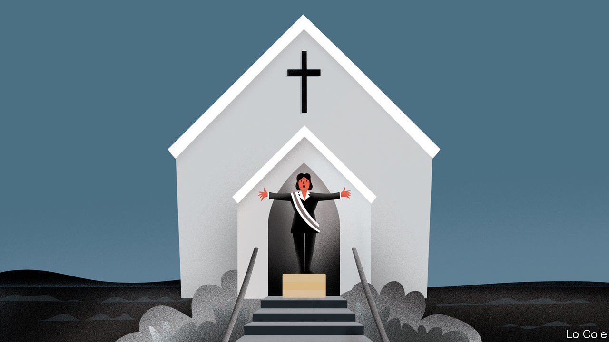

###### Bello

# Latin America’s new war of religion 

##### Blurring the separation between church and state 

 

> Feb 8th 2020 

UNDER THE banner of “religion and traditional (ecclesiastical) privileges”, in 1858 Mexican Conservatives rose in arms against a Liberal constitution which declared freedom of worship and ended a rule preventing Catholic church property from being transferred to anyone else. After a three-year war, the liberal principles of religious toleration and the separation of church and state triumphed. In the following decades they spread across Latin America. Now, it seems, this 19th-century political battle has to be fought all over again.

The new blurring of the divide between spiritual and temporal realms owes much to the rise of evangelical Protestantism. Although 69% of Latin Americans were still Catholics in 2014, 19% were Protestants (26% in Brazil and more than 40% in three Central American countries), says a Pew poll. The number of Protestants is likely to have risen since then. Most are Pentecostals.


They emphasise a literal reading of the Bible and a direct personal relationship with God through baptism with the Holy Spirit. Many want their beliefs to shape public policy. Their concern is mainly, but not solely, to oppose gay rights and abortion. In some cases they dismiss science and have intervened in foreign policy. Some question the separation of church and state.

Jair Bolsonaro, Brazil’s populist president, says he is a Catholic but was rebaptised in the river Jordan by a Pentecostal pastor. “The state is secular but we are Christian,” he has said, suggesting to some that he is out to undermine the former. After an uprising overthrew Bolivia’s socialist president, Evo Morales, in November, the caretaker conservative successor, Jeanine Áñez, declared that “the Bible has come back to the palace.” The new cabinet took the oath of office on a large copy of the scriptures and before a cross. Luis Fernando Camacho, who led the uprising and is now a presidential candidate, wants to end the secular state enshrined in the constitution of 2009.

Capitol Ministries, an American evangelical outfit that aims to set up Bible-studies centres in the legislatures of nearly every country on Earth, has opened eight in Latin America. More are “scheduled to launch”, according to its website.

The chief battleground for the new religious conservatism is personal behaviour. Mr Bolsonaro derides gay people. Damares Alves, a pastor who is his minister for women, family and human rights, promotes abstinence (rather than contraception) to prevent teenage pregnancy. Evangelicals opposed gay marriage even in communist Cuba. Their policy concerns go wider. Mr Bolsonaro has appointed a sceptic of evolution to head the agency that oversees the quality of higher education and a former evangelical missionary to run the body that deals with isolated indigenous tribes. Some pastors opposed the peace agreement of 2016 in Colombia between the government and the FARC guerrillas. Capitol Ministries has lobbied Latin American governments to follow the United States in moving their embassies in Israel to Jerusalem. Guatemala has done so.

The Catholic church, too, is no stranger to politics. It used to promote Christian Democratic parties in Latin America. It, too, has fought against abortion and gay rights and to preserve religious education. Pope Francis, an Argentine, has made no secret of his sympathy for Peronism, the ruling populist movement. But evangelical politics tends to have more vigour and organisation. In Brazil, 195 of the 513 deputies in the lower house of Congress are members of the evangelical caucus. They include the Republican party, formed by the Universal Church of Edir Macedo, a wealthy megapastor. Evangelical pastors are more likely than Catholic bishops to tell their flock whom to vote for.

Not all evangelicals are conservative. In Brazil’s election in 2018, Mr Bolsonaro got 22m evangelical votes but his left-wing opponent got 10m, estimates Datafolha, a pollster. Nor is religious conservatism carrying all before it. Brazil’s Supreme Court last year ruled that homophobic acts are criminal. Alberto Fernández, Argentina’s new president, has proposed a bill to legalise abortion.

Popular religiosity in Latin America has strong roots, as solace in an often unjust world. But secularism has served the region well. It has been free of religious strife since the 1920s. Latin America cries out for more, not less, science. Many of its citizens believe that their democracies owe them the right to live as they wish. The separation of religion and politics needs defending.

