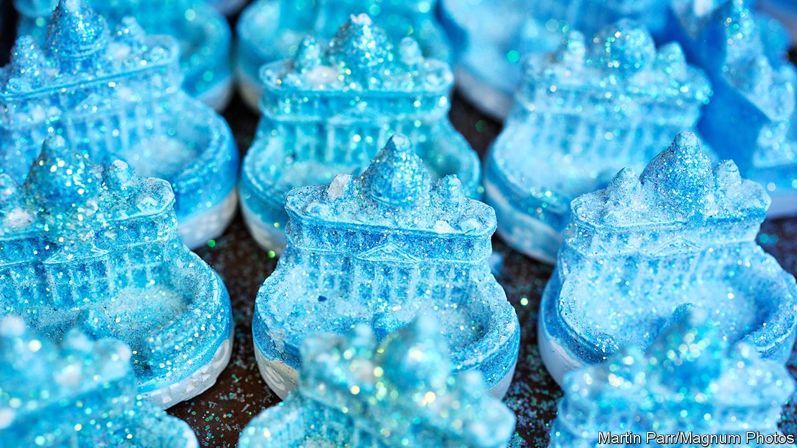

###### Beautifying government

# Donald Trump threatens to bring his taste to government buildings 

##### Modernism is out, Corinthian columns are in 

 

> Feb 8th 2020 

AS A PROPERTY developer, Donald Trump’s tastes were for the brash. The Trump Taj Mahal in Atlantic City, built at a cost of $1.2bn in 1990, featured neon-lit golden onion domes. The Trump International Hotel in Las Vegas, built at a reported cost of $800m and opened in 2008, resembles a golden tombstone, towering 600 feet above the Strip. In more recent years Mr Trump’s name has been attached to equally hideous edifices that he did not develop in places as far afield as Uruguay and India.

So perhaps it should come as a surprise that in government Mr Trump’s favoured architecture seems to be more conservative. On February 4th the Architectural Record, a trade journal, reported that it had been leaked a draft copy of an executive order the president intends to sign, ordering that new federal buildings should be designed in neoclassical style. According to the document, in recent decades, architects designing federal buildings have been too much influenced by “brutalism and deconstructivism” and should return to the era of America’s founding, when the inspiration, both politically and architecturally, came from ancient Athens and Rome.


It is unclear whether the order will ever be enacted. The White House refused to comment. But if it were, the edict would bring about the first major changes in almost 60 years to the guidelines set out for federal architecture by Daniel Patrick Moynihan, a sociologist-turned-senator, in 1962. He argued that the “development of an official style must be avoided” and that design “must flow from the architectural profession to the government and not vice versa.”

Moynihan’s ideas made the American government a remarkable sponsor of architectural experimentation. It may be exactly that which has drawn Mr Trump’s disapproval. According to the Record, the draft order specifically mentions three newish and very modern buildings, the Federal Building in San Francisco, built in 2007, and the United States Courthouses in Miami and Austin, built in 2007 and 2012 respectively, as having “little aesthetic appeal”.

Mr Trump has long been known to dislike brutalism. In 2018 the website Axios reported that he was “obsessed” with the Hoover Building in Washington, DC, the brutalist headquarters of the FBI. He has apparently called it “one of the ugliest buildings in the city”. Such opinions are not new. Jack Kemp, George H.W. Bush’s housing and urban development secretary, described his agency’s curvy brutalist headquarters in Washington as resembling “ten floors of basement”.

But Mr Trump’s interest brings a complication other critics do not: his own interests. The Hoover Building sits directly across from his Trump International Hotel, which occupies the Romanesque-revival former Post Office Building. The FBI has considered moving out of the city and selling the site, which Mr Trump opposes. If the site is ever redeveloped, its style may concern the president less than its function—lots of gold, fine, but absolutely not another hotel.

