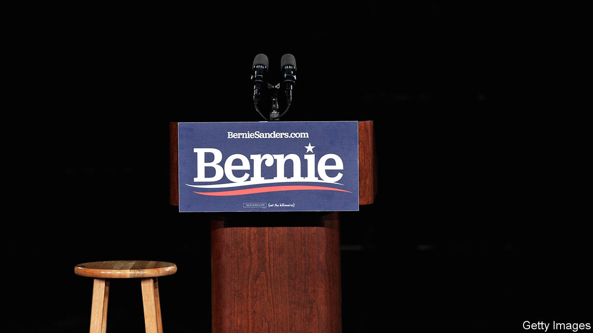

###### Living free

# Waiting for Bernie in New Hampshire 

##### The oldest, leftiest candidate is expected to win round two of the Democratic primary 

 

> Feb 8th 2020 

NEW HAMPSHIRE is a contradictory state. Its towns make good postcards, with saltbox houses meandering outward from a central green and a white clapboard church. Yet few states have lost a larger share of their population to opioids. Geographically, it resembles its twin, Vermont, but whereas the Green Mountain State has a genial, hippieish image, the Granite State is the watchful neighbour sitting on his porch, fingering his shotgun every time your dog wanders too close to his property.

Its political culture is similarly unusual. It has a libertarian spirit—eschewing sales and income taxes, and printing licence plates that read “Live Free or Die”. But it also has America’s biggest state legislature. What unites the two is a time-honoured commitment to participatory democracy. For 100 years it has held America’s first presidential primary election (Iowans caucus; New Hampshirites vote with ballots). Although many grumble over its primacy—some consider it too white (around 90%, compared with around 60% nationally) and too small—New Hampshirites take their politics seriously, and expect face time with any future president.


In the week before the primary, candidates planned to make more than 80 appearances around the state. The front-runners were making up for lost time. While they were in Iowa, Deval Patrick, a former governor of Massachusetts currently polling at “who?”, and Tulsi Gabbard, polling at “ugh”, had the state virtually to themselves.

Mr Patrick was a popular and accomplished governor, and may have made a decent run had he entered the race earlier. But he is out of step with the times: not only did he implement Mitt Romney’s health-care plan in Massachusetts, he worked at Mr Romney’s old private-equity firm, Bain Capital, until he launched his campaign. As for Ms Gabbard, she has long been erratic, but in January she sued Hillary Clinton for defamation, seeking $50m in damages for Mrs Clinton’s public remark that Russia was “grooming [her] to be the third-party candidate,” which Ms Gabbard denies.

The rest of the field arrived in the wee hours of February 4th. Local news the next morning showed each of them stepping off their planes, all looking bleary-eyed except for Elizabeth Warren, who was bouncing with her customary energy. At Pete Buttigieg’s event in Manchester the next morning, journalists embedded with the campaign competed to see who had slept least. Mr Buttigieg knows how to pander to a hometown crowd. Six days earlier, just before Iowa caucused, he said it was time for “a president whose vision was shaped by the American heartland.” In Manchester he praised New Hampshire’s “tradition of the town meeting and town hall.”

Mr Sanders also nodded to the town-hall tradition, at a rally in Derry the next day: “Probably in this very room, you have town meetings and people argue about how much you’re going to spend on the schools and roads...One person, one vote is what American democracy is supposed to be about,” he said, before launching into his customary stemwinder on concentrated wealth. His rally was well-attended, and not just by his usual supporters either. Alex, a business student from Massachusetts who favours Mike Bloomberg and plans to work in the health-insurance industry after he graduates, waited in line for two hours on a frigid morning to ask Mr Sanders what he planned to do about workers like him once private health insurance goes the way of the dodo. Mr Sanders asked, “Does anyone think that Alex is an enemy of mine?” and promised a “just transition.”

Mr Sanders will be hard to beat in the Granite State. Renny Cushing, the state legislator who introduced him, said that “Bernie has had an impact on our state for decades,” crossing the border to join picket lines and support workers trying to unionise. Though Elizabeth Warren represents New Hampshire’s southern neighbour, Mr Sanders has been in politics longer; people seem to know him better, and at least in that room, they liked him more. After that small triumph, Mr Sanders and the rest continued trundling along the state’s narrow, winding roads, looking for one more mic to grab, one more hand to shake.■

