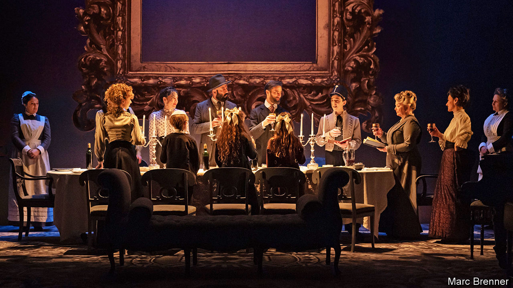

###### Laughter in the dark

# Tom Stoppard’s haunting new play about the Holocaust 

##### Set in Vienna from 1899 to 1955, “Leopoldstadt” tells an acutely personal story 

 

> Feb 13th 2020 

THE ORIGINAL title of his haunting new play, Sir Tom Stoppard confides, was “A Family Album”. The name was changed, but the album survives. The curtain rises on an assimilated Jewish household in Vienna in the winter of 1899, where Hermann, a prosperous convert to Catholicism, and Ludwig, his brother-in-law, are discussing the liberality of Austria and the necessity of Zionism. “To a homeland for the Jews!” they toast. “Happy Christmas!” As children gambol around them, Ludwig’s sister, Wilma, and Grandma Emilia flip through old pictures. “It’s still an amazing thing to me,” Wilma reflects, “to know the faces of the dead!” As for a relative who lived before photography, “no one knows what she looked like any more than if she’d been some kind of rumour.”

The moment, Sir Tom says, “makes explicit something that is part of the play’s fabric”, namely the question of “remembering and misremembering”. “Leopoldstadt”, which opened at Wyndham’s Theatre in London on February 12th, is about memory and forgetting in all their forms. At the most superficial level, the characters keep struggling to pin down how they are related; at the deepest looms the oblivion of the Holocaust. Off-stage, meanwhile, the catastrophe at the play’s heart is passing out of living memory, as the generation that survived it dwindles.


That generation is also the playwright’s, who was born Tomas Straussler in Czechoslovakia in 1937. When Leo, a character in “Leopoldstadt” who is saved as a child—and later writes “funny books” in England—reappears in Vienna in 1955, the drama “superimposes itself on my experience”, Sir Tom says. The parallel is inexact: Leo makes it across the Channel on the eve of the war, whereas, after his parents fled, Sir Tom spent much of it in India. His father was killed in a Japanese bombardment; he moved to England, and became a devoted Englishman, after his mother remarried to a British officer. The play is set in Vienna, not Czechoslovakia, in part to underscore the distinction.

But, like Leo’s, Sir Tom’s own mother “never looked back and never spoke about” what had happened. Which, as he discovered only after communism collapsed and a cousin came to visit, was that all his grandparents, among other relatives, had been murdered.

Never never never never never

A play takes four years to put together, Sir Tom reckons, so that, if he writes another, he would be pushing 87 when it opened. “Do people write plays at 87? Who knows?” Whether or not it proves a finale, “Leopoldstadt” showcases the motifs of a dazzling career that began even before “Rosencrantz and Guildenstern Are Dead” made him famous in 1967. As with the tortoise in “Arcadia” (1993) there are symbolically recurring objects, as well as multiple time-frames and cerebral dialogue that covers Freud and mathematics as well as politics. Only now has he written directly about the Holocaust, but he has always taken on demanding themes, from philosophy in “Jumpers” (1972) to neuroscience in “The Hard Problem” (2015). And, as always, “Leopoldstadt” is wonderfully, defiantly funny.

Some of the gags are frivolous. “Do you happen to have a cigar-cutter?” asks a smoker who gatecrashes a circumcision and is mistaken for the mohel doing the snipping. “Don’t worry, I can bite it off.” Some are pointed. Leo’s pride in Britain was “ubiquitous” in the post-war years, Sir Tom says, but his paean to the country’s royal family and its hospitality to refugees will sound bitterly ironic to London ears today. Some of the jokes are traps. Hermann makes an anti-Semitic quip to Ludwig. The audience laughs. “Do you mind if I take that back?” Hermann says. But it is too late to take back the laughter. (In Patrick Marber’s production, Ludwig is played by Ed Stoppard, Sir Tom’s son, piquant casting in a story that touches on family businesses and what fathers leave their children.)

The ultimate, savage dramatic irony—the fate that the audience knows but the characters cannot—is foreshadowed in the play’s name. After all, Leopoldstadt is not the fine Viennese district where the cultured family live, but the site of the ghetto that they wrongly think they have escaped. Hermann is confident that the “pogroms, ghettos, yellow patches” have all been “rolled up and dumped like an old carpet”, yet ambitions and romances keep bumping up against the cage of anti-Semitism. “The question of Judaism is in everything if you’re a Jew,” comments Sir Tom. “It enters into every conversation.”

In scenes that unfold and contrast like the movements of a musical score, the action shifts to the political maelstrom of 1924, after some of the characters have fought and died for Austria. By 1938 one is enrolled in a school for butlers in the hope of getting an exit visa as a domestic servant. Finally comes the coda in 1955.

The combination of music and trauma is another Stoppardian motif. A spectral orchestra haunts a Soviet psychiatric institute in “Every Good Boy Deserves Favour” (1977); in “Rock ’n’ Roll” (2006), Czech rockers undermine communism. In the tragic diminuendo of “Leopoldstadt”, the symphony of the early family gatherings subsides to a bare trio, one of whom—Leo, the witty Englishman—carries a trace of the ghetto in his name. The quicksilver repartee for which Sir Tom is renowned is hushed. As he puts it, “the language becomes elementary”, then disintegrates in a way that echoes the ending of “King Lear”. At the close, a single word reverberates: Auschwitz. ■

