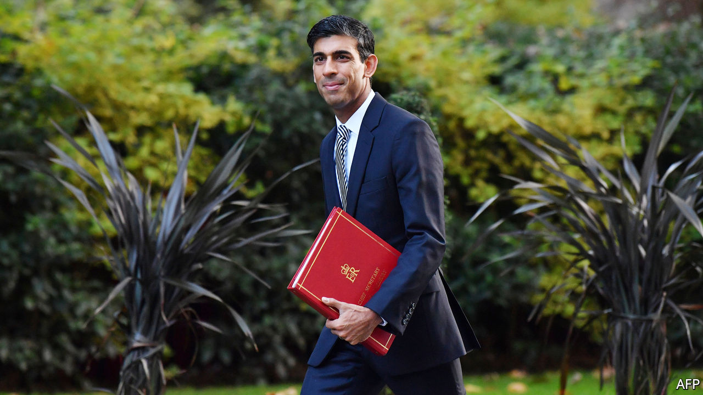

###### Reshuffle

# Number 11’s new incumbent 

##### Boris Johnson’s sacking of the chancellor consolidates his power 

 

> Feb 15th 2020 

ASIDE FROM their families’ South Asian origins, Sajid Javid, the outgoing chancellor of the exchequer, and Rishi Sunak, the incoming one, have little in common. Mr Javid’s father came to Britain with £1 in his pocket and made his living as a bus driver. Mr Sunak’s father was a doctor, and he went to Winchester College, one of the country’s most exclusive schools, and subsequently to Oxford University. More importantly, neither Boris Johnson nor his chief adviser, Dominic Cummings, had much time for Mr Javid, and both have a great deal of respect for Mr Sunak.

Mr Javid’s resignation on February 13th lent drama to a reshuffle that was expected to be routine. The immediate cause of his departure was a row over his senior advisers: Number 10 said that he could only stay on if he sacked the lot of them and he refused. But there were two deeper causes. The first is a smouldering feud between Mr Cummings and Mr Javid over the broad direction of policy. Mr Cummings has lost a series of high-profile battles recently over HS2, Huawei and restructuring government. Mr Javid’s resignation is proof that he remains a formidable player.


The second reason is a shift in the balance of power between the prime minister and the Treasury. Under Philip Hammond, Theresa May’s chancellor, the Treasury exercised tight control over government domestic policy, much as it did under Gordon Brown when Tony Blair was prime minister. But under Mr Javid the Treasury has been weaker than it has been in decades. The new plan, to create a joint unit of special advisers to service both Numbers 10 and 11, will consolidate Number 10’s hold over policy.

Mr Johnson used his first appointments to demonstrate that he would brook no internal dissent and then won an 80-seat majority that has made him invulnerable. His instincts are to have his cake and eat it—spending big on infrastructure while also keeping taxes down. Mr Javid is a much more orthodox figure who puts a premium on balancing the budget.

Mr Sunak is the golden boy of the 2015 intake and has received nothing but plaudits from people who have dealt with him from his first job in local government onwards. He has been chief secretary to the Treasury since July 2019. He also has a business and finance background as a former investment banker with Goldman Sachs and a graduate of Stanford Business School. He is an enthusiastic Brexiteer who sees the future in Asia and the United States rather than Europe.

Mr Sunak’s seat in the northern constituency of Richmond, William Hague’s old seat, is a source of strength. He has a massive majority and a knowledge of the north of England—home of the marginal seats which brought Mr Johnson his victory in the general election. But whether he will be happy with Number 10’s power grab, or indeed its have-your-cake-and-eat-it philosophy, remains to be seen. His demeanour is not that of a big spender, and his popularity with bureaucrats suggests that he is likely to prove a powerful chancellor.

This reshuffle has sent out a clear message. A split between Numbers 10 and 11 is often regarded as the sign of a weak prime minister. Mr Johnson has no intention of being viewed in that light. ■

