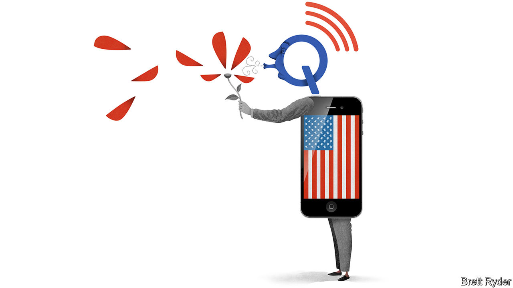

###### Schumpeter

# American state capitalism will not beat China at 5G 

##### The Qualcommunist manifesto 

 

> Feb 15th 2020 

IF IMITATION IS the best form of flattery, one can only imagine the mandarins in Beijing blushing bashfully on February 6th as they eavesdropped on William Barr, America’s attorney-general, firing the latest shots in the tech cold war. One of America’s main concerns, he told a think-tank in Washington, DC, was Chinese dominance of fifth-generation (5G) wireless technology by Huawei. It had achieved this with totalitarian central planning. “As a dictatorship”, he said, “China can marshal an all-nation approach—the government, its companies, its academia, acting together as one.”

Mr Barr’s response to this threat? Central planning, also involving the state, business and academia, but in support of American goals, not Chinese ones. He said America and its allies should decide which “horse we’re going to ride in this race”. That might mean, he went on, that America’s government or its companies should buy controlling stakes in Huawei’s European rivals, Finland’s Nokia, Sweden’s Ericsson, or both—despite there being no precedent for such a move (at least one that does not involve covert operations). It also meant public and private sectors standing shoulder to shoulder against China’s technological blitzkrieg.


Call it state capitalism, American-style. In full 5G panic, President Donald Trump’s administration wants to co-opt not just other countries’ national champions, but domestic ones, too. One focus of attention is Qualcomm. The company, which is based in San Diego and worth $103bn, is among the world’s biggest 5G chipmakers. In 2018 it received unusual government support, when Mr Trump blocked its takeover by Broadcom, then a Singapore-based rival, on national-security grounds. As The Economist went to press on February 13th, it was due a second round of state-backed reinforcement, this time in a San Francisco courtroom where it is appealing against a landmark antitrust verdict. Its backer was Mr Barr’s Department of Justice (DoJ).

Qualcomm’s relations with the government reveal a lot about the way America is fighting the battle for global supremacy in technology. The Trump administration has two main national-security concerns about 5G. The first revolves around the public telecoms networks. It worries that kit installed by Huawei, which boasts a 30% market share in 5G and is in most places bar America, could be used for surveillance. Huawei insists it will never be. But news reports this week said American officials believe it can access mobile networks via “back doors” meant solely for law enforcement. Nokia and Ericsson are among the next-biggest makers of 5G kit but they lack Huawei’s financial firepower. A deep-pocketed American rival like Qualcomm or Cisco could in principle bolster their balance-sheets. But they show no appetite for building fiddly, low-margin 5G networks.

The government’s second worry is about micro-industrial networks, which is where Qualcomm could play a role. The administration argues that within five years 5G could become the backbone of a vast economic system in which everything from cars to factories to fridges seamlessly streams limitless information. It fears that a dominant China could jam them, monopolise them or suck up all the data they produce for its own artificial intelligence. Qualcomm hopes its modems used in 5G devices, and the licences on its patents, will enable customers around the world to build a web of private 5G networks in this “industrial internet”. But it will have to remain competitive against Huawei, which also makes modems and licenses technology.

So far Qualcomm’s bets on 5G have been ahead of the competition. But its ambitions have been undermined by repeated allegations that it is a monopolist. It was in court this week appealing against an antitrust verdict in a case brought by the Federal Trade Commission (FTC) under Barack Obama. The FTC took aim at a lucrative licensing model that 5G could further strengthen. It is a sign of the Trump administration’s alarm about Qualcomm’s future that the DoJ, supported by the Pentagon and the Department of Energy, is throwing its weight behind the firm’s appeal—on national-security grounds. Hence the strange spectacle of two trustbusting agencies battling each other in court.

The DOJ’s backing may bolster Qualcomm’s case. Much of the national-security argument, though, is rather nebulous. The DoJ argues that a verdict against Qualcomm forcing it to renegotiate its licence fees with customers could hit profits and hamper its ability to innovate, which would put America itself at risk. Yet the lack of competition could be a bigger threat to innovation.

The case highlights a deeper question about America’s approach to 5G. How urgent is it to reduce China’s technological lead? Some advise patience, and think much of the hysteria is a veiled justification for protectionism. At present, 5G capabilities are little different from superfast 4G, and as yet the applications do not exist to make the most of the industrial internet. There is still time for experiment and innovation. Alternatives to Huawei’s hardware-heavy, vertically integrated networks are emerging. Companies in America, Europe and elsewhere are using their strengths in software to build virtual networks that are more open and decentralised. Qualcomm is eyeing such opportunities hungrily, and plans to sell chips for virtualised 5G networks as well as devices.

Chip on the shoulder

Mr Barr, who has mixed a career in government with one in telecoms, argues that all this would take too long to counter the clear and present threat from China. The message is unambiguous. If only America could play by China’s rules, subsidising domestic champions and hobbling foreign rivals, it could win in 5G. That is a counsel of despair. Qualcomm and other firms may happily lap up government support. They would benefit, too, from an overdue infrastructure upgrade. But ultimately America’s greatest industrial strength is its freewheeling spirit. Rewriting the rules of American capitalism with Chinese characters would not help that at all.■

