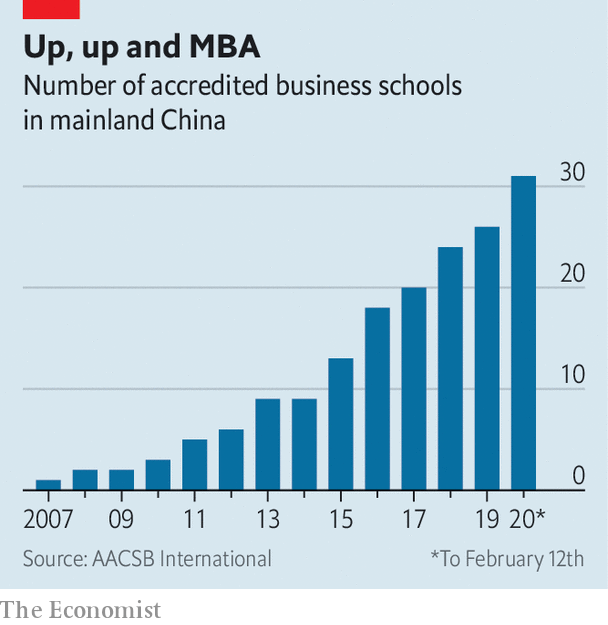
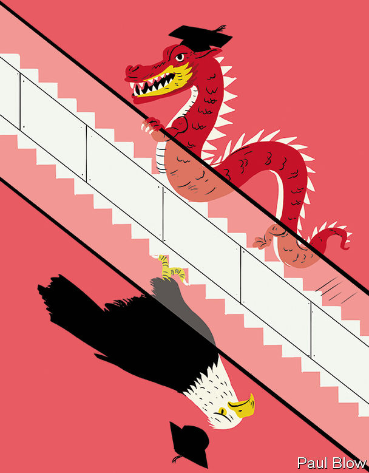

###### MBAs with Chinese characteristics

# Chinese management schools are thriving 

##### Thanks to a mixture of Western and local traits 

 

> Feb 15th 2020 

WHEN THE China Europe International Business School (CEIBS) was established in Shanghai’s Pudong district in 1994, its campus abutted mostly nondescript warehouses and tracts of marshy farmland. Today the area is among the city’s ritziest—and gives it its iconic skyline. CEIBS, too, has become something of an icon in the quarter-century since its founding as a joint venture between the European Union and the Chinese government. Last month it held on to its fifth place in the annual ranking of the world’s 100 best MBAs by the Financial Times, a newspaper. Only heavyweights such as Harvard Business School, Wharton, Stanford’s Graduate School of Business and INSEAD of France scored better.

Business education in China is booming, and not just at CEIBS. When the FT first published its list in 1999, no Asian school made the cut. This year 17 have done, nine of them Chinese. Seven Chinese institutions are among the 90 or so worldwide to boast the coveted “triple crown” of accreditations—from bodies in America, Belgium and Britain. In 2012 the American one, AACSB International, accredited 13 Chinese schools, seven of them in Hong Kong. Today it certifies 39, including 31 on the mainland (see chart). Between them, China’s home-grown business schools—not counting branches of Western ones it also hosts—offer more than 200 MBA programmes. Competition for places is fierce. Nearly 200,000 people applied last year, close to twice the number in 2016. Fewer than one in four typically get in.

 


In many ways, the best Chinese business schools look a lot like their Western rivals. CEIBS has aped foreign peers like INSEAD, which has branches in Singapore, Abu Dhabi and, since last year, San Francisco, by creating satellite campuses—at home, in Beijing and the southern boomtown of Shenzhen, and abroad, in Ghana and Switzerland. Many professors possess Western experience. Chen Fangruo, dean of Antai College of Economics and Management at Shanghai’s Jiaotong University, taught at Columbia Business School in New York for 25 years before returning to China. Their classroom manner is no different from their Western counterparts’: sleeves rolled up, approachable, engaging, witty. (When, in response to a question about cost allocation in producing an MBA degree, a student suggests that staff salaries are a considerable expense, a CEIBS professor quips that “we would rather be treated as assets”.)

Teaching to the test

Crucially, programmes have Western rigour—a must for those prized global accreditations, says Zhao Ying, who runs WhichMBA.net, a big Chinese tracker (not to be confused with Which MBA?, The Economist’s own annual ranking, which places only one Chinese school, at Sun Yat-sen University in Guangzhou, in the world’s top 100; CEIBS stopped submitting data for our list in 2016). “Our curriculum must meet international standards,” says the dean of one top institution.

Perhaps recognising this, the Communist party has allowed business schools to grow unfettered. Although, as the same dean adds, “we need to please the ministry of education”, institutions like his have been mostly spared from curbs on the use of imported textbooks which the authorities have imposed on other places of higher learning. They are not expected to teach Xi Jinping Thought, as the Chinese president’s philosophy, enshrined in the country’s constitution three years ago, is officially known. The ministry does oversee the Chinese management schools’ governing committee, which consists of 30 deans, two or three officials and a few business executives. But meetings are sporadic and contentious topics rare, according to an insider. The last big directive came down in 2014, when Mr Xi forbade bureaucrats and bosses of state-owned firms to attend “high-priced training courses” as part of a broad crackdown on graft. MBAs had previously been all the rage among party cadres.

In important ways, however, China’s management schools are growing more distinct from those in the West. This is true both in terms of what they teach and the career boost they offer.

The teaching first. In the past, Chinese students saw an MBA as a path to joining a foreign company and launching an international career. No local firm was prepared to pay the salary a good MBA commanded. Now China Inc has become “global, richer and ready to recruit our students”, says Ding Yuan, dean of CEIBS. Roughly half of full-time MBAs from CEIBS join Chinese firms. Some go on to Chinese companies that have either recently expanded abroad or acquired a foreign business. Others are young heirs taking charge of family firms as the country’s first generation of entrepreneurs retires. These have often gone to university in the West and want to “recharge themselves” in China, in Mr Ding’s words. The last big group are bosses who missed out on a business degree in their youth. CEIBS has 700 of these enrolled at its MBA for active executives, compared with around 170 students for its regular MBA course—inverting the proportions typical at Western schools. Applications for its English-language Global Executive MBA are growing by 20% a year.

Courses cater to this Sinocentric student body. At Antai some professors use ancient Chinese texts (and not just Sun Tzu’s “The Art of War”) to teach their own brand of management theory. Marxism, which many schools still include among their foundation courses, is used as a way to tell students how to navigate capitalism with Chinese characteristics. Schools do not offer explicit modules on relations with the government, which still dominates the commanding heights of China’s economy. Few students, many of whom are in their mid-30s, with a startup or two under their belt or some other real-world experience, think that would be useful. As entrepreneurs, they know far more about dealing with officials than any professor can. But they are still keen to learn how to make the most of regulations. This “policy dividend”, as one prominent dean calls it, is “embedded in everything that we teach”.

Not all divergences from Western MBAs are so subtle. Mr Chen is changing Antai’s syllabus to organise courses by industry—with modules on fintech, health care, self-driving cars and other thriving Chinese industries—rather than by discipline (accounting, marketing and so on), as in the West. CEIBS’s Beijing campus is located in the capital’s Zhongguancun district, which is China’s answer to Silicon Valley.

Above all, students want professors to teach case studies on home-grown firms, not some “old Southwest Airlines case”, Mr Ding explains. “It’s even worse if you bring up GE.” Instead, they want to know how Western theories apply to China’s buzzy native firms. Schools are churning out new local cases about firms such as Ichido, a 20-year-old bakery chain, or Luckin Coffee, a Starbucks wannabe set up in 2017. CEIBS leads a consortium of a dozen or so Chinese institutions aimed at creating common criteria to write them.

Wealth management

Like MBA students everywhere, Chinese ones expect the degree to confer advantages besides pure knowledge. One is a boost to career prospects. Graduates of Western schools typically double their pre-MBA pay. Antai and Fudan University’s School of Management, also in Shanghai, triple it (albeit from a lower base and adjusted for living costs). Both boast near-perfect job-placement rates. CEIBS runs a course for corporate human-resources managers on how to make the most of their graduates.

Many business schools now also run startup incubators to help students with a clever idea for a business. Some graduates co-found startups. Fellow alumni also benefit from the schools’ unusually close ties to China’s leading entrepreneurs. A stamp of excellence from a leading school is a good way to impress deep-pocketed domestic investors. A Chinese MBA has become “one of the real secrets of entrepreneurs’ success”, observes Rupert Hoogewerf, compiler of the Hurun Rich List, a Who’s Who of the ultra-wealthy.

A chance to rub shoulders with captains of China’s private sector is a big draw even for seasoned executives. Ye Kai, a serial entrepreneur from Shanghai who runs a restaurant chain and a group of urban ski schools, and who attended an executive MBA in the late 2000s, says he still meets up with old classmates every other month.

CEIBS claims to have the “largest and most prestigious network” of alumni in China—over 22,000, including more than 3,000 chief executives. Among them are Dong Mingzhu of Gree, a maker of air-conditioners, and Richard Liu of JD.com, a big e-merchant. In Beijing the Cheung Kong Graduate School of Business, founded in 2002 by Li Ka-shing, Hong Kong’s richest tycoon, claimed in 2016 that former students ran one-fifth of the 103 Chinese firms then in the Fortune Global 500 list of the world’s biggest corporations by revenue. They included Jack Ma, the now-retired boss of Alibaba, China’s e-commerce titan and its largest listed firm. The local press has dubbed the school “the rich club”. Members certainly enjoy rich benefits. Jia Yueting, founder of LeEco, an indebted tech giant, was able to rustle up $600m from about a dozen classmates in 2016.

 


But graduates say that the network’s true value lies in the intangible perks that other groupings do not offer. “In the classroom entrepreneurs are allowed to be weak, and nobody will look down on them,” explains Ms Zhao of WhichMBA.net. “Classmates tell you the truth.” Mr Ye thinks that, in terms of trust, it has no equivalent in China’s business world. Members swap inside details which they would normally never share, he says. After-hours get-togethers can be especially useful to compare notes on delicate subjects like dealing with officials or state-run firms. There is “no textbook to manage this kind of relationship”, says Mr Ye.

Given all these blessings, going abroad for an MBA is increasingly seen as a “huge opportunity cost” by Chinese students, says Mr Chen. In some sectors it can be a liability, by keeping them out of China’s fast-changing market for too long. Henry Zhan, a 29-year-old manager at Fangduoduo, a booming online service connecting homebuyers and sellers, chose CEIBS over top American schools because of its ranking and popularity among Chinese property moguls (including Fangduoduo’s founders). He thinks CEIBS’s 428,000 yuan ($60,000) tuition fee, excluding a monthly boarding fee of $400, will be a better investment than Columbia Business School, which he also considered, and which would set him back well over $100,000.

Luring laowai

Foreign students are taking note. Even as international applications fell at seven out of every ten American business schools in 2018—in part because of stricter visa requirements—Asian schools reported a 9% rise in the number of applicants. Demand has risen for immersive Chinese modules taught in China itself. CEIBS recently educated a crop of South Korean executives from Hyundai, Japanese ones from Toyota and French from Michelin and Total. Already over a third of its MBA students are foreign. Rose Luo of INSEAD (which opened a campus in Singapore in 2000) says that several Western schools have enhanced their offerings with double degrees, popular with domestic and overseas students alike—and boosted the prestige of their Chinese partners. She runs one in Beijing, at Tsinghua University’s School of Economics and Management.

The chasm in quality between China’s most prominent schools—Tsinghua’s counts the bosses of Tesla, Microsoft and Facebook among its board members and, since last year, Tim Cook of Apple as chairman of its advisory committee—and its dozens of hangers-on is much wider than in the West, Ms Luo notes. Those unable to get into the best Chinese schools may prefer a decent one abroad. Some of the most ambitious executives at Chinese firms going global will still often plump for a renowned Western institution. But with the rise of CEIBS, Tsinghua, Antai and others, the decision is no longer the no-brainer it once was.■

