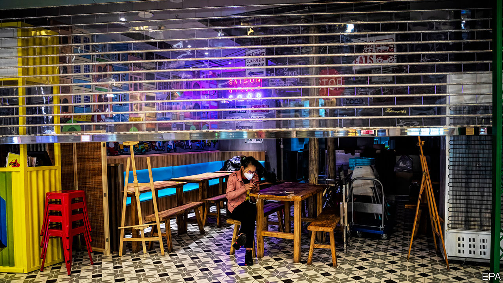

###### Business in paralysis

# China’s official holiday ends, but not the woes of its firms 

##### It is hard to keep factories going when workers are stuck in the countryside 

 

> Feb 13th 2020 

RED BANNERS and an enormous QR code flank the iron gates of a compound for recruitment agencies in Waigaoqiao, a north-eastern district of Shanghai. “Scan with WeChat and get jobs”, the banners urge visitors, who are normally migrants from the countryside. In any other year, on the first day of work after the lunar new-year holiday, people would stream to this complex after celebrating the festival in their ancestral villages. But this time, on February 10th, it was all but deserted.

One firm, Yongbing Labour, had reopened. But its boss said only three people had made inquiries there, compared with over 100 on the first day back last year. Maybe the lack of jobseekers was for the best. He said he had found no work even for those three. In fact, he had received no requests from any factory for labour, and was thinking of closing for the rest of the week.


No one expected that business would resume as normal this year. China is battling a new coronavirus that was detected in December in the central city of Wuhan and has spread swiftly nationwide and to more than two dozen other countries. Many local governments had extended the holiday by ten days in an effort to contain the outbreak. But when that period expired, officials seemed torn. They worried about the virus’s damage to the economy, but also about how a return to work might affect the pathogen’s spread. In many places they urged people to work from home. Surging downloads of video-conferencing apps suggest that is happening, but many firms remain closed. The streets of major cities remain eerily quiet.

Official data imply that few people are back behind desks and conveyor belts. The number of trips taken on February 9th, the last day of the holiday (for most) and usually a peak time for travel, was 85% lower than the equivalent day last year. Huatai Securities, a broker, reckons that, of those working in China’s main cities before the holiday, only 15-30% have returned from their holiday trips elsewhere. Shanghai and Beijing, among others, have stopped arrivals and departures of long-distance buses, the favoured mode of transport for migrant labourers from the countryside.

In many cities, including Shanghai and Shenzhen, companies need official permission to restart. Few have been given it. Across from Yongbing Labour is the sprawling Waigaoqiao Free Trade Zone. Just 120 of its 4,000 firms were back at work on the first day after the holiday. To qualify, businesses must have, for instance, an adequate stock of face masks for their employees. That is a tall order given there is a huge nationwide shortage of them, points out Gavekal Dragonomics, a consultancy. Some firms, including Foxconn, which makes Apple’s iPhones, have started making their own masks.

Some companies that have been allowed to resume work are struggling. Just one in ten of Foxconn’s workers reported for duty at its plants in Zhengzhou and Shenzhen on the first day, reports Reuters news agency (see ). Part of the problem is that Zhengzhou, the capital of Henan province, requires those entering the city to undergo a 14-day quarantine. Migrant workers arriving at Shanghai’s central railway station say they expect similar confinement.

Some places have adopted even more draconian measures. Wuxi and Yangzhou in Jiangsu province, which borders on Shanghai, have barred travellers from seven provinces. Yiwu, a hub for wholesale traders in Zhejiang province, Shanghai’s other neighbour, appears to have barred all out-of-towners. Wenzhou, an entrepreneurial hotspot there, has cancelled every train out of the city.

Such restrictions have alarmed higher-level governments. Zhejiang’s has accused some cities of “spontaneously escalating control measures” and told them to stop. The capital’s government has told districts not to require companies to seek permission to open. But local officials continue to err on the side of caution, for fear of being punished for letting the virus spread.

Halted production could cause another problem that officials fear: a spike in unemployment. Liu Kaiming of the Institute of Contemporary Observation, an NGO in Shenzhen, says many blue-collar migrant workers could lose their jobs if travel and quarantine restrictions are not lifted within two weeks. Last week the Office for Migrant Workers, a government agency, told firms that they were not allowed to terminate contracts if work had to be suspended because of virus-related “emergency measures”. China’s leader, Xi Jinping, promised this week that the government would do its utmost to prevent “large-scale lay-offs”.

Local governments are giving tax breaks, waiving rental fees and postponing levies on firms for social security. But most businesses say they are already suffering much more than during SARS, another coronavirus, which hit in 2003. Bernstein, a research firm, points out that sales by Yum China, a restaurant giant, dipped by no more than a third for two or three weeks back then. Now, nearly a third of its stores are closed and sales at those still open have fallen by almost half.

Many migrant workers are choosing to stay put. On the outskirts of Baoding, an area near Beijing that is a big source of workers for the city, Chen Yixiu, a 26-year-old who had a job at a wholesale flower market in the capital, says she worries about falling ill should she return to Beijing—migrant workers usually have no access to health coverage in cities where they work. What of the government’s promises that it will cover her treatment should she fall sick from the virus? Ms Chen says she is sceptical. Others might well be of officials’ predictions that many will be back at work in the next few days. ■

