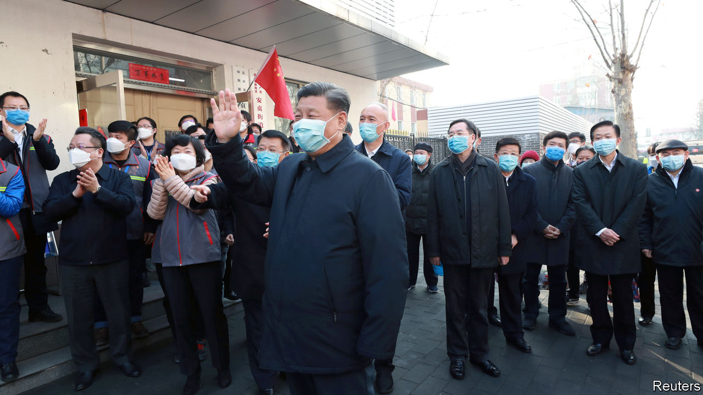

###### Big changes in Hubei

# Xi Jinping sends in the hard men to deal with the Wuhan virus 

##### He fires the local bosses who failed to get to grips with the covid-19 outbreak 

 

> Feb 13th 2020 

WHEN SECRETIVE, Leninist parties have bad news to get out of the way, they do not hang about. In the space of a single day, February 13th, China’s ruling Communist Party fired the officials who run the province and city at the heart of the epidemic of covid-19, announced a big jump in the number of recorded virus infections there, and sent in hardliners close to Xi Jinping, the country’s supreme leader, to clean up the mess.

The unusually brutal reshuffle saw the top party post in the central province of Hubei, where more than 48,000 infections and 1,310 deaths had been recorded as The Economist went to press, handed to the mayor of Shanghai, Ying Yong, who is 62. Mr Ying’s background is in public security, the law courts and the feared discipline-inspection commission that roots out malfeasance by officials. He earned Mr Xi’s trust while serving as a police chief and discipline inspector in the coastal province of Zhejiang, when Mr Xi was Zhejiang’s party boss from 2002-07.


Public anger is seething over weeks of bungling and cover-ups by officials responsible for fighting the virus in Hubei and Wuhan, the provincial capital. A handful of brave doctors, academics and relatively outspoken journalists have been pleading with national leaders to allow for more openness and free debate to avoid further deadly policy blunders. Mr Xi and his inner circle appear to have granted half that request, offering greater transparency about virus numbers, matched with sterner party discipline.

State media are at pains to note that new cases outside Hubei have been growing less common since February 4th. But on February 12th Hubei reported 14,840 new infections, a sharp rise. This followed instructions from the central government to count not just cases confirmed by nucleic acid tests performed on nose or throat swabs (kits for that are in short supply and not always reliable), but also patients whose lungs show telltale signs of covid-19 on CT scans.

Hubei’s new chief, Mr Ying, indicated his preferred approach to governing a province in remarks he made in Shanghai a few days before his transfer. He praised “non-sloppy” administrations that are brave enough to endure strict supervision. Mr Xi’s war on sloppiness will be fought in Wuhan, a city of 11m people that has been under lockdown for weeks, by Wang Zhonglin, who has taken over as the city’s new party chief. He is also an ex-cop.

After some days of hesitation, when Mr Xi was unusually absent from state media, the Chinese president and party chief appeared on February 10th in Beijing to inspect a hospital and address hard-pressed doctors in Wuhan by video link (see picture). Wearing a face mask and submitting to a nurse who took his temperature, Mr Xi pledged victory in a “people’s war” against the virus, but also expressed concern about the economic costs of nationwide quarantines. His emphasis on the party’s absolute leadership is reflected in the latest personnel moves. During a deadly outbreak of the SARS virus in 2002-03, the health minister and the mayor of Beijing were sacked. The reality has always been that such government officials are outranked by party leaders at each level of administration. The reshuffle in Hubei makes that explicit.

Other officials with experience of high office in Zhejiang are being deployed. One of them is Chen Yixin, the secretary-general of the Central Political and Legal Affairs Commission, the party’s main law-enforcement body. He has been sent as Mr Xi’s envoy to oversee virus-control work in Wuhan. Meanwhile Xia Baolong, who was Mr Xi’s deputy in Zhejiang, has been appointed head of the central government’s Hong Kong and Macau Affairs Office, putting a Xi loyalist in charge of another crisis—anti-government unrest that has roiled Hong Kong since June.

Among China’s embattled Christian community, both Mr Chen and Mr Xia are notorious for leading a campaign to strip crosses from the roofs of churches in Zhejiang. When trouble strikes in Mr Xi’s China, the party sends for the hard men. ■

