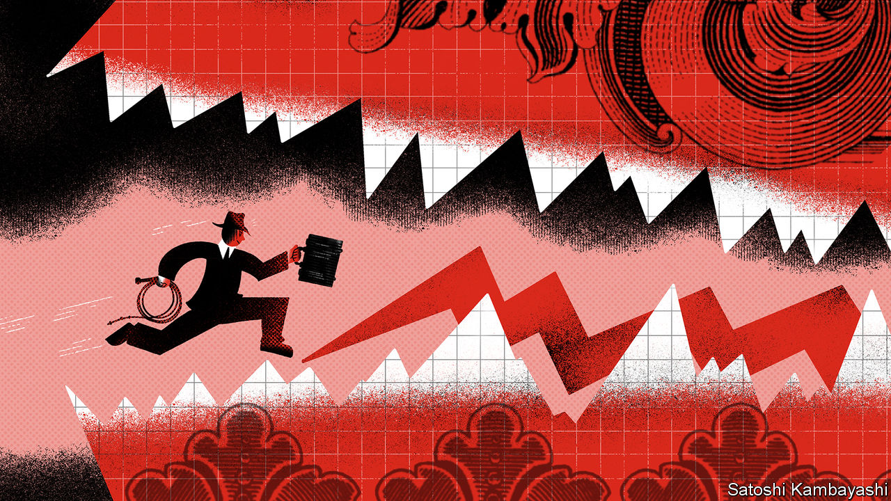
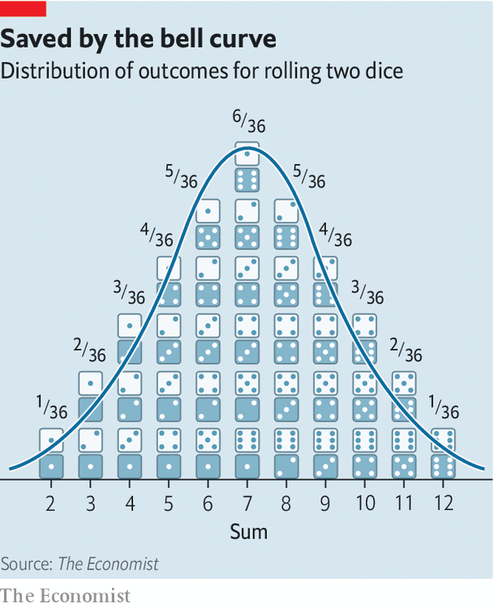

###### Buttonwood

# Looking at the world through the eyes of options traders 

##### The action that matters is not in the middle but in the fringes 

 

> Feb 15th 2020 

EVERY STONER knows, or has bored you silly, about the third eye. It is the imaginary oracular organ you develop as a side-effect of taking hallucinogens. The data from hazy late-night discussions in college dorms in the 1960s are quite clear on this. The strait-laced are too middle-of-the-road to grasp what is really going on in the world. The third eye allows you to see what they simply cannot.

Every investor could use a third eye. But there is one type who can claim to need it the most: options traders. They have to keep one eye on the most likely outcome and one eye on each of the best and worst scenarios. A lot of the time, the middle outcome—the average, the midpoint, the most common—is a good predictor. But for some things, some of the time, the middle lies on shaky ground. This is the world in which having options—or the right to buy or sell assets at a predetermined price—is most valuable. And the action that matters is not in the middle but at the fringes.


To understand why, imagine you had to bet on the height of the next man to walk into the coffee shop you are sitting in. A good guess would be 1.75m (5ft 9in), which is the average height of an adult male in America. It is likely that you would be wrong, but not by a whole lot. Many of the men who could walk in will be close to average height; very many will be an inch or two below or above it; and only very few will be a lot shorter or taller. The middle—the average—is a good predictor of how something entirely random will turn out.

A throw of two dice is similar. There are 36 possible pairs of numbers. Some throws are more likely than others: there are six ways to throw a seven, but only one way to throw either a two or a 12. If you display each possible throw by how often it occurs, it will follow the outline of a special kind of bell curve, known as a normal distribution (see chart). A lot of very different kinds of measures—IQ, exam scores, height—also look like this. A feature is that the values deviate from the average in an ordered way. Two-thirds of dice throws (24 out of 36) are within one standard deviation of the average throw, ie within a range of five to nine. In a normal distribution, 68% of outcomes are within one standard deviation of the average and 95% are within two.

 


The standard deviation—volatility—is a key concept in options trading. The VIX, or volatility index, is the best-known gauge for it. It is the level of volatility derived from the price of options on the S&amp;P 500 share index. (Put options confer on a buyer the right to sell the index at a specified “strike” price; call options confer the right to buy it.) Key inputs to the value of an option are expected volatility and the gap between the strike price and the index price. The more violently prices move, the more likely the gap between the two will be bridged—in which case the option pays off. If the VIX says that implied volatility is 14, as it does now, traders expect an annual standard deviation of 14% in equity prices.

The level of implied volatility depends on the weight of buyers and sellers. Vol sellers in effect supply insurance. They are betting on the middle, that the world will stay regular and normal, or become more so. People active in the options market describe all investment strategies as if they were options trades. To buy corporate bonds with low spreads, for instance, is like selling volatility: you get a low premium and cross your fingers it doesn’t default. Vol buyers, in contrast, seek insurance. They don’t believe the middle. They think the world will become more disordered. And sometimes they are right. Asset prices are not distributed in as ordered a way as height is. Extreme events, such as market crashes, are more frequent than normal distributions suggest. Volatility has been remarkably low—in stocks, bonds and currencies. Viruses, populism, trade wars, papal abdications and royal bust-ups—nothing seems to move the needle much. But no one can be sure how long the age of placidity will last.

People with squeegee-cleaned third eyes insist that vol must eventually go up. They blame central banks, which have relaxed monetary policy whenever markets panic, for suppressing volatility. The central bankers have been free to do so because inflation, their main obsession, has gone missing. A revival in inflation will one day force them to stop managing the markets. That is the big bet of options buyers. In the meantime, the standard investor will keep his two eyes firmly on the middle.

