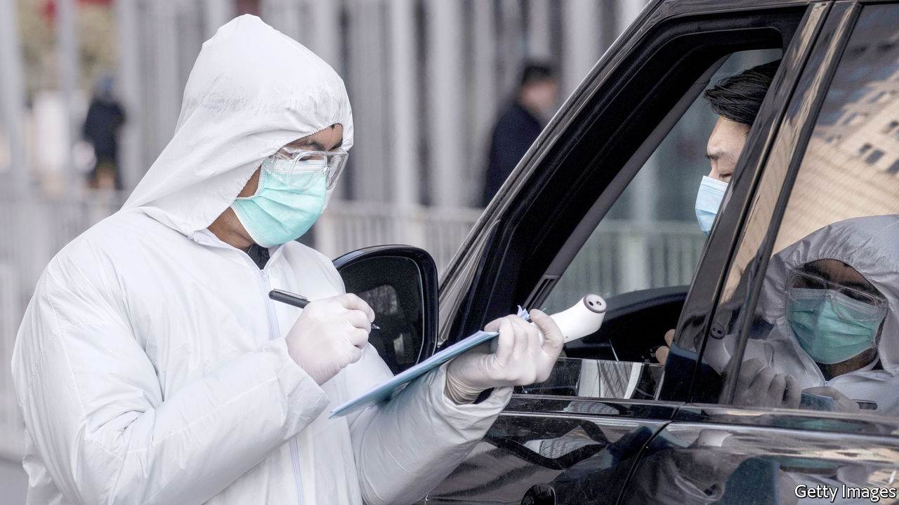

###### Viral slowdown

# How China’s coronavirus epidemic could hurt the world economy 

##### Covid-19 brings many unquantifiable risks 

 

> Feb 15th 2020 

WHEN SHOCKS hit the global economy, Wall Street looks to history to see what will happen next. The outbreak in China of covid-19, a respiratory disease, invites a comparison to the last one, SARS. In that outbreak in 2003 China suffered a sharp hit to its growth, followed by a strong rebound. Although covid-19 has now claimed more lives than SARS, investors remain optimistic that its economic effects will follow a similar path.

On February 13th Hubei province, centre of the outbreak, announced 14,840 new confirmed cases, a sharp rise. That was because it suddenly started including CT-scan diagnoses, not just specific tests for the virus. Although the statistical fog is thick, indicators such as the fall in new cases outside Hubei and the total of suspected cases suggest that the rate of fresh infections may be trending lower.


Most economists have thus only nudged down their forecasts for full-year global growth. Chinese stocks and commodities, which track economic prospects, have clawed back ground after initial falls. Global stockmarkets are higher than they were in January, when the severity of the outbreak became clear. We hope their optimism is justified. Yet the comparison makes two assumptions: in supposing that containing the virus maps neatly onto a better economic outlook; and in thinking that the world still works as it did when SARS was a threat.

There is an inherent tension between China’s apparent success in containing the epidemic and its growth prospects. Though less lethal, covid-19 seems more infectious than SARS. China has slowed its advance only by severely limiting people’s movement and closing businesses. If the government were to relax these controls too hastily, progress could stall or even go into reverse. So far, officials have erred on the side of caution. Provinces accounting for more than 90% of Chinese exports have kept factories either shut or running at low capacity since January 31st, when the lunar new-year holiday was due to end.

It is hard to overstate the effect on the economy. Coal consumption is more than a third lower than the average for this time of year. Property sales are down by more than 90%. After the holiday some 200m people usually leave their home towns to return to work. This year the trains that carry migrants have been nearly empty. Cities have warned outsiders that they might face 14-day quarantines. Nine out of ten companies surveyed by the American Chamber of Commerce in Shanghai have employees working from home. Couriers still zoom around on their electric motorbikes, but the takeaway trade is not saving restaurants because people fear eating meals prepared by strangers who may be infected. Grabbing a latte is a risk too far. Starbucks has shut half its 4,000-plus cafés in China.

The second doubt is over the relevance of SARS as a comparison. The global economy has changed since 2003, when SARS struck. China now accounts for 16% of global GDP, up from 4% back then. And it is the world’s second-biggest importer, so any weakness, however temporary, is felt far and wide. Already, some of its firms are trying to get out of contractual commitments to import copper and liquefied natural gas. And its tourists, who spend $250bn a year on overseas travel, are staying at home.

Accounting for China’s increased size is easy. But the economy has not just grown since 2000; its manufacturers have also become enmeshed in supply chains of mind-boggling complexity. A factory in Wuhan may provide parts to a firm elsewhere in China, which in turn supplies a factory in Stuttgart, with the final product emerging in Michigan. Just-in-time production leaves little room for delays. Many firms cannot trace all their suppliers, making it hard to predict the impact of work stoppages in China on their output, let alone on global GDP (see ). History provides little guidance on the effects of disrupted supply chains, because the world economy has not been organised around them for long.

Some problems have already emerged. Hyundai has halted some car production in South Korea because parts are short. So has Nissan in Japan. Facebook has stopped taking orders for its new virtual-reality headset and Nintendo has delayed shipments of new gaming devices. Foxconn, which makes smartphones for Apple and Huawei, has restarted its factories but with skeletal staffing. And these are just the brands you have heard of. China churns out a third of the world’s chemicals, half of its LCD screens and two-thirds of its polyester. Companies that think they are isolated from China could be in for a surprise.

It is also possible that the virus spreads rapidly outside China. Infections in developing countries may be going undetected. Vietnam has quarantined 10,000 people, but most governments could not enact the measures that China is using to slow the disease, so covid-19 could yet become a pandemic. Wall Street’s optimism, in other words, is premature. If economists have a bias, it is to focus on things that are measurable and quantifiable. Alas, the covid-19 outbreak brings many risks that are not. ■

