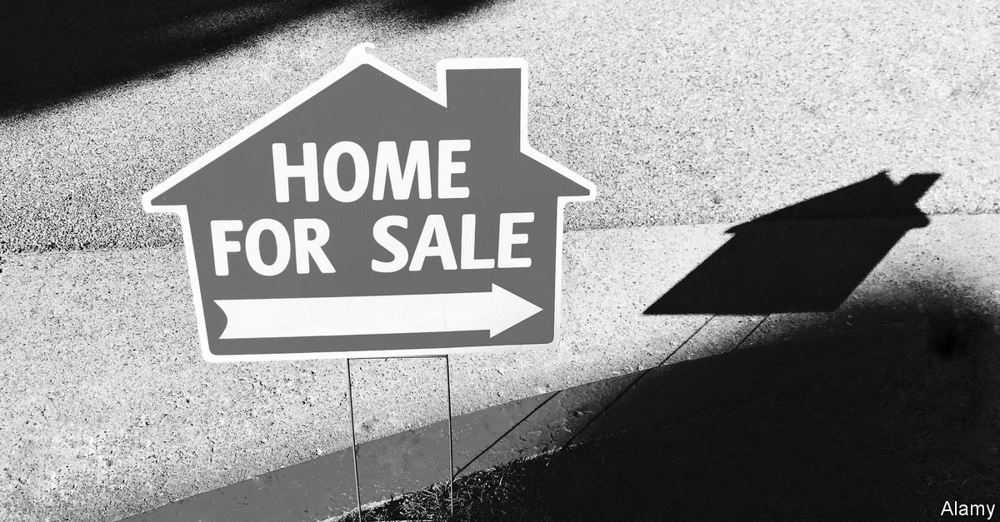
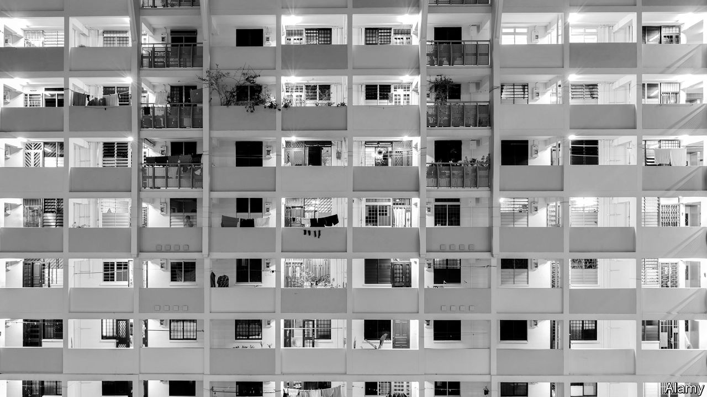
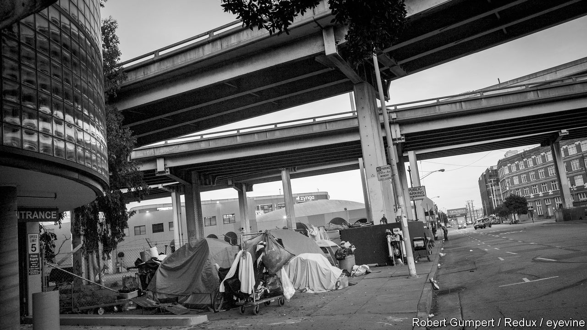

###### On housing

# Letters to the editor 

##### A selection of correspondence 

> Feb 15th 2020 

Letters are welcome via e-mail to letters@economist.com

 


As safe as houses

Though your attempt at presenting the issue of home ownership was engaging and unique, the coverage was incomplete (, January 18th). Home-ownership rates vary wildly across countries for a number of reasons. For example, to cite Romania’s high rate of private-home ownership, which went from zero to 95% virtually overnight after the collapse of communism, as somehow a failure because Romania still “has its fair share of social problems” is absurd. As is mentioning Japan’s affordable homes without acknowledging its declining population. To verify if these two variables are related consider Youngstown, Ohio, where the population is also falling and housing is exceedingly affordable.


You correctly point out that the rapid rate of job creation in San Francisco has pushed home prices to record high levels, but this is more the result of misguided local policy that has prevented developers from building homes than anything else. In fact, Texas and Utah have enjoyed even stronger job creation, but home prices in those states are manageable because construction has been relatively active. 

Home ownership provides immense benefits for our country (economic growth), local communities (civic engagement) and for families (wealth creation and stability that allows children to excel). In your dismissal of the positive values of home ownership, several questions should be asked. Who would own property, if not homeowners? Would it be landlords, small and corporate, and the government, but not the mass of citizens? Would a corporate oligarch-controlled property market provide for a better society? What about a government-owned one? The answer to all these is a resounding no. 

LAWRENCE YUNChief economistNational Association of RealtorsWashington, DC

I don’t agree that “Singapore’s public-housing system helps improve social inclusion” and is the model to copy. Its subsidised housing market is an income-regressive apology for a social-security system, one positioned in a wildly unequal society, where the elderly and disabled still have to clean the tables of the expats and tax havenites who make their lives increasingly unaffordable. If Singaporeans were provided with a respectable and progressive welfare programme, they might rely less on their government for housing and invest their funds in other assets.

MEGHNA BASUSingapore

 


Reaching retirement age without the security of home ownership is irresponsible. The senior citizen who has paid rent for 30 years has still bought property—for the landlord. Tenants have no long-term security. They can be asked to leave a property at any time. Landlords may fail to make repairs or control noxious neighbours. Home ownership is the surest kind of nest-egg. People are living longer. Security of place is basic to a comfortable old age.

JULIA VIERACoronado, California

Nimbyism significantly contributes to bad policies that exacerbate the growing gulf between those seeking housing and housing availability. Policymakers would do well to read your report and examine thoughtful, sustainable solutions that treat rental housing as a valuable part of their communities. Proper zoning and planning can address the affordability crisis by making it easier to add more supply as well as lowering our respective carbon footprints. As more people choose to rent a serious conversation is long overdue to address their needs, rather than continually crafting policy to protect homeowners.

ROBERT PINNEGARPresident and CEONational Apartment AssociationArlington, Virginia

 


Contrary to the implications in your report, today’s independent mortgage banks are appropriately regulated, not just by the federal Consumer Financial Protection Bureau and state regulators, but also by counterparty agreements with Fannie Mae, Freddie Mac, Ginnie Mae, and the lenders that extend them credit. As a result of the regulations that were implemented after the financial crisis, these companies are operating in the safest and soundest mortgage-lending environment for decades.

In the aftermath of the crisis, it was the independent mortgage banks that stepped up to support the housing recovery, providing credit to millions of well-qualified low-to-moderate-income, minority, veteran and first-time homebuyers. Rather than fret over their market share, regulators should focus on why these banks are being driven away from the mortgage business. 

BOB BROEKSMITPresident and CEOMortgage Bankers AssociationWashington, DC

Demographics drive house prices, too. The labour-force participation rate for women has ballooned over the past 75 years and dual-income couples now account for the majority of households. The resulting growth in household income helps explain in part why house prices have risen. But the age of first marriage has also increased, so attaining a dual household income comes later in life. “Still single” millennials will find it increasingly harder to step onto the home-ownership ladder.

JOHN SWETTENHAMOttawa

Modular construction saves building time, loss of material and environmental costs because of the easy ways to disassemble entire buildings in blocks. In Amsterdam, undeveloped sites are being leased out for ten years to social-housing associations. High quality flats are built within a few months. After the lease period, the buildings are disassembled, refurbished in a factory and moved to another location for re-use. Modular construction is 100 years old, espoused by great names in architecture such as Le Corbusier and the Bauhaus school.

FRANK VAN OOIJENBreda, Netherlands

Made-to-measure smart materials use 3D printing. In 2018 Amazon invested in Plant Prefab, which makes prefabricated smart homes. “Alexa, construct me a home” may soon be an option. The resulting lower housing costs will truly be something to build on.

CHRISTOPH FEESTNeuried, Germany

 


Homelessness isn’t just about economics; a large number of rough sleepers suffer from mental illness. Meanwhile, developers are constructing ever-higher apartment buildings in our cities that are bought for investment by the wealthy, who rarely use them. And they block the sunlight.

REBECCA TAUBNew York

Part of the appeal of homeowners is the notion that they are motivated to maintain their property. Yet a recent survey found that a third of millennial dads do not even own a hammer. Perhaps we have lost the do-it-yourself culture, or career mobility has undermined the enjoyment of labouring on your home. Your questioning of home ownership was uncomfortable, but necessary in a changing world.

GERALD LOEBSouth Pasadena, California

Renters miss out on one of the great pleasures of home ownership: making the final mortgage payment.

KEN OBENSKIKona, Hawaii

