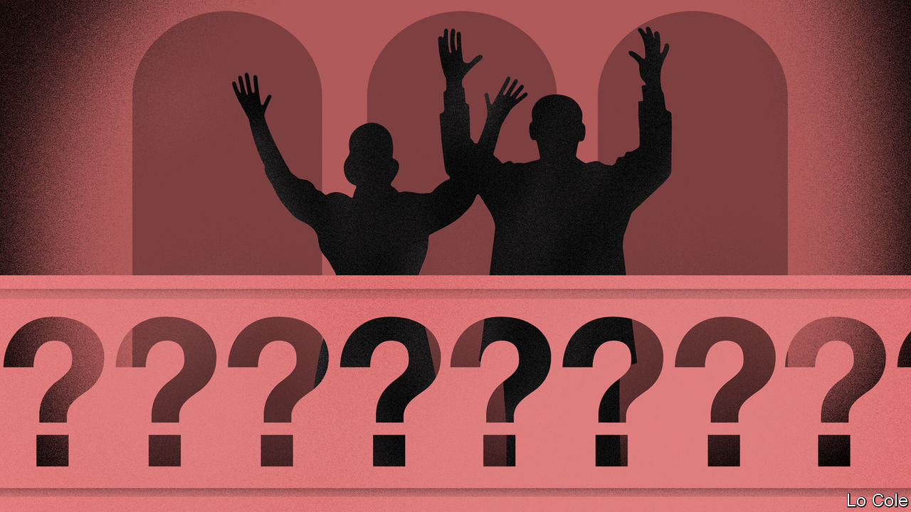

###### Bello

# “What is Peronism?” 

##### Argentina’s president tries to explain to the German chancellor 

 

> Feb 15th 2020 

ON FEBRUARY 3RD Argentina’s new Peronist president, Alberto Fernández, joined Angela Merkel for dinner at the German chancellery in Berlin. According to press reports, Mrs Merkel asked her guest a question: “What is Peronism? I don’t understand. Are you on the left or the right?” Bello imagines a conversation that might have followed.

Mr Fernández laughed. He was used to foreigners not knowing much about Argentina besides Evita, tango and hyperinflation. But something about Mrs Merkel suggested that she was only feigning ignorance. “Let me explain,” said Mr Fernández cautiously. “First of all, we’re not populists. That was an invention of Mauricio Macri, my neo-liberal predecessor. We don’t just stir up the masses.”


“Really?” asked Mrs Merkel, sounding unconvinced.

“Really. I’m a social democrat,” the president insisted. “The base of Peronism is the trade unions and the poor, whom we always look after. But we also have the industrialists behind us. They liked General Juan Perón’s protectionism 75 years ago and they like it today. And we have the pope.”

“As always, Perón himself put it best,” Mr Fernández continued. “In 1972 he told a journalist: ‘Look, in Argentina, 30% are Radicals…30% are conservatives and a similar amount Socialists.’ ‘So where are the Peronists?’ asked the journalist. ‘Ah,’ replied Perón, ‘we are all Peronists.’”

“Perhaps we should try this Peronism thing,” mused his host. Slightly alarmed, an aide to the chancellor intervened. “We have done some research,” he said. “And we have read ‘What is Populism?’ by Jan-Werner Müller, a German political scientist. The professor writes that ‘populists claim that they, and they alone, represent the people.’” The aide went on: “Perón said that his movement ‘has ceased to be the cause of one man to become the cause of the people’. He also said ‘true democracy is where the government does what the people want and defends a single interest, that of the people.’”

“Quite,” said Mr Fernández. “That’s why we have no social explosion in Argentina.”

“The first problem,” replied the pesky aide, “is who decides who constitute ‘the people’? Do those who disagree with you belong or not? What is clear to us is that Peronism is a populist way of exercising power, and that’s why you can be both left- and right-wing. Herr Professor also writes that populist governments usually try to hijack the state apparatus, are prone to corruption and practise ‘mass clientelism’. We have seen this in Argentina.”

Faced with such cold Weberian logic, Mr Fernández changed tack. “We are the people who know how to run the state and the economy,” he chipped in. “We are the professionals.” He explained that in 1989 and 2002 Peronists had inherited economic chaos. “And that’s what Macri left me, too,” he complained.

“True,” intervened the aide. “But it was the Peronists who created the mess in the first place. You have dominated Argentina since 1946. In that period the country has moved from the first world to the third.” There was an awkward silence. The chancellor cut in: “President Fernández…or may I call you Alberto?”

“Cristina does,” came the reply.

“Cristina? Oh, your vice-president, Cristina Fernández de Kirchner, who used to be president herself. Yes, I met her. Her government asserted in 2015 that there was more poverty in Germany than in her Argentina, which was nonsense. And she claimed to have abolished inflation by changing the head of the statistics institute. Germans would never stand for that. There’d be a revolution.”

“We are not hiding inflation,” said Mr Fernández. “I’ve frozen most pensions for a few months, so inflation will get rid of the fiscal deficit just as your bankers want me to. We’ve also negotiated a wage freeze with our union allies. As the Argentine saying goes, ‘Some bums will bleed more than others.’”

“Our companies tell me they won’t invest in Argentina until you lift exchange controls and open up the economy,” added the chancellor.

“I am a moderate,” said Mr Fernández. “I know that dollars don’t grow on ombu trees. Argentina should join the world. But you are asking me to dance the tango while I’m still in intensive care.”

As she finished her rabbit, Mrs Merkel said consolingly: “I can see that it’s not easy to be a Peronist social democrat.” “It isn’t,” said Mr Fernández. “The economy is a mess, everyone expects a Peronist president to shower them with money, and I don’t have any. I don’t normally drink, but I need a glass of Malbec.”

