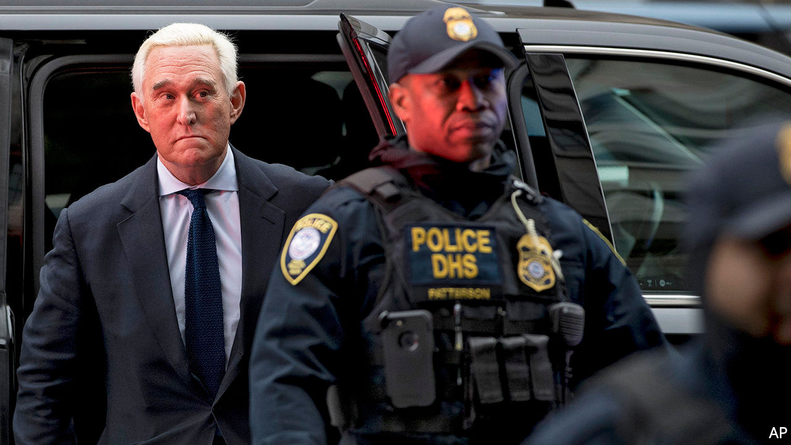

###### The DoJ heads south

# Acquittal has emboldened Donald Trump 

##### In Bill Barr, the attorney-general, the president seems to have found his Roy Cohn 

 

> Feb 15th 2020 

SUSAN COLLINS, a moderate Republican senator from Maine, voted to acquit Donald Trump in his impeachment trial. “I believe the president has learned from this case,” she said, before downgrading that “belief” to a “hope”. On February 12th a reporter asked Mr Trump what lesson he had learned from impeachment. “That the Democrats are crooked,” he replied. “That they’re vicious.” Welcome to the retribution project.

First Mr Trump showed that he would retaliate against those who testify against him. On February 7th he fired Gordon Sondland, America’s ambassador to the EU, who had told Congress that “everyone was in the loop” regarding efforts to pressure Volodymyr Zelensky, Ukraine’s president.


That same day Alexander Vindman, a lieutenant-colonel who had told Congress that Mr Trump’s call to Mr Zelensky was “inappropriate”, was removed from the National Security Council (NSC). Mr Trump suggested that the army should consider disciplinary action. Mr Vindman’s brother was also removed from his NSC job. Robert O’Brien, Mr Trump’s national security adviser, defended the dismissals, saying that America is “not a country where a bunch of lieutenant-colonels can get together and decide what the policy is of the United States.”

Then Mr Trump showed he will help those who break the law on his behalf. On February 11th four federal prosecutors abruptly withdrew from the case against Roger Stone, a sometime adviser to Mr Trump, after the Department of Justice pushed for him to receive a lighter sentence. Mr Stone was convicted of seven felonies related to his obstruction of Robert Mueller’s inquiry and facing a sentence of up to nine years.

On the same day Jessie Liu—who as US Attorney for Washington, DC, oversaw the prosecutions of several Trump associates, including Mr Stone and Paul Manafort—learned that the administration had withdrawn her nomination to a Treasury Department post. Last month she was removed from her former position and replaced by a top aide to William Barr, Mr Trump’s attorney-general.

The Department of Justice is not meant to be like other departments of the federal government, which jump when the president claps. But that distinction seems to have vanished. Mr Trump tweeted that the prosecutors’ recommendation of up to nine years for Mr Stone was “horrible and very unfair”. Later that day the government filed an amended sentencing request. It argued that the court should consider Mr Stone’s “advanced age, health, personal circumstances and lack of criminal history”, that the initial recommendation “could be considered excessive and unwarranted”, and that “it is unclear to what extent the defendant’s obstructive conduct actually prejudiced the government at trial”. As it happened, that same morning Mr Barr gave a speech to a group of sheriffs blasting “rogue DAs who undermine” law enforcement with lenient sentencing.

