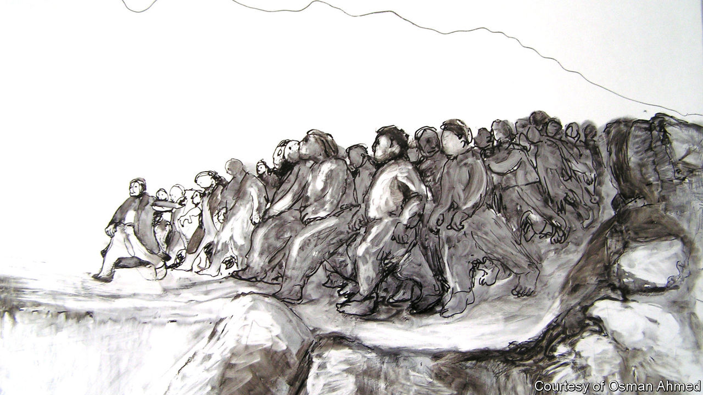

###### Remember, remember

# A Kurdish artist memorialises the experiences of his people 

##### Osman Ahmed trekked with the Peshmerga, armed only with a pencil and a sketch-book 

 

> Feb 22nd 2020 

“I REMEMBER IT was so cold and raining heavily,” recounts Osman Ahmed, “and somehow in the mountains it was snowing.” It was November 1985, and Mr Ahmed was making an arduous journey that would lead to an artistic one. He had been trekking across northern Iraq with Kurdish Peshmerga, to escape Baathist persecution during the Iran-Iraq war. Unusually for a militiaman, he refused to carry a weapon and was armed only with a pencil and a sketch-book. Making it across the Iranian border to Tehran, he discovered libraries replete with images of European art. But his subsequent efforts to reach Europe landed him in prison and refugee camps; reluctantly, he went back to Kurdistan.

It seemed to Mr Ahmed that no one was documenting the horrors of the conflict. He remembers his anguish, after returning to the mountains with the Peshmerga, to find that no radio station in the region was covering the destruction of Kurdish settlements. Then in 1988, during the last phase of Saddam Hussein’s genocidal Anfal campaign, government forces unleashed the worst-ever chemical-weapons attack on civilians in the village of Halabja. “If I make it through this war alive,” Mr Ahmed vowed, “I will make sure that the whole world knows about this.”


He has since become one of Kurdistan’s best-known artists; his pictures, which memorialise the suffering of his people, have appeared in galleries across the Middle East and Europe, including Tate Britain in London. His emotionally raw work is sometimes compared to Goya’s, though friends describe him as a Kurdish Toulouse-Lautrec, partly because of his small stature, but mostly for his observational style. For the PhD he completed in London in 2013, he documented Anfal in line-drawings based on the memories of survivors. Despite the grave subject matter, the drawings’ sense of movement—like the vibrancy of his earlier, modernist-inspired paintings—imbues his oeuvre with an air of resilience and vitality.fs

“I was shocked to see such vivid and lively works,” says Shad Abdulkarim, a collector who plans to include some of Mr Ahmed’s early paintings in the contemporary-art museum he is opening in the Kurdish city of Sulaymaniyah this year. That is one of the institutions now springing up to safeguard a culture that has helped sustain the Kurds’ stateless nation through centuries of conflict. Another is the Culture Factory, an expansive new arts hub that, with support from the Kurdistan Regional Government, is being developed in a formerly derelict tobacco factory in Sulaymaniyah. An exhibition of Mr Ahmed’s drawings opened in one of its galleries in December.

“Our political situation repeats every ten years,” says Daro Ola, the show’s curator and a co-founder of the Culture Factory. Mr Ahmed’s theme “of Halabja, refugees, of fleeing home—it’s always current.” Indeed, the parallel with Turkey’s recent attacks on Kurds in Syria is stark. Mr Ola suspects that younger Kurds, tired of politics and war, need to be reminded of their history, and thinks Mr Ahmed’s pictures can help. “It’s a different experience to see artwork about this subject rather than a documentary or photos,” he reckons. For his part, Mr Ahmed now abjures colour in his art. “Black and white”, he says, “is the best language to bring the pain out.” ■

