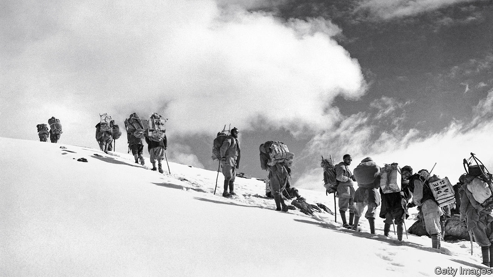

###### Summit diplomacy

# A race to the top of the world 

##### In the 1930s great-power rivalry played out in the Himalayas 

 

> Feb 20th 2020 

The World Beneath Their Feet. By Scott Ellsworth. Little, Brown; 416 pages; $30. John Murray; £25.

IN 1933, WHEN Maurice Wilson decided to pilot a single-propeller aeroplane from London to the Himalayas, crash land on a 14,000-foot glacier and ascend to the summit of Mount Everest by himself, he did not reckon on the forbidding challenge of British bureaucracy. After flying more than 5,000 miles (8,050 kilometres), the amateur aviator and mountaineer was denied a permit to cross Nepali airspace and grounded in British India. Undeterred, Wilson secretly slipped across the border into Tibet on foot, disguised as a Buddhist monk. The last entry in his diary, found near his body 2,300 metres below Everest’s peak, reads: “Off again, gorgeous day.”


Persistently optimistic—and perhaps completely mad—Wilson shared the determined idealism of the world’s best mountaineers. In his lively new book, “The World Beneath Their Feet”, Scott Ellsworth profiles the single-minded climbers who scaled the Himalayas’ tallest peaks in the 1930s. With war on the horizon, teams from Britain, the United States and Germany raced to plant their national flags on the “roof of the world”.

By the 1930s high-altitude mountaineering had become as much a source of national prestige as space exploration would be in the 1960s. “We ought not to treat the climbing of Mount Everest as a domestic issue,” argued a piece in theLondon Morning Post in 1936. “It is an issue of National and Imperial importance.” In Berlin the Reichssportführer demanded the conquest of Nanga Parbat “for the glory of Germany”; Nazi officials wondered whether mountaineering missions could facilitate high-altitude aircraft tests over the Himalayas.

The 23 expeditions undertaken between 1931 and 1939 invariably entailed extreme trials—among them perilous icefalls, pounding hail and fingers and toes lost to frostbite. The British Everest expedition of 1933 began with a 300-mile walk from Darjeeling to Base Camp in Tibet, where one climber felt the cold “must be that of interstellar space”. Not that these efforts were entirely without luxury. The failed French Himalayan expedition of 1936 was weighed down by eight tonnes of supplies, including 72 fillettes of champagne and “countless” tins of foie gras.

Many of these adventures ended in tragedy. Seven climbers and nine porters were buried by an avalanche during a German expedition to Nanga Parbat in 1937; it was, at the time, the worst disaster in the history of mountaineering. But for those who succeeded, the payoff was astonishing. “The horizon surrounded us in one unbroken ring,” wrote the American climber Terris Moore in his diary after reaching the summit of Minya Konka, “and I fancied that I could see the curvature of the Earth.”

Mr Ellsworth presents a gripping history, despite the occasional cliché (“Whether or not mad dogs and Englishmen could stay out of the noonday sun was debatable. But Englishmen…simply couldn’t keep out of the hills”). He takes care to describe the experiences and contributions of Nepali sherpas—including a young man named Tenzing Norgay—who were hired to support expeditions. Even as European and American mountaineers relied on their expertise, they typically maintained strict divisions between sherpa and sahib. Sherpas were nearly always allocated inferior equipment and lodging.

When war broke out in 1939, the mountaineers were forced to abandon the Himalayas for the front. But the race was merely on hold. In 1953, after seven failed attempts by British expeditions, Tenzing and Sir Edmund Hillary made the first successful climb to the summit of Everest. From the mountaintop, Tenzing waved the flag of the United Nations. “I like to think that our victory was not only for ourselves”, he reflected, “but for all men everywhere.” ■

