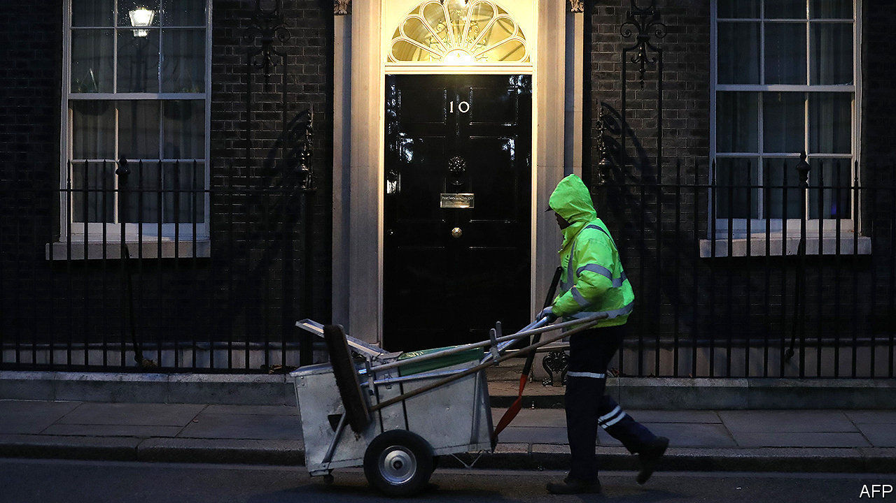
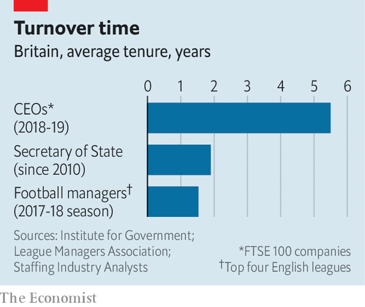

###### Reshuffle revisited

# British ministers come and go almost as often as football managers 

##### Secretaries of state change jobs too frequently—and the talent pool they are drawn from is too shallow 

 

> Feb 20th 2020 

THE BIG story of Boris Johnson’s first ministerial reshuffle on February 13th was the unexpected loss of his chancellor, Sajid Javid. But another feature is the acceleration of the ministerial merry-go-round. The Institute for Government (IFG), a think-tank, calculates that the average length of service of a senior minister in the past decade has fallen to less than two years—closer to that of a football manager than of a company boss (see chart). Junior ministers typically last even less time, frequently moving on after only a year.

Government suffers from such rapid turnover. There have been five justice ministers in the past five years, and ten housing ministers in the past decade (Esther McVey, the ninth, was sacked last week after serving six months). It is hard to recall policy successes in either department, and easy to spot failures. Nor is political churn offset by official stability. The IFG reports that the turnover rate among senior civil servants has risen as well.

 


The absence of training for ministerial office exacerbates the problem. A recent book* by Peter Riddell, a former head of the IFG, quotes many former ministers bemoaning their lack of preparation and saying it often took them two years to learn their job—at which point they were expected to move on and start all over again. Experience as a special adviser and then an MP—which is all many ministers have—is insufficient training for managing a complex department.


Britain is rare among rich democracies in requiring that all ministers must come from its legislature, which means that the talent pool is essentially limited to the ruling party’s backbenchers. Outsiders can be brought in through the House of Lords. But this has often been unsuccessful in practice, and MPs also complain that they cannot hold peers to account. Discounting those MPs whom one Tory chief whip memorably described as “the bad, mad, drunk and over the hill”, the talent pool becomes even shallower.

This could be a problem for Mr Johnson. Despite his 80-seat majority, he has many enemies inside his party. His reshuffle benefited keen Brexiteers in particular. Many political analysts reckon that this meant rewarding the compliant over the competent. The sacking of Julian Smith, the Northern Ireland secretary, fresh from his success in getting the province’s assembly up and running again, was widely criticised. As previous prime ministers have found, disgruntled big beasts lurking on the backbenches instead of in the cabinet can be destabilising.

Here at least Mr Johnson’s reshuffle featured one welcome innovation: bringing back those whom he had earlier sacked. Penny Mordaunt, a former defence secretary, and James Brokenshire, a former housing and local government secretary, have returned to more junior posts in other departments. Not all former cabinet ministers will feel able to swallow their pride after falling out with the prime minister and his Downing Street team. But the precedent of ministerial return may at least keep the talent pool that Mr Johnson has to draw from in future a little deeper.■


