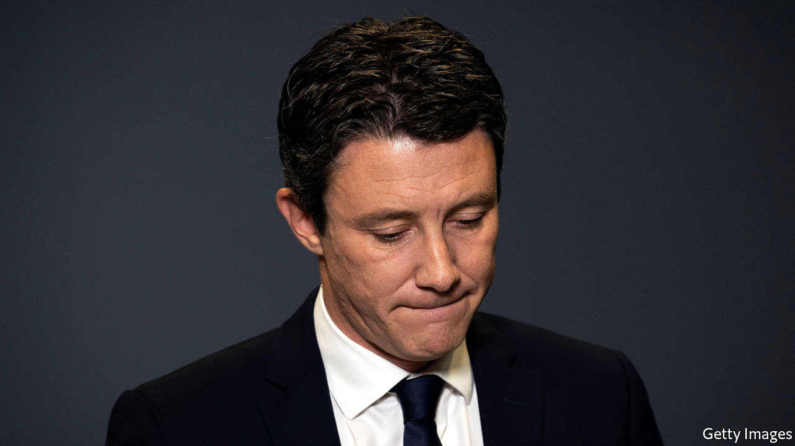

###### Liaisons dangereuses

# A sexting scandal makes France fret it is turning Puritan 

##### A Paris mayoral candidate drops out. A Russian artist is to blame 

 

> Feb 20th 2020 

IN MATTERS OF sex and politics, French insouciance rules that the public interest stops at the bedroom door. Presidents have often kept mistresses. Public opinion shrugs off such dalliances. While in office, François Hollande was photographed astride a scooter visiting his lover. In 1899 Félix Faure died in his mistress’s arms at the Elysée Palace.

Yet on February 14th Benjamin Griveaux, Emmanuel Macron’s struggling candidate for mayor of Paris, made history by standing down after a private sex video he made was posted online. Mr Griveaux, a close ally of the president, did not dispute its authenticity. In 2018 he sent the clip via an app to a woman with whom he was having a consensual liaison. On February 12th the video was posted by Pyotr Pavlensky, a Russian political artist, on a pornographic website along with an article denouncing Mr Griveaux. Within 48 hours he resigned.


To some this marks a cultural shift: the end of French tolerance of sexual indiscretion in public life. It represents the “Americanisation” of French politics, wrote one commentator; the embrace of “puritanism”, said another. That it was an effort to bring down Mr Griveaux is not in doubt. Mr Pavlensky, who once nailed his scrotum to the cobblestones of Moscow’s Red Square and was granted political asylum in France, said he was out to expose Mr Griveaux’s “hypocrisy”. While campaigning, the candidate posed with his wife and used the hashtag #happyfamily. Was this a sting from the start? Who else was involved? In a twist, the recipient of Mr Griveaux’s video, Alexandra de Taddeo, is now romantically linked to Mr Pavlensky. The police have brought preliminary charges for breaching privacy laws against both.

Yet most public anger is directed at Mr Pavlensky and the perils of technology, which suggests sexual culture may not have changed that much. One in five French people say they have shared sexual images of themselves. The political reaction has been near-universal revulsion—not at Mr Griveaux’s behaviour, but at the way it was exposed, and the Russian link. “Odious”, tweeted Jean-Luc Mélenchon, a far-left leader who usually delights in Mr Macron’s woes. Others were darker still. The affair, warned Le Monde, carries the risk of “a fatal erosion of democratic life”.

