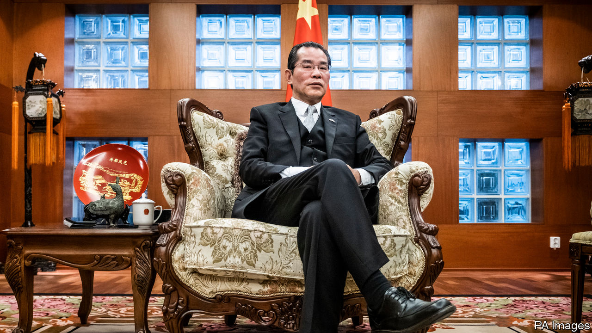

###### Shotgun diplomacy

# How Sweden copes with Chinese bullying 

##### “For our enemies, we have shotguns,” warns Beijing’s ambassador 

 

> Feb 20th 2020 

TRADITIONALLY, CHINESE ambassadors are restrained, colourless figures who emerge from the wallpaper only to object ritually that any criticism of their government is an insult to Chinese people. Gui Congyou, China’s ambassador to Sweden, has taken a different tack. He and his embassy denounce journalists and public figures for perceived slights on an almost weekly basis, a pace so unusual it has been studied by Swedish political scientists. He has been summoned to Sweden’s foreign ministry more than 40 times in two years.

But Mr Gui has only grown more outspoken. Interviewed on Swedish public radio in November, he sounded like a gangster: “We treat our friends with fine wine, but for our enemies we have shotguns.” Mr Gui offers a glimpse of a newly forceful brand of Chinese diplomacy (see ). The regime is quicker to take offence, and retaliates more harshly.


Sweden has friendly business ties with Chinese companies: Volvo is now owned by a Chinese carmaker, and Swedes are happy with that relationship. But the two countries are at odds over human rights. In 2015 Gui Minhai (no relation to the ambassador), a Swedish national who was a bookseller in Hong Kong, disappeared in Thailand and reappeared months later in Chinese custody. His crime seemed to have been selling disparaging books about President Xi Jinping. Mr Gui was released in 2017, but was snatched again months later by plainclothes agents on a train from Shanghai to Beijing, while he was being escorted by Swedish diplomats. The Swedes have been repeatedly denied consular access to Mr Gui; China claims he does not wish to see them. The authorities say he tried to leak state secrets to foreigners.

The bookseller’s case has poisoned Chinese-Swedish relations. In November, when he received an award from the Swedish branch of PEN, a free-speech group, the Chinese embassy demanded it be rescinded. Then Ambassador Gui warned of “consequences” if Sweden’s culture minister participated in the ceremony. (The minister ignored the warning.) In December the ambassador warned that China would restrict trade with Sweden in retaliation.

All this bluster has won no concessions. Sweden’s government plans to subject Chinese investments in Swedish companies to more scrutiny. The business press has also turned more sceptical of Chinese investment. In November the parliament passed a law that allows for a national-security review of Huawei as a potential supplier to Sweden’s 5G network. That could mean favouring Ericsson, a Swedish native, over the Chinese firm. In December some opposition MPs called for Ambassador Gui to be declared persona non grata. The public is no more friendly: in a survey of 34 countries last year by the Pew Research Centre, 70% of Swedes had an unfavourable opinion of China. Only Japan was more hostile.

China may be using Sweden to send a message to the world—just as it shunned Norway for years after the Nobel Peace Prize was awarded to Liu Xiaobo, a man who argued that the Chinese people should be allowed to select their own rulers. Ambassador Gui recently remarked to a Swedish newspaper that, for all his talk of shotguns, Sweden was “not important enough to threaten”.

Still, the ambassador’s non-threats seem to have had an effect. Last year the United Nations Development Programme’s office in Stockholm cancelled a human-rights gala at the last minute; Chinese diplomats reportedly objected because it involved photos of the Dalai Lama. And a former Swedish ambassador to China will stand trial in March for allegedly arranging, without authorisation, talks between Chinese representatives and the daughter of the imprisoned Mr Gui, in an apparent effort to secure the daughter’s silence. Some China-watchers worry that the government secretly wanted the bookseller’s case shoved under the rug.

A rapprochement looks improbable, and it is hard to imagine Ambassador Gui helping to achieve one. He is described by Swedes who have met him as an old-school party apparatchik, less polished than some of his foreign-ministry colleagues. A Russian-speaker with little English whose previous post was in Moscow, he was an odd choice for Stockholm. Meeting with Swedish sinologists at his residence not long after his arrival in 2017, Mr Gui said he had no idea why he was sent there. He then offered a toast in Chinese over a glass of grain alcohol. “To Gui Minhai’s victim!” he declared, an apparent reference to the car accident for which the bookseller was nominally jailed, and emptied his tumbler. His appalled guests did not join him. ■

