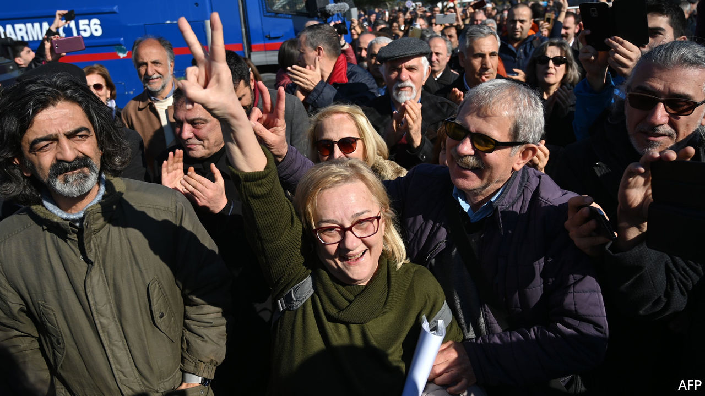

###### Guilty of caring

# Turkey acquits the Gezi Park protesters, then rearrests one 

##### Demonstrators against President Erdogan’s government do not go unpunished 

 

> Feb 20th 2020 

THE FINAL hearing in the trial of the environmental activists was rushed. Throughout the case, the court had failed to scrutinise evidence. So on February 18th, when the judge told the defendants they were acquitted, a stunned courtroom broke out in applause. The relief was short-lived. Ruling-party officials tweeted their disapproval, and by nightfall Osman Kavala, the best-known of the group, was arrested again.

The philanthropist, who has spent his fortune saving historic monuments and promoting dialogue with Armenians and Kurds, is now charged with aiding an attempted military coup in 2016. The new investigation lets the government ignore the European Court of Human Rights (ECHR), which in December ordered Mr Kavala to be freed and said his detention was meant to muzzle civil society.


In the protest case, the prosecution wanted Mr Kavala sentenced to life for allegedly masterminding anti-government protests sparked by plans to demolish Istanbul’s Gezi Park in 2013. The proof? He bought pastries and gas masks for protesters. Now he could face another life sentence. Prosecutors have yet to explain what the lifelong leftist was doing in a military uprising linked to an Islamist sect. But Turkey’s president, Recep Tayyip Erdogan, has used the attempted coup to justify thousands of dubious arrests. Turkey’s judiciary is ranked 109th out of 126 countries on the World Justice Project’s rule-of-law index.

Mr Kavala’s acquittal and re-arrest suggest a governmental power struggle. But such decisions “would never be made without President Erdogan’s consent”, says Garo Paylan, a leftist MP. The president says Mr Kavala takes orders from “the famous Hungarian Jew”, referring to his work with the Open Society Foundations founded by George Soros.

Gezi Park still stands, a scruffy patch of grass and trees. But Turkish civil society has melted away, as has any appetite for street protests. Seven years ago, the construction of a giant mosque near the park, one of Mr Erdogan’s pet projects, was a divisive issue. The mosque has since gone up without a whimper. Ahead of his acquittal, Yigit Aksakoglu, one of Mr Kavala’s co-defendants, described how the surreal trial had upended their lives. “I feel like I’ve been vacuumed into a movie,” he said. “Damn the park, let them build whatever they want to build.”

