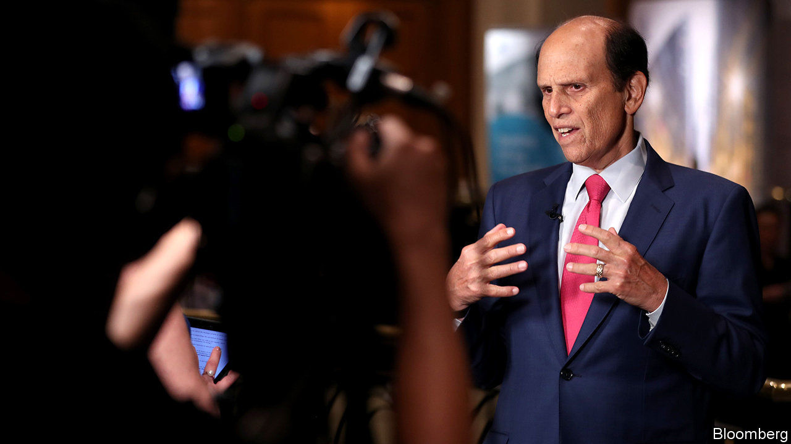

###### Friends in high places

# Michael Milken receives a presidential pardon 

##### The junk-bond king gets a ratings upgrade 

 

> Feb 20th 2020 

ON FEBRUARY 13TH 1990 Drexel Burnham Lambert, which only a few years earlier had been America’s most profitable investment bank, filed for bankruptcy. Its death knell had sounded ten months earlier when Michael Milken, who created the junk-bond market on which the bank’s success was founded, was indicted for fraud. He would plead guilty to six counts and serve 22 months in prison.

Thirty years on, Mr Milken has been pardoned by President Donald Trump. Among his petitioners was Rudolph Giuliani, the president’s personal attorney, who had led the investigation into Drexel three decades ago. The pardon was much sought after. Many of the people who worked at Drexel have long felt that the prosecution of Mr Milken was, in essence, a vendetta. Drexel was an upstart firm. It unsettled corporate America by supplying junk-bond finance to a new breed of corporate raiders. It used its dominance of high-yield-bond trading, which Mr Milken had built up in the 1970s and early 1980s, to push into mergers and acquisitions and underwriting. That put noses on Wall Street out of joint. “We were not very humble about our success,” says a former colleague. So when the Feds came for him, Mr Milken had few friends in high places and a lot of enemies. He made a handy scapegoat for the savings-and-loan crisis.


If that was the reality then, things are quite different now. A statement from the White House listed 33 names of the great-and-goodish behind Mr Milken’s appeal. And the fresh-faced MBAs who flocked to work with Mr Milken in the 1980s are now the financial establishment. The Drexel diaspora is a roll-call of the leading lights in the world of private-equity and private-credit markets.

What is striking about the diaspora is their enduring reverence for “Mike”. Part of this is a recollection of an exciting time, when visiting entrepreneurs would pitch madcap ideas: a 24-hour-news channel; a casino with a fake volcano. If you had an idea and a sliver of equity, Mike and his team would raise the necessary debt. It is also—perhaps mostly—a form of gratitude for a unique education in markets and in the importance of understanding a company’s capital structure, its mix of debt and equity finance. The skills acquired in the buy-out boom of the 1980s are perfectly tailored for today’s boom in private equity. The diaspora owe their lucrative careers to what they learned from Mike.

The question naturally arises as to why a pardon could possibly matter now. Mr Milken pleaded guilty. He served time. So central was he to the network of issuers and buyers in the junk-bond market that it would seem a minor miracle if he had not transgressed some aspect of securities law. Mr Milken is already applauded for his philanthropy. He is now 73. An official exoneration may permit a kinder judgment of his legacy: as a financier who widened access to corporate credit. When Wall Street sneered at “junk bonds, junk people”, Mr Milken would remind his apostles that anything AAA-rated can only go down. But anything rated as junk can always improve its standing. ■

