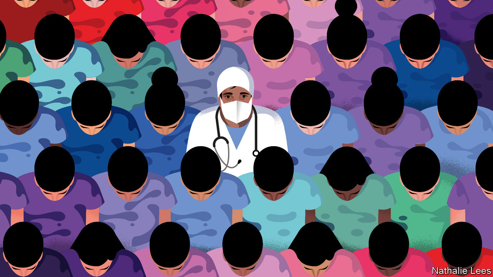
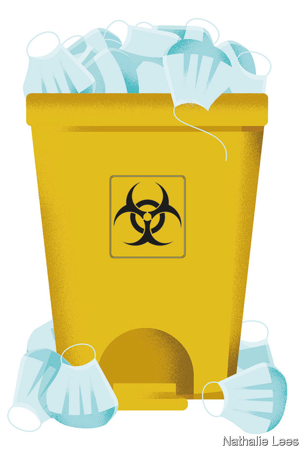

###### Watchful waiting

# Experts predict that covid-19 will spread more widely 

##### The world is getting ready. Poor countries are especially vulnerable 

 

> Feb 22nd 2020 

“THERE ARE so many crises in Congo.” Gervais Folefack, who co-ordinates the emergency programmes run by the World Health Organisation (WHO) in the Democratic Republic of Congo, has mastered the art of the understatement. The country has been shattered by war and corruption. “All the time we are responding to crises,” says Dr Folefack. He lists the most recent: Ebola, measles, cholera. To them, he may well have to add covid-19, a respiratory disease that originated in China. Those who would need to respond to a surge in covid-19 cases are already busy with the Ebola outbreak that began in 2018. “We are trying to prepare,” continues Dr Folefack, but there is simply not enough time.

So far 99% of confirmed cases of the new coronavirus have been in China. Of the 1,000-odd cases outside mainland China, more than half have been on the Diamond Princess, a cruise ship docked in Japan; the rest are scattered among 27 countries, mostly in Asia. Covid-19 has spread rapidly in China despite the government locking down entire cities for weeks. China’s efforts, along with the travel restrictions that many countries have imposed on its citizens, have slowed the virus’s progress. But many experts fear that it will inevitably become a pandemic. Health authorities are frantically trying to prepare.


On February 12th Nancy Messonnier of America’s Centres for Disease Control and Prevention (CDC) said America should be prepared for the virus “to gain a foothold” in the country. Doctors in South Africa are on high alert, says Cheryl Cohen of the National Institute for Communicable Diseases. More than 850 medics in all nine of the country’s provinces have been taught to spot the disease. The WHO is sending surgical masks, gowns and gloves to hospitals in more than 50 countries. It is teaching health workers across Africa how to use them to prevent covid-19 infections—and how to treat those who have the disease.

Growing numbers of countries are screening passengers at airports and borders for signs of covid-19. But when a virus starts travelling around the world, says Michael Ryan of the WHO, its real point of entry is a busy emergency room or a doctor’s surgery. In the 2003 outbreak of SARS (severe acute respiratory syndrome), another coronavirus which spread to more than 20 countries, about 30% of the 8,000 people infected were health-care workers. Many, if not most, of the SARS outbreaks around the world—from Toronto to Singapore— started in a hospital with a single patient who had been infected abroad.

In countries where covid-19 cases are still rare doctors are, for now, trying to identify suspected patients by asking those with a cough and fever about recent travel to countries with outbreaks of the disease and then testing them. In America if patients test negative for seasonal flu, laboratories are starting to test for covid-19 (the country has so far identified 29 cases).

Confirming a suspected infection in a laboratory can take days. Some small European countries have just one or two laboratories able to process covid-19 tests. Europe’s entire supply of test kits is shipped from the two main laboratories of the European Centre for Disease Prevention and Control (ECDC), the EU’s public-health agency. America’s supply all comes from the CDC in Atlanta. It will be several months before commercial tests are available.

Tests could soon run short if other countries experience covid-19 epidemics like China’s. Delays in getting the results would increase. A lab technician must first prepare the samples. After that, processing each test through a molecular-analysis machine can take an hour and a half. These machines also run tests for the seasonal flu and other diseases. A covid-19 epidemic in the middle of winter—peak season for the common flu—would quickly overwhelm laboratories in most countries. Rapid diagnostic tests for the new virus that are as quick to carry out in doctors’ offices as pregnancy tests were at the top of the wishlist at a WHO meeting about research priorities for covid-19 in February.

Once an epidemic is in full swing, extensive testing to find everyone who might have the disease is less useful, says John Hick, an emergency co-ordinator at the Hennepin County Medical Centre in Minneapolis. At that point, he says, doctors will start to diagnose probable cases by symptoms alone—which is common practice for many illnesses, including the flu. Medics in parts of China are already doing this.

As with other contagious diseases, covid-19 patients in hospitals must be isolated to prevent its spread. When patients become too numerous to contain in isolation rooms, shared rooms, wings or entire floors may be set aside for covid-19 patients only. The Vrije University hospital in Amsterdam has dusted off its plans for doing this, including where to put “do not cross” lines to separate such sections, says Rosa van Mansfeld, who oversees infection prevention there. When all Dutch hospitals are overwhelmed, the lights will be turned on at the country’s “calamity hospital”, a fully equipped facility in Utrecht that is otherwise shut (it last opened to care for the victims of a terrorist shooting in 2019). In Kinshasa, Congo’s capital, an empty Ebola treatment centre will be used when covid-19 cases are identified.

Dr Hick says the biggest challenge if the disease starts to circulate widely in Minneapolis will be staffing. With no vaccine to protect them, many doctors and nurses will be infected. Others will need to stay at home to look after their children because schools may be closed. In its disaster planning, the hospital where Dr Hick works considered offering child care on-site for its staff. But he admits that people may be reluctant to bring their offspring to a hospital during an epidemic.

Hospitals will encourage people who do not seem to be seriously ill to stay away, as they do during the peak of seasonal flu. In part, that is to prevent them from straining the capacity of hospitals that are already overwhelmed. Doctors have no treatment to offer those with mild symptoms but in a hospital they can infect other patients or medics. Such people will be advised to isolate themselves at home. Others with mild symptoms may in fact have a different bug—but if they flock to hospitals, they may contract covid-19 for real.

Hospitals in both rich and poor countries are worried that in the event of an epidemic they will quickly run out of masks, gowns and gloves. Guidelines by the ECDC say that 24 disposable sets per day may be needed for a covid-19 patient in an intensive-care unit. The WHO says that a global shortage is already occurring, with a 20-fold rise in prices for some types of equipment. Surging demand in Asia, stockpiling by hospitals and disrupted production in China have all contributed to shortages of surgical masks.

Some hospitals are trying to conserve supplies. Dr van Mansfeld says that nurses in her hospital in Amsterdam are being reminded not to use the high-protection respirator masks if they are caring for patients for whom the guidelines say ordinary surgical masks suffice. At some point, says Dr Hick, medics may have to start reusing respirator masks judiciously. Instead of throwing them away after each patient, they could remove them, handling them particularly carefully so that any germs on the outer surfaces are not transferred to their mouths or noses, and re-use them.

The swine-flu pandemic, which was caused by the H1N1 virus and infected 16% of the world’s population in 2009, brought home the message that doctors would have to make such tough decisions when big epidemics strike, says Dan Hanfling of In-Q-Tel, an American organisation that invests in national-security technology. Between the first and the second wave of H1N1 infections in America, the country’s National Academies of Sciences developed a set of “crisis standards of care”. These specify what doctors should do as shortages of medical supplies become worse.

 


One course of action is to substitute treatments with near-equivalents, such as drugs that have a similar effect. Another is to adapt what is available for different uses. For example, simpler breathing machines from ambulances may be used as substitutes for the sophisticated machines in intensive-care units. Medics may have to clean and re-use equipment, such as catheters, rather than throw it away after each use (as doctors in poor countries do every day, Dr Hanfling points out).

The hardest decisions would come when all these options are exhausted. Few countries have discussed how doctors would choose which patients get ventilators when there are not enough for everyone who needs one. If doctors have one patient who is on a ventilator but clearly getting worse, and another who is healthier and more likely to survive, they can justify reallocating the ventilator to the second patient. But such decisions would be particularly hard to make with covid-19, based on what doctors already know about the disease. A patient may be on a ventilator for several weeks and show little improvement but still make a good recovery.

Be prepared

America is ahead of most countries in planning for such things, says Dr Hanfling. Disasters such as Hurricane Katrina—when many patients died in hospitals that were unprepared for disaster—laid bare the need to prepare for the worst. Each year the federal government gives states and hospitals about $1bn specifically for disaster preparedness. That is more than the national health budget of many African countries. Other countries’ recent experience may help them. Kerala, the only state in India to have confirmed cases of covid-19, swiftly contained an outbreak of Nipah, a nasty virus, in 2018 and has since bolstered its health system. Uganda has held back the spread of Ebola from next-door Congo and in the process built up stocks of protective clothing for health-care workers.

But poor countries would be hit particularly hard by outbreaks of covid-19. Uganda is used to dealing with diseases transmitted through blood, mosquitoes or parasites. Covid-19, if it comes, could spread quickly and unpredictably, which would test a cash-strapped health-care system. Ian Clarke, chair of a private health federation based in Uganda, worries that the mortality rates could be higher in Africa than they are in China because many people already have weakened immune systems as a result of HIV or poor nutrition. SARS mostly skipped Africa; the continent may not be so lucky with the new virus.■


