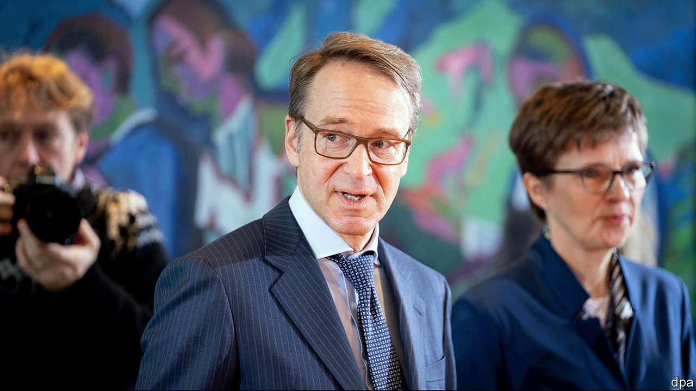

###### The Bundesbank

# Healing the rift in Europe’s single currency 

##### The central bank is one of Germany’s most trusted institutions 

 

> Feb 20th 2020 

FEW POST-WAR economic institutions have been as successful as the Bundesbank. Its tough stance on inflation in the 1970s ensured that, while the world battled double-digit price rises, those in Germany were relatively contained. Its credibility with the public and markets was so strong that other countries were keen to harness its might, leading to the creation of the single currency in 1999. Jacques Delors, a European politician, once joked not all Germans believe in God, but they all believe in the Bundesbank. Others in Europe were ready converts, ceding monetary sovereignty to the European Central Bank (ECB), which is based in Frankfurt, and was at first heavily influenced by German economic doctrine.

The Bundesbank has a distinct role and identity—it represents Europe’s biggest economy at the ECB, runs payments systems, operates in the bond markets and continues to be admired by most Germans. But relations with the ECB have soured, partly as a result of the euro-zone sovereign-debt crisis. After 2011 influence gradually drained away from the Bundesbank and power became concentrated under Mario Draghi, then president of the ECB (see ). His successor, Christine Lagarde, wants a fresh start. Both sides need to make up. If they do not, they risk a botched response to the next recession and a deadly seeping away of German voters’ trust in the euro.


Like most Germans, the Bundesbank has a horror of debt-monetisation and an aversion to inflation. Its austere philosophy has come into conflict with the ECB’s efforts to hold the euro together and prop up growth. In a court case in 2013 Jens Weidmann, the Bundesbank’s boss, gave evidence against Mr Draghi’s commitment to do “whatever it takes” to save the euro through unlimited bond purchases (outright-monetary transactions, or OMTs). By the end of Mr Draghi’s term, the quarrel seemed personal. Interest-rate cuts and the resumption of quantitative easing (QE) last autumn prompted a backlash in the German press. Mr Weidmann has supported rate cuts, but German public opinion has turned against the ECB on his watch. Bild, a German tabloid, has depicted Mr Draghi as a vampire feeding on German savings.

All central banks benefit from debate—indeed, some could do with more of it. But the stand-off could harm the ECB. When a downturn strikes, it cannot afford to be side-tracked by infighting. And recession is an ever-present risk. In the last quarter of 2019 output either fell or stagnated in France, Germany and Italy, which together make up around two-thirds of the euro zone’s GDP. Because interest rates are already negative, the ECB’s best hope for providing stimulus would be to buy more bonds. But this would eventually require raising the ECB’s self-imposed limits on the share of a country’s debt it can hold. The Bundesbank would almost certainly resist that.

A more insidious risk is a leaching away of faith in the single currency from its largest member state. That would be a disaster, undermining the viability of the euro in the long run, and posing a mortal threat to both the ECB and the Bundesbank.

Both sides have work to do. The Bundesbank is entitled to its own philosophy. But it needs to accept that the facts have changed. Its fears that loose monetary policy would cause a surge in inflation have not materialised. Agreeing to a proposal to make the ECB’s inflation target symmetrical around 2%, by removing the “close to, but below” wording, would signal that it is principled but not ideological. And it could wield its influence at home more effectively. Isabel Schnabel, Germany’s new pick for the ECB’s executive board, has begun to take on misconceptions of its policy—showing, for instance, that real interest rates on savings deposits in Germany are close to their average over the past 24 years. Mr Weidmann could do more to defend collective decisions.

In return for the Bundesbank taking more responsibility, the ECB should try to bring it back into the fold. On paper it makes decisions by consensus. But by the end of Mr Draghi’s term the dissenters were being left by the wayside.

So far the signs are promising. Ms Lagarde’s arrival makes it easier to leave behind the emotional baggage of the Draghi era. She has vowed to be more inclusive and launched a wide-ranging strategy review. This is an opportunity for Mr Weidmann. To his credit, he has become less uncompromising, saying last year that OMTs are part of the ECB’s toolkit, and cautioning against Germany fetishising its own fiscal rules. Ironing out the differences today could spare the ECB from a speculative attack in the next recession.

The Bundesbank is still a mighty intellectual and institutional force. But that will count for little if its intransigence causes Europe’s economy to weaken needlessly. And if the single currency falters, obstinacy will be self-defeating.■

