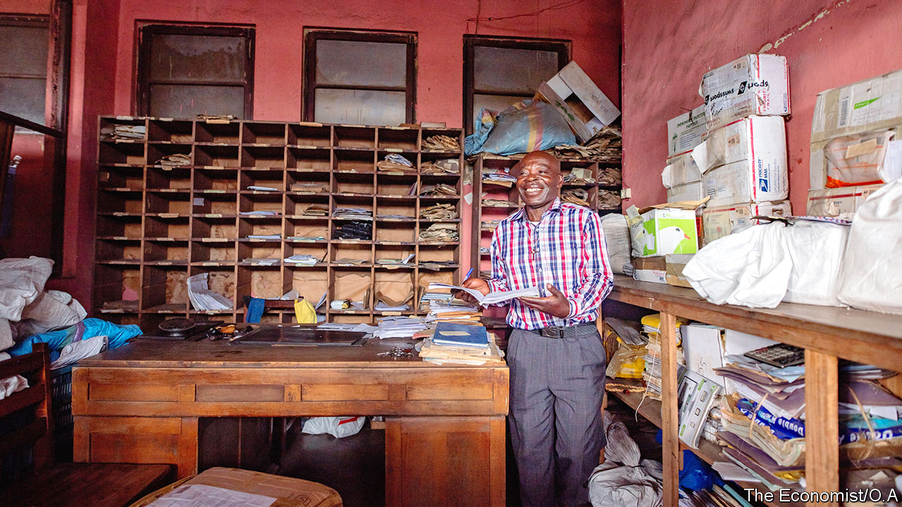

###### The postman never rings at all

# Why delivering the mail in Congo is so hard 

##### No street numbers, no wages and lots of rebels 

 

> Feb 20th 2020 

A HISTORIAN REMARKED, of the ancient Persian postal system, that “neither snow nor rain nor heat nor gloom of night stays these couriers from the swift completion of their appointed rounds.” Snow is not much of a problem in the Democratic Republic of Congo, but dozens of rebel groups make delivering the mail rather difficult. So do bad roads and a dysfunctional government.

The main post office in Goma, a city of 2m in eastern Congo, is a vast rectangle with turret and colonnade, built by the Belgian colonial government in 1955. Inside it a worker tips a sack of letters from Kinshasa, the capital, onto a table. He sorts them into wooden lockers according to their destined village, town or region. Most will never get there.


The post office’s director, Dominique Molisho, reckons that only 40% of letters reach their recipients. Many houses in Goma do not have addresses, he explains. Moreover, people move often. Matters are even trickier outside the city in the rest of North Kivu province, an area larger than Switzerland where more than 40 rebel groups lurk in the bush.

Just nine out of the province’s 19 post offices are still open. The rest have been looted or abandoned. Some were used as headquarters by rebel groups. In 2013 the M23, a Rwandan-backed militia, occupied one in Rutshuru. Troops from another militia, the FDLR, often slept on the floors of the Masisi branch. Back in 1996 Laurent Kabila, a Rwandan-backed warlord who marched on Kinshasa and declared himself president, used the Goma post office as his recruitment centre. Gunmen tend to leave little intact, says Mr Molisho. They rip out doors and shutters and use them for firewood.

Rural Catholic missionaries sometimes help, picking up bundles of post every week and pinning letters to the windows of parish buildings, where villagers come to collect them. The missionaries also sell stamps, and take letters to Goma on their return trip.

In its heyday, 100 years ago, the postal service was one of the most desirable employers in Congo. “Back then, everyone wanted to work here,” says Mr Molisho. Today its glory is as faded as the red paint on the walls of the Goma branch, where staff have not been paid for a year. They make ends meet by leasing adjacent land to small businesses.

Still, they are proud. “A letter is a letter, nothing can replace the post,” says Martin Wema, the immaculately dressed finance director. Before leaving, your correspondent is asked to leaf through a dusty pile of letters addressed to aid workers in Goma, in case she happens to know any of them. After spotting two familiar names on envelopes dating back a year she is sent away with a handful.

