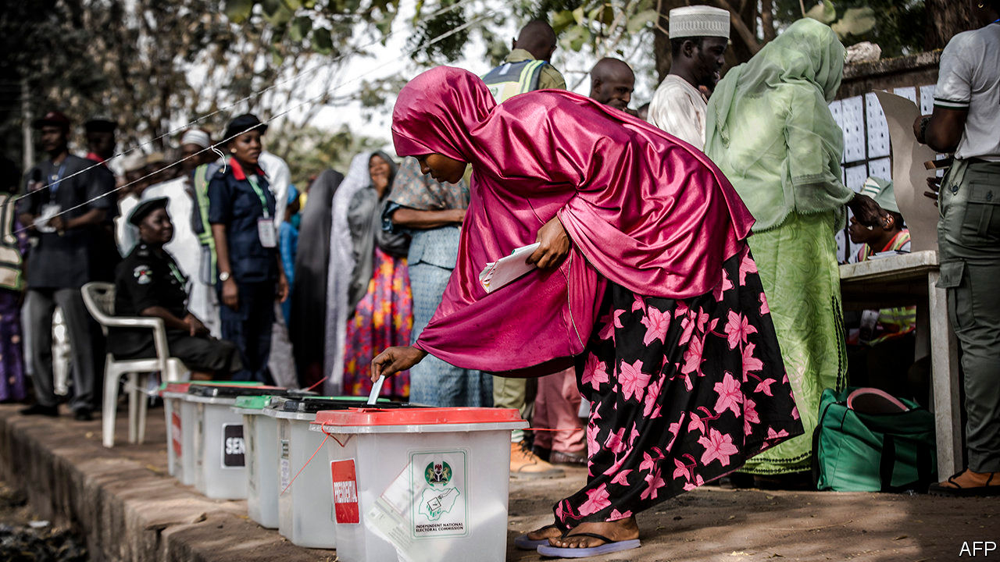
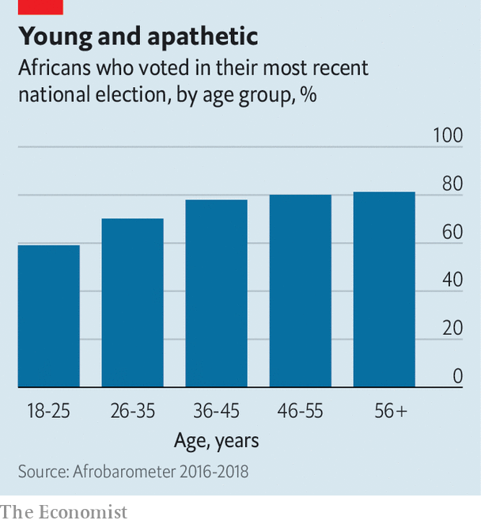

###### The countryside counts

# Why young, urban or rich Africans are less likely to vote 

##### Ruling parties find it easier to corral poor, old and rural voters 

 

> Feb 20th 2020 

PURVEYORS OF BALLOT papers, indelible ink and polling booths will do well in Africa this year. No fewer than 18 countries are to hold general elections. Not all will be free and fair, but in many the stakes are high. In Ethiopia the popularity of Abiy Ahmed, a reformist prime minister, will be tested at the polls for the first time. Burkina Faso, which is battling jihadists, will hold only its second poll since Blaise Compaoré, a long-serving dictator, was overthrown in 2014. And in Ghana President Nana Akufo-Addo faces a tight race for a second term.

Given the stakes, one might expect voters to turn out in droves. Yet in Africa fewer tend to vote than elsewhere, even if the election is not rigged. More surprisingly it is the young, rich and urban who tend to stay away from the polls. Why?


In the West the rich vote more than the poor. But Kimuli Kasara of Columbia University and Pavithra Suryanarayan of Johns Hopkins University, who surveyed voting patterns in poor countries, many of them in Africa, found that the poorest fifth of citizens tended to vote more assiduously than the richest fifth. One possible reason for rich Africans’ lack of motivation to vote is that no matter who wins, they are unlikely to be taxed more. Rates may rise, but tax collection is ineffective. In sub-Saharan Africa tax revenue averages 17% of GDP compared with 34% in the OECD, a club of mostly rich countries.

 


Where people live ought to affect whether they vote. Getting to the polling booth can be a slog for people in the sticks—only a third of rural Africans live within two kilometres of a good road. Yet despite this, rural Africans are more likely to vote than city slickers, by 77% to 67%.

One reason is that ruling parties find it easier to bribe or bully rural voters into turning out. In Zimbabwe, where the opposition dominates the towns, rural folk are often bludgeoned into attending rallies for Zanu-PF, which has run the country since 1980. Officials warn that villages which vote the wrong way will be denied food aid. Because rural voters are easier to corral, constituencies are often gerrymandered so that their votes count for more than urban ones. For example, electoral districts in Tanzania’s biggest city, Dar es Salaam, have three times as many people on average as those in the countryside.

Turnout among the young is strikingly low, no matter where they live. In its most recent election survey, Afrobarometer, a pollster, found that only 59% of 18- to 25-year-olds voted, compared with 80% of people who were 35 or older. Youngsters everywhere tend to vote less frequently than their grandparents. This matters far more in Africa, because 60% of the population is under 25, whereas in Europe just 25% are of a similar age. One reason why young Africans vote less is that registering for the first time can be confusing. Another may be that many of them (42% of 18- to 25-year-olds, according to Afrobarometer) plan to emigrate, so they give up on seeking to improve things at home.

Still, some politicians do try to shake things up by targeting youngsters in the cities. Bobi Wine, a singer turned opposition politician in Uganda, is doing so through music. “We are the youngest population in the world, we stand a chance,” he sings in “Zukuka” (Wake Up), a recent hit. “If we only come together we can change our destiny.” For that to happen, voter registration, gerrymandering and even tax collection may need to change first. ■

