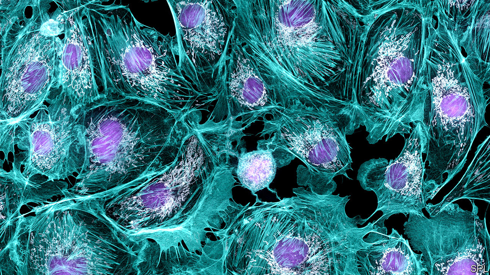

###### Cell biology

# Mapping cells to build a complete atlas of the human body 

##### An international team makes progress 

 

> Feb 22nd 2020 

BODIES ARE made of cells. Lots of them. An average adult human contains about 37.2trn cells, 100 times as many as the number of stars in the Milky Way. Clearly, trying to map the location of every one of these cells would be a futile endeavour. But cells are not identical. They are divided into many types, each specialised for different tasks. Mapping the location of each of these types is a more tractable problem. And that is the objective of the Human Cell Atlas project, a collaboration of researchers from 1,029 institutes in 71 countries around the world. Work on the atlas began in 2016, and its organisers hope to complete the effort by the end of this decade. Several of those involved gave a progress report to the AAAS meeting in Seattle.

As Aviv Regev of the Massachusetts Institute of Technology explained, compiling the atlas has been made possible by a technique called single-cell transcriptome sequencing. This looks, a cell at a time, at the messenger molecules which carry instructions from a cell’s nucleus to the protein-making machinery in its cytoplasm. These messengers are made by transcribing genes into a DNA-like chemical called RNA. All an organism’s cells have more or less the same DNA. What makes them different from each other is which bits of that DNA are being actively transcribed, and thus what proteins are being made. This means identifying and counting the RNA messengers shows what sort of cell it is.


One early discovery the project’s researchers have made is that there are many more types of cell than the text books suggest. Human cells have about 20,000 protein-coding genes and so possess 20,000 different possible messengers. One way to classify cells, Dr Regev explained, is to devise a graph that has 20,000 axes, each corresponding to a gene’s activity, and then plot particular cells as points on this graph. Clearly, such a graph would in a physical form be impossible, but it can exist and be manipulated in a computer. Plotting cells out in this way reveals how they cluster together. Those clusters are cell types.

Based on cells’ appearance under a microscope, and their reactions with chemical stains used to make them visible to microscopy, early histologists came up with about 300 cell types in a body. Single-cell RNA sequencing is multiplying that number by showing that cells which look similar under a microscope often turn out to be chemically different from one another. It has also found previously unknown cell types so rare that microscope studies have missed them.

One example Dr Regev proffered concerns the lining of the airways of the lungs. This tissue, pulmonary epithelium, is more easily sampled pre mortem than many others, so was an early candidate for investigation. The text books suggest it has six types of cell in it. RNA analysis showed that three of these six can themselves be divided into three, and that there are also two minor cell types previous investigators had overlooked. This turned out to be an important discovery, because one of the minor types proved to be where the gene involved in cystic fibrosis, a fatal hereditary disease of the lungs, is active.

Having identified individual cell types in this way, it is then possible to locate them within tissue samples. Fluorescent chemicals attached to molecular tags that will stick only to particular RNA messengers show up the cells containing those messengers. This permits construction of three-dimensional maps into which an observer may zoom to reveal ever finer levels of detail, in the same way that the zoom control works on an internet map of Earth.

That makes understanding the microscopic details of anatomy much easier. Shannon Hughes, of America’s National Cancer Institute, illustrated this with the example of skin cancer. Tumours are particularly good targets for transcriptome sequencing because they are caused by genetic mutations that show up in the RNA messengers. This has led to a parallel effort to the Human Cell Atlas, the Human Tumour Atlas, a network devoted specifically to studying cancer. And, like the lining of the lungs, the skin is easily sampled. Dr Hughes and her colleagues have been able to detect pre-cancerous skin cells (those without the full complement of mutations needed to make them cancerous), and observe how these are already attracting the attention of immune-system cells called T-lymphocytes, which burrow through the skin tissue to attack their targets.

Kerstin Meyer of the Wellcome Sanger Institute in Britain, meanwhile, trailed the publication of a complete map of an organ called the thymus. This has subsequently appeared on February 20th as a paper in Science, the AAAS’s house journal,

The thymus, located just above the lungs, is where T-lymphocytes develop. By looking at 25 thymuses from embryos, fetuses, children and adults, Dr Meyer and her colleagues have constructed a map that stretches through time, as well as space. Their transcriptome sequencing distinguishes more than 40 cell types, and they can follow the ebb and flow of these at different stages of life.

The thymus is, admittedly, but a small continent in the world that is a human body. Mapping it is, however, an important advance for the cellular cartographers. Bigger organs will follow soon. The result will be the most granular view yet obtained of human anatomy.■

