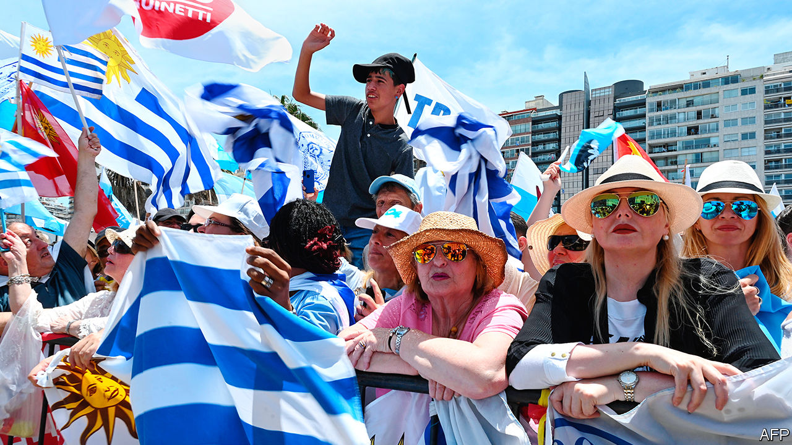
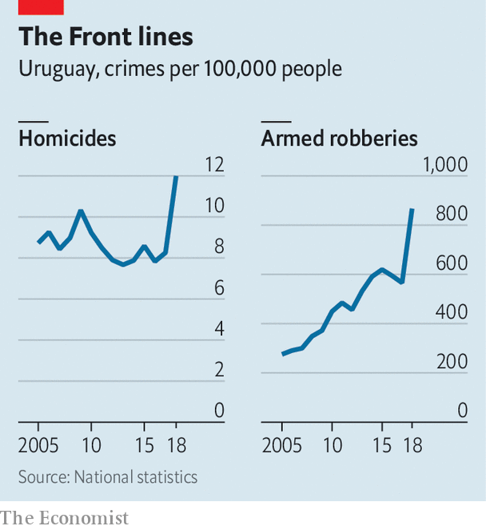

###### Changing the guard

# An interview with Uruguay’s president-elect, Luis Lacalle Pou 

##### He favours austerity, and using paramilitaries to fight crime 

 

> Feb 20th 2020 

AT HIS campaign headquarters on Artigas Boulevard, named after Uruguay’s founding hero, the man who hopes to be its next one was energised. Luis Lacalle Pou, the country’s conservative president-elect, is 46 years old but looks younger, with floppy brown hair, no jacket and sleeves rolled up. Days ahead of his swearing-in on March 1st, in an interview with The Economist, Mr Lacalle Pou set out a wide range of plans, from relaxing immigration rules to cutting public spending. But what obsessed him most of all was tackling a recent surge in crime (see chart). He lamented that just down the road were “no-go areas” overrun with violence. “It’s time to take back the streets,” he said, “by force if need be.”

The first step was to take back power. Last November, in a run-off, Mr Lacalle Pou narrowly defeated Daniel Martínez, the candidate of the Broad Front, a leftist coalition that had ruled Uruguay for 15 years. (The last president from Mr Lacalle Pou’s National Party was his father, in the 1990s.) The Broad Front had maintained economic and constitutional stability, and liberalised marijuana use and same-sex marriage. But it also presided over sharp rises in public employment, the fiscal deficit and violent crime. The homicide rate in Uruguay, a traditionally safe country of about 3.5m, shot up by 46% in 2018, to 11.8 per 100,000 people, lower than Brazil’s but higher than Argentina’s. Mr Lacalle Pou’s coalition blames lax policing and light sentencing.

 


“Not even priests feel safe here,” says Mercedes Rossi, a housewife in the working-class quarter of Casavalle, 20 minutes from downtown Montevideo, the capital. “The delinquents rule this neighbourhood with guns and knives.” Such fears helped Mr Lacalle Pou win.

So it is unsurprising that he sounds so gung-ho about security. His appointment of Jorge Larrañaga, an experienced politician and longtime rival within his own party, as interior minister, was further confirmation. The incoming minister has promised a “very tough hand”, and his record suggests as much. Last year Mr Larrañaga pushed a “Live Without Fear” plebiscite, which proposed harsh measures: deploying soldiers to fight crime, encouraging night raids by police and imposing draconian prison sentences. That initiative failed, by 47% to 53%.

But its proposals may be revived, with minor alterations. Mr Lacalle Pou said his government intends to deploy paramilitary units from the existing Republican Guard and a new National Guard, as well as double some sentences for serious crimes. This is part of an emergency package to address public safety but also housing, education and the budget. With coalition partners, the new president can probably push it through. “This will not be brutal,” Mr Lacalle Pou insisted; “it will be decisive in giving people security again.” The opposition disagrees. Carolina Cosse, a politician in the Broad Front, decries the tough-on-crime measures as “an authoritarian attack on democracy”. Her colleagues are supporting planned strikes to coincide with congressional debate on the legislation.

The man who would bin bureaucrats

The incoming government has economic woes, too. It will inherit a budget deficit of about 4.7% of GDP and anaemic growth. This is in part because Uruguay tends to suffer economically when next-door Argentina and Brazil do. As a candidate, Mr Lacalle Pou, who is pro-business and pro-austerity, favoured fiscal discipline. He committed to reducing public spending by $1bn. Cuts will come, he has promised, from government jobs and infrastructure, not services in what is often regarded as Latin America’s oldest welfare state. Nonetheless the axe will hurt. Adolfo Garcé, a political analyst, predicts that hitting the target will require slashing public-sector jobs by a third.

Foreign investment and talent could provide a boost. “We are one of the best countries in the world to live in,” said Mr Lacalle Pou. To tempt foreigners, he plans to make it easier for them to seek residency in Uruguay, where they already enjoy low taxes and exemptions on some types of foreign income, such as pensions. The target audience is Argentina. Immigration lawyers report that many Argentines seek to live across the River Plate as a result of their country’s economic crisis.

Next month’s inauguration offers an opportunity to reintroduce Uruguay to the world. In some ways the ceremony will reflect the country’s perennial position, predetermined by geography, as a sober intermediary between its bigger, more powerful and less temperate neighbours. Jair Bolsonaro, Brazil’s populist president, and Alberto Fernández, his centre-left counterpart in Argentina, were expected to meet at the ceremony after a public spat. Now it seems that Mr Fernández has cancelled. Mr Lacalle Pou promises to work with both men to reinvigorate the Mercosur trade bloc, comprised of their three countries plus Paraguay. But the guest-list also marks a noticeable shift: the authoritarian leftist leaders of Venezuela, Cuba and Nicaragua are personae non gratae.

The next president faces high expectations and only a short period, maybe a year or 18 months, in which to meet them, predicts Mr Garcé. Voters were split in the last election. And the opposition, especially the trade-union movement, remains strong. Reforms must strike a balance between reassurance and disruption. Mr Lacalle Pou seeks a middle way, in line with the people who elected him. “I voted for change, and I’m optimistic our president will be a vehicle for change,” says Ernesto Cis, a driver and tour guide. “We Uruguayans don’t do revolutions. We like change with continuidad.” ■

