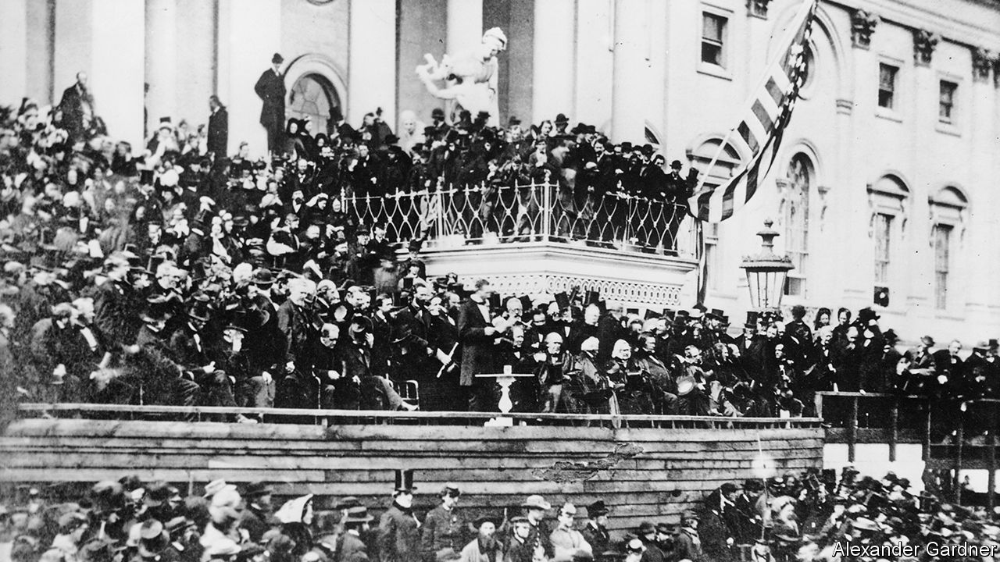

###### Immortal words

# The tragic genius of Abraham Lincoln’s second inaugural 

##### Edward Achorn’s rich history brings the inauguration of 1865 to life 

 

> Feb 29th 2020 

Every Drop of Blood. By Edward Achorn.Atlantic Monthly Press; 336 pages; $28.

A  ROTATING PANEL of historians occasionally ranks America’s presidents. The leading contenders tend to be George Washington and Abraham Lincoln; Lincoln usually wins. The accolade is in part the result of his oratorical brilliance, notably the addresses at Gettysburg and at his second inauguration on March 4th 1865 (a month before Robert E. Lee’s surrender). Together, the two speeches constitute a grand aspirational statement about the meaning of the country’s bloodiest war.


Rhetoricians still marvel at Lincoln’s simplicity, authenticity and eloquence. Containing only 700 words (about as many as this review) and lasting under six minutes, the second inaugural was rooted not in utopian expectations of a seamless reunion with the Confederacy, but in the shadow of frightful slaughter on a thousand battlefields. Lincoln (pictured above: look closely) had aged decades in four years. But his faith in democracy and what was right, as he saw them, was firm. Sober and resolute as his nature inclined him, he also embodied what the times required.

By 1865 Lincoln had substituted rationalism and fatalism for the predestination theology of his Kentucky forebears at Little Pigeon Creek Baptist Church. But he still venerated the King James Bible and often quoted it at length. Sceptical about the God it depicted, he nonetheless believed that some power beyond human understanding controlled the destiny of nations. As Edward Achorn writes in “Every Drop of Blood”, though Lincoln was hardly an orthodox Christian, his second inaugural was “the most overtly religious” of any presidential speech to that date. He said America’s “original sin” of slavery required a righteous God to purge both those who wielded the whip and the politicians who permitted it. He noted that northerners and southerners read from the same Bible and prayed to the same God, and both invoked God’s judgment on their adversaries.

The awful presence he described came from Ezekiel and Jeremiah, not from stories of baby Jesus, meek and mild. But afterwards came divine healing:


As they listened, the African-Americans close enough to hear began murmuring, “Bless the Lord,” the chant growing louder until it erupted into shouts and weeping.

America’s partisan newspapers reviewed the address according to their biases. Lincoln’s opponents dismissed it as specious and naive. His allies seemed confused by the biblicism. Ironically, perhaps, the British press—especially the Times, the Saturday Review and the Spectator—applauded the president’s preference for reconciliation over triumphalism. Lincoln’s assassination 41 days later replaced his policy with a “reconstruction” anchored in revenge. Thus perished a president who, for many Americans, was an almost divine political presence; his magnanimous vision of the nation’s future died with him.

Lincoln’s last days have been the subject of more extensive hagiography than for any other president, so it is tempting to dismiss Mr Achorn’s book, which focuses on the inauguration, as redundant. That would be a mistake. Its strength lies less in the events themselves than in the elaborate detail and rich historical context that he musters. Spring thunderstorms turn the parade route into a muddy quagmire that swallows shoes and ruins dresses. John Wilkes Booth relies on the father of his teenage mistress, a New England senator, for VIP passes to both the inauguration and Ford’s Theatre, giving the murderer more than one chance to get to his victim. Washington’s hospitals overflow with wounded soldiers; prostitutes in its brothels serve the assassin, Confederate agents and federal officials without discrimination. Walt Whitman chronicles the era brilliantly. Freed slaves celebrate jubilantly.

As in some of the plays performed in Ford’s Theatre, minor roles sometimes eclipse major ones in this fascinating account. By the end, as well as mourning Lincoln’s fate, American readers might wish for another chance at politics without malice and with charity to all. ■

