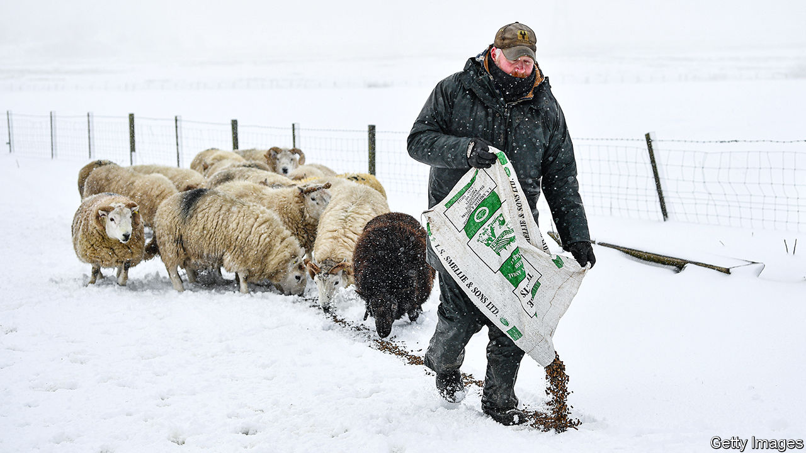

###### Agriculture after Brexit

# British farmers fret about losing their protection and their subsidies 

##### Many could soon have reason to regret voting for Brexit 

 

> Feb 29th 2020 

IT IS A TRUISM that farmers like Conservative governments. The party has deep roots in the shires and has traditionally supported country pursuits. Yet the present Tory government worries farmers. Their biggest concern is about whether and how it will replace their £3bn ($3.9bn) of annual subsidies under the European Union’s common agricultural policy, which make up nearly two-thirds of total farming income. They are right to fret. Some Tories believe that escaping the ludicrously lavish and protectionist CAP is among the biggest benefits of leaving the EU.

Drenched by recent floods, farmers will have drawn little comfort from this week’s conference of the National Farmers Union (NFU). George Eustice, newly promoted to the job of secretary of state at the Department for the Environment, Food and Rural Affairs, spoke enticingly of a prosperous future, but also of the biggest change in agricultural policy in half a century. Much of his agenda is commendable, notably tying subsidies to environmental and other public goods rather than ownership of land. And he promised that any changes would be phased in over seven years.


But there was a sting in the tail. The day before delivering his speech, Mr Eustice announced sharp and progressive cuts in direct payments to farmers, starting in 2021. Those due to get under £30,000 will see a reduction of just 5%, but the cuts will rise in steps to 25% for those collecting over £150,000. And this attack on the squirearchy may be just the beginning. The government is committed to keeping total subsidies unchanged only for the term of the current parliament.

In future, subsidies will be doled out in three tiers under the broad heading of “environmental land management”: one to incentivise such measures as pest control, hedge planting and soil improvement, a second for local actions like tree planting and creating habitats and a third to foster general landscape improvement. These may be sensible goals, but the red tape involved in monitoring them could be even more intrusive than today’s system of direct support. Imposing such an avowedly green agenda may also sound to farmers decidedly unTory.

And then there is the prospect of future trade deals that may lead to cheaper imports. Mr Eustice told the NFU that, in response to farmers’ concerns, he was amending the agriculture bill to include regular assessments of food security. He also promised to pay particular attention to food safety and animal welfare. Yet his bill offers no guarantees on food standards. And whereas his predecessor, Theresa Villiers, vowed in January to stick to the EU ban on importing such horrors as chlorinated chicken from America, Mr Eustice has made no such pledge, suggesting instead that there is “a discussion to be had” on food standards.

This ambiguity is surely deliberate. Next week the government will publish its guidelines for future trade talks with America, hoping thus to put pressure on Brussels to soften its negotiating position in the EU-UK trade talks that start on March 2nd. Washington’s priority in any trade negotiations will be to prise open the British market for American agriculture. Minette Batters, the NFU’s president, argued this week that letting in cheaper food which it would be illegal to produce in Britain would be “morally bankrupt” and “insane”. But she may have a fight on her hands.

Farmers are mindful of the experience of New Zealand, which scrapped most of its farm subsidies in the 1980s. Agriculture is now thriving there, but the transition was long, painful and, to quote Mr Eustice once more, chaotic. Yet if the future looks frightening, farmers share responsibility for shaping it: like turkeys voting for Christmas, a substantial majority of them backed Brexit in June 2016.■

