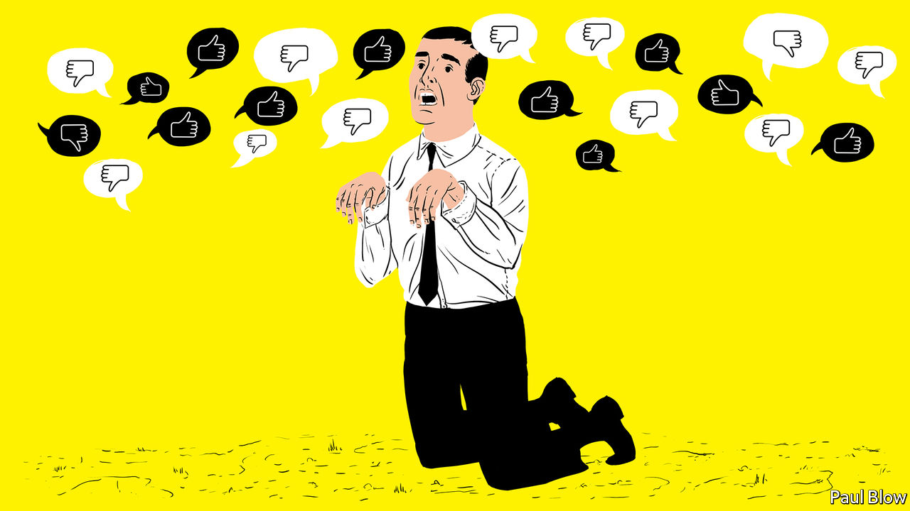

###### Bartleby

# When rank leads to rancour 

##### How not to give employee feedback 

 

> Feb 29th 2020 

IN DAVID MAMET’S film, “Glengarry Glen Ross”, a group of American property salesmen are forced into a contest to maximise sales. The top two will get prizes; the bottom two will be fired. The play comes across as a critique of the corrupting effect of “dog-eat-dog” capitalism and putting performance above all else. But is competition between employees an effective way of improving overall outcomes for business?

Jan Woike, from the Max Planck Institute in Berlin, and Sebastian Hafenbrädl, of the IESE business school in Barcelona, try to answer the question in an article* for the Journal of Behavioural Decision Making. They tested whether performance ranking helped or hindered group effort.


Their approach was to use a “public goods” game in which participants are given tokens which they can invest. They had the choice of investing in an individual project or investing collectively. Two different versions of the game were played. In both games returns were higher if everyone collaborated. But in one version, investing in the individual project improved the relative ranking of the participant, even though the returns to both the individual and the group were lower.

Participants in the game included some students and some experienced managers. The researchers observed no significant difference in the way the two groups played the game. What mattered was the form of feedback. In one version of the game, individuals were told how well they scored and how well they were performing relative to the rest of the group. In another, they were informed about how well the group as a whole was performing, relative to the maximum possible return.

Predictably, the second feedback mechanism led to more co-operation. Less obviously, information on individual performance relative to fellow group members led players to favour moving up the pecking order over not just their group’s collective returns, but also over their material wellbeing. They were willing to forgo guaranteed financial gains; achieving “status” was more important.

As the authors note, this result has implications for most organisations. “Ranking feedback, which is often used in organisational settings, prompts people to perceive even situations with co-operative outcome structures as competitive,” they write. People may not be innately co-operative or competitive; they may simply respond to cues set by the organisation they work for.

Destructive competition would be a particular problem for those companies which use so-called “agile” management approaches, in which staff from different departments are organised into teams and asked to work together. Instead of being agile, such teams may wrestle themselves to a standstill.

The research also raises more questions about a management approach, dubbed “rank and yank”, under which all employees are rated yearly and those who fall into the lowest category are liable to lose their jobs. Ranking systems of this kind, associated with Jack Welch’s tenure as boss of GE, an engineering giant, from 1981 to 2001, have been the subject to increased academic scrutiny. Study after study suggests that they hurt overall performance, not least by lowering productivity.

Businesses need to compete with their rivals but within the firm, co-operation is normally much more useful than competitive rivalry; a house divided against itself, cannot stand, as Abraham Lincoln said. Competitive ranking seems not just to reduce co-operation and foster selfishness but also to discourage risk-taking. Such findings have prompted many bosses to yank “rank and yank”. Microsoft abandoned it in 2013.

The Economist is a genuinely co-operative place (although Bartleby is locked in a Darwinian struggle with Schumpeter for the right to a full-page column). If it wasn’t, journalists would be reluctant to pass on contacts or story tips to their colleagues, and section editors would constantly rubbish the suggestions of their peers [as it is, we only do it occasionally, ed.].

In “Glengarry Glen Ross” two of the salesmen conspire to rob the office, steal some of the best sales leads and sell them to a rival business. If you set up a dog-eat-dog system, you risk having the hounds turn around and bite their owner.

* “Rivals without a cause? Relative performance feedback creates destructive competition despite aligned incentives”

