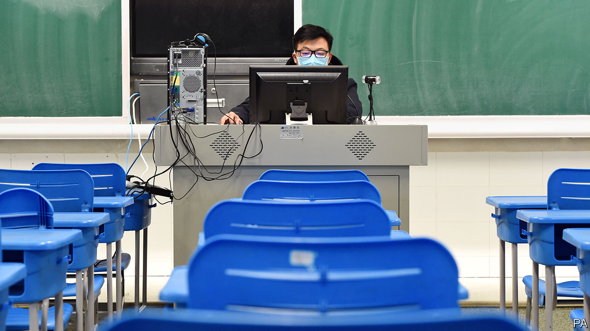

###### Getting to know your teacher

# The coronavirus is causing massive disruption to education in China 

##### Could teacher-pupil relations change for the better? 

 

> Feb 29th 2020 

“DON’T DELETE your browser history,” Lin Kai warns his 11-year-old son, who is supposed to be live-streaming lectures delivered by his schoolteachers. Mr Lin has reason to be anxious. To curb the spread of covid-19, the authorities have closed schools and universities indefinitely. But “study must not stop”, says the education ministry. Under its orders, the country’s biggest exercise in remote learning is under way, watched over by parents. Mr Lin, who lives in the eastern city of Hangzhou, has caught his son being distracted by online games. He wants his son to know that he will inspect the browser for evidence of such naughtiness.

There are other ways to enforce discipline. Liu Weihua, who teaches at Wuhan University of Technology, cold-calls his students during live streams. With sit-down exams now impossible, his grading system places more emphasis on how students perform in classroom discussions, Mr Liu explains. These are conducted using video-conferencing platforms such as Dingtalk by Alibaba, a tech giant, and Ketang by Tencent, a competitor.


Slow internet speeds at home are no excuse for shirking, says Yue Qiu, a secondary-school teacher in Beijing. If connections are too wobbly for video calls, students can download audio files and assignments. Parental supervision is encouraged. The municipal government of Beijing has decreed that, in households with two working parents, one is entitled to stay home without any loss of pay.

In poor rural areas, where some households lack internet access, instruction by television fills the void. Since February 17th China Education Network, a state-run service, has been broadcasting classes every weekday from 8am to 10pm. The first lesson of the day is aimed at pupils in the first year of primary school. Programmes for older children air in the afternoon and evening. All core subjects, such as mathematics and Chinese, are covered.

The disruption is felt most keenly by pupils in the final year of secondary school. That is the year leading up to the gaokao, the notoriously hard university-entrance exam. Many parents fret that online learning is a poor substitute for classroom instruction. Hou Kaixuan, who will sit the gaokao in the northern city of Zhangjiakou this summer, eagerly awaits the re-opening of his school. “I’m simply more productive in a physical classroom,” he says.

Not all his classmates agree. Kaixuan observes that some of them study just as hard at home as in school, and take perverse pleasure in the fact that others must be slacking off. (It helps that very little new material is taught in the last year of secondary school. The emphasis is on revision.)

When schools and universities eventually re-open, classrooms may be different, says Mr Yue, the teacher in Beijing. The teacher-student relationship will become “less hierarchical”, he predicts. That is because China’s prolonged experiment with online learning is reducing the typical reserve between instructor and pupil. Teachers who were previously reluctant to give out their contact details on WeChat, a messaging app, now rely on it to respond to students’ queries. At Mr Yue’s school, students may even call their teachers to ask for feedback. If he is right, such a breaking-down of barriers could be one of the few happy by-products of the epidemic. ■

