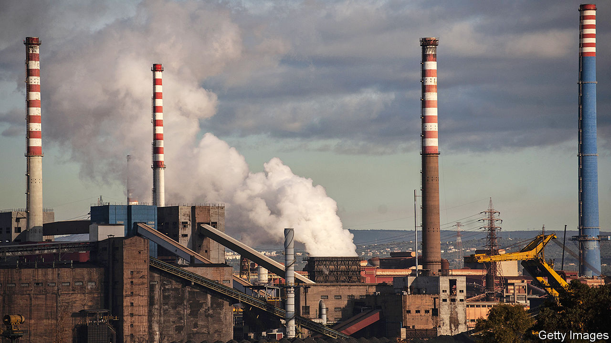

###### Down at heel

# The travails of “ex-Ilva”, Europe’s largest steel plant 

##### A rescue plan may be on the way 

 

> Feb 29th 2020 

DR GRAZIA PARISI has been working for four hours without a break at her paediatric surgery. “I’ve seen between 30 and 35 children—all with coughs,” she says. It is Monday. The previous week, from Wednesday to midday on Friday, Taranto, in Italy’s far south, had endured a succession of what the locals call “wind days”. That is when the wind blows from the north-west, through Europe’s biggest steelworks on the outskirts, and into the city.

“There is a mathematical correlation between wind days and the [number of] respiratory ailments I treat,” says Dr Parisi. The closer her patients live to the steelworks, the more acute their symptoms. Several of her patients had spent part of the weekend at the local hospital and some had even been admitted, such had been the seriousness of their ailments.


Things used to be even worse, before the factory’s new owners, ArcelorMittal, a multinational, covered its giant stockpiles of coal and iron. But, says Luciano Manna, an environmental campaigner, the wind still picks up plenty of mineral dust from the factory’s waste dumps. Commonly known, by reference to its earlier owners, as the “ex-ILVA”, the steelworks is the size of a small town or a large suburb. It covers 15 square kilometres (six square miles).

The Italian government has set February 28th as the deadline for an agreement with ArcelorMittal on the fate of the factory, one of Europe’s worst environmental black spots. The firm leased the site in 2018 under an agreement whereby it undertook to clean up the plant and inherited—from the government commissioners then managing the place—immunity from prosecution for environmental crime as it did so.

But last November ArcelorMittal withdrew from the deal after the maverick Five Star Movement (M5S), which is in a governing coalition with the centre-left Democratic Party (PD), succeeded in getting the immunity lifted. Critics of the firm argue that it has failed to invest enough in the clean-up, a charge the company rejects. Dr Parisi wants the steelworks shut down. She is not alone: a pledge by the M5S to close the plant helped it win 48% of the votes in Taranto at the last general election, in 2018.

On one side of Taranto’s Piazza Gesù Divin Lavoratore, the walls between the shops and bars are clad in a textured stone that catches whatever dust may be in the air. Run a finger over the stone and it comes away red. “Iron oxide”, says Ignazio D’Andria, owner of the Mini Bar. “That’s why all the apartment blocks here are painted red or pink or some other dark colour—so you can’t see the mineral dust.” His bar is in Tamburi, a district built for the steelworkers and their families that begins almost at the perimeter of the giant complex. Tamburi gets the worst of the pollution, but locals say that plenty of mineral dust finds its way into the centre of Taranto when the wind blows across the city and out to sea.

According to a gold dealer who has the shop next door to the Mini Bar, six of the children from homes on the piazza suffer from learning difficulties. That would be consistent with a study published in 2016, which found that the IQs of children from Tamburi were on average 13 points lower than those of children living 15km away. But the threats the ex-ILVA poses are not just to health and the environment.

Jobs, too

“It’s a social bomb,” says Giuseppe Romano, the local secretary of the left-wing CGIL-FIOM trades union federation. The factory employs more than 8,000 people. Another 4,000 work for its suppliers. If the ex-ILVA were to close altogether, thousands of other jobs would be lost as the turnover of bars, shops and other businesses shrank. And that in a province where one worker in six is already unemployed.

Taranto and the province to which it belongs form part of Puglia, the “heel” of the Italian “boot”, a region of mixed fortunes in recent years. It has enjoyed a tourism boom but has been hit by the spread through its olive groves of an insect-borne disease, Xylella fastidiosa. Searching for sources of income and employment to replace the steelworks in the event of its demise, the local authorities have sponsored plans for the founding of a university at Taranto, for more shipbuilding and for an aquarium. There is talk of encouraging more cruise liners to berth in its ample port. And in January Taranto became the first city in Italy to offer houses for sale for a token €1, on condition that the buyers renovate and live in them. The plan aims to revive the historic but dilapidated old town on an island between a lagoon and the Mediterranean.

Mr Romano hopes a way can nevertheless be found “to make steel without killing people”. The question is how much. He calculates that a thousand workers are needed to produce a million tonnes of steel. The market in Europe is glutted. Last year the steelworks produced just 4.3m tonnes against a capacity of 9m-10m and a government target of 8m.

Negotiators are reportedly close to a deal that would involve ArcelorMittal continuing to operate the works, possibly in partnership with the government, on the understanding that one of the existing blast furnaces is renovated and a new electric one built. Such a deal would represent a defeat for the M5S—a party already wracked by bitter internal divisions that has seen its popularity collapse since 2018. But it would reduce the pollution, though not eliminate it. And it would save thousands of jobs.

Still, it is clear that, if the factory is to operate at a profit and without becoming an endless drain on the resources of the long-suffering Italian taxpayer, thousands more jobs will have to go. ■

