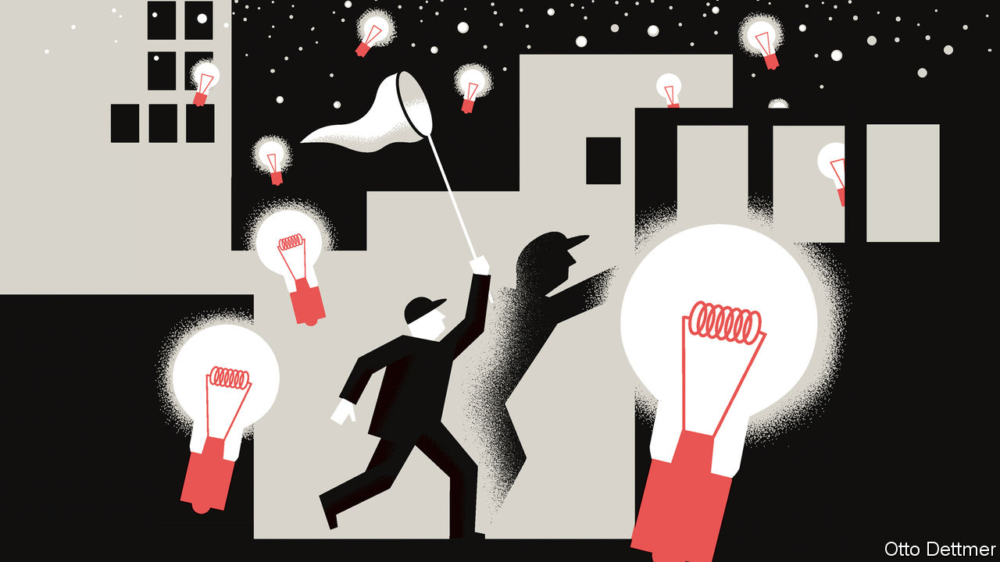

###### Free exchange

# How to get more innovation bang for the research buck 

##### Narrow incentives such as citations can skew behaviour 

 

> Feb 29th 2020 

ABOUT A DECADE ago, a few economists began asking whether the rich world’s prolonged spell of lacklustre growth might have something to do with a shortage of new ideas. Tyler Cowen of George Mason University suggested that when it came to discovery, humanity may well have plucked all of the low-hanging fruit. Robert Gordon of Northwestern University scoffed at recent technological contributions, noting that none was nearly as important to human welfare as the humble toilet. Progress since—in gene editing, artificial intelligence and even rocketry—seems impressive. But the radical change and roaring growth enabled by the innovations of the 19th and 20th centuries continue to elude rich economies. Before abandoning hope, though, it is worth considering that it may be the motivation we provide our innovators, rather than a shortage of ideas, that is the problem.

The argument that humanity has run out of big ideas (or nearly so) makes a degree of intuitive sense. Fundamental forces of nature, like the theory of electromagnetism, can only be discovered and exploited once. Scanning through available evidence, it certainly seems like breakthroughs are ever harder to come by. In a paper by Nicholas Bloom, Charles Jones and Michael Webb of Stanford University, and John Van Reenen of the Massachusetts Institute of Technology (MIT), the authors note that even as discovery has disappointed, real investment in new ideas has grown by more than 4% per year since the 1930s. Digging into particular targets of research—to increase computer processing power, crop yields and life expectancy—they find that in each case maintaining the pace of innovation takes ever more money and people.


Humans, though, have mistakenly believed their understanding of the universe to be complete many times before. In a new paper by Jay Bhattacharya of Stanford University and Mikko Packalen of the University of Waterloo, the authors quote the Nobel-winning physicist Albert Michelson, who, in a speech in 1894, reckoned that “the more important fundamental laws and facts of physical science have all been discovered”. Within a few years of his remarks, theories of relativity and quantum mechanics revolutionised physicists’ understanding of the universe. We do not know what we do not know.

If there are more powerful ideas waiting to be discovered, why is investment in new research experiencing such diminishing returns? One factor could be the growing burden of knowledge. Intellectual progress has created a mound of know-how which must be mastered before an innovator can even begin to push the frontier forward. Benjamin Jones of Northwestern University has found that the average age at which great scientists and inventors produce their most important work rose by six years over the course of the 20th century, thanks to the need for more early-life investment in education. But although important thinkers begin their careers later than they used to, they are no more productive later in life. Education, while critical to discovery, shortens the working lives of great scientists and inventors.

Yet it is also worth assessing the incentives researchers experience during their careers. Most of the benefits of new knowledge flow to people other than those responsible for discovering it, such as those who build on new ideas or make use of inventions. Societies therefore come up with ways to motivate researchers who might otherwise labour at more self-serving tasks. Patents and copyrights, for instance, grant creators temporary monopoly control over their work so they can capture at least some of the monetary gains it generates. Universities and research institutes link promotions and pay to research productivity, as measured by the number of citations published papers receive. Prizes and awards create additional incentives to do exceptional work.

But these schemes do not always have the desired effects. Intellectual-property protections make it more difficult for others to make their own contributions by building on prior work. Barbara Biasi of Yale University and Petra Moser of New York University studied the effects of an American wartime policy that allowed domestic publishers to freely print copies of German-owned science books. English-language citations of the newly abundant works subsequently rose by 67%.Too closely linking career progress to success in publishing can also skew behaviour. Over the past half century, Messrs Bhattacharya and Packalen note, promotions and pay for research scientists have increasingly been determined narrowly by the numbers of citations their works have received. Such metrics probably push research in a more conservative direction. While novel research is more likely to be cited when published, it is also far more likely to prove a dead end—and thus to fail to be published at all. Career-oriented researchers thus have a strong incentive to work towards incremental advances rather than radical ones. Similarly, Pierre Azoulay of MIT, Gustavo Manso of the University of California, Berkeley, and Joshua Graff Zivin of the University of California, San Diego, find that medical researchers funded by project-linked grants, like those offered by the National Institutes of Health, an American government research centre, often pursue less ambitious projects, and thus produce breakthrough innovations at a much lower rate, than researchers given open-ended funding.

The social sciences

Not all incentives must be material in nature. Some economic historians, such as Joel Mokyr of Northwestern University, credit cultural change with invigorating the innovative climate in industrialising Britain. A “culture of progress” made intellectual collaborators of commercial rivals, who shared ideas and techniques even as they competed to develop practical innovations. Changing culture is no easy matter, of course. But treating innovation as a noble calling, and not simply something to be coaxed from self-interested drudges, may be a useful place to start. ■

