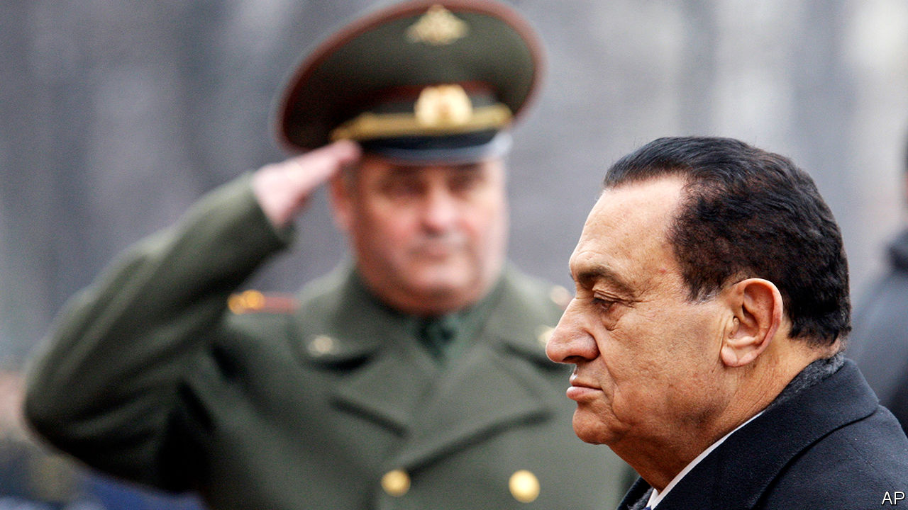

###### The soldier’s tale

# Hosni Mubarak, ex-despot of Egypt, died on February 25th, aged 91 

##### Three suffocating decades in power were ended by revolt 

 

> Feb 27th 2020 

BACK IN 1981, when assassins’ bullets felled Anwar Sadat at a military parade and propelled Hosni Mubarak to Egypt’s highest office, no one dreamed he would fill it for longer than his two predecessors put together. As Sadat’s vice-president, the former air-force commander had kept the low profile of a stolid, trusted retainer. This was not by accident. Mr Mubarak was a military man to the core. To his dying breath he held to the code of silent dutifulness that marks Egypt’s officer class, a praetorian guard that has run the most populous Arab state—with a brief interruption—since seizing power in 1952. In one of his last speeches as president, a week into the 2011 uprising that would soon end his rule, he vowed not to flee into exile as Tunisia’s dictator had done weeks earlier. “Egypt and I shall not be parted until I am buried in her soil,” he said. And so he shall be. Mr Mubarak died in Cairo on February 25th, aged 91.

Like many officers of his generation, Mr Mubarak owed to the armed forces his escape from the provincial working class, and shared their grudge against Egypt’s cosmopolitan elite. He was a squadron leader in the early 1960s, when Egypt’s then president, Gamal Abdel Nasser, sank the country in a ruinous effort to bolster the republican side in Yemen’s civil war. The distraction left Egypt ill-prepared for the six-day war of 1967, when Israeli raids destroyed most of its aircraft on the tarmac.


Mr Mubarak’s new job was to rebuild that shattered force. His grim determination, which bore fruit in a respectable showing during the October war of 1973, when Egypt seized back lost territory, won him notice from above.

As president he held rigidly to his predecessor’s course, maintaining peace with Israel and close ties to America, while slowly winning back the favour with fellow Arabs that Sadat had lost by consorting with the “Zionist enemy”. This brought rewards in foreign aid, but Mr Mubarak’s risk-aversion in domestic politics carried a heavy cost. The economy stalled and schools and courts floundered as the population surged. His lack of imagination was reflected in bureaucratic inertia, compounded by unrestrained security agencies and an ever-expanding network of ex-army men rewarded with provincial governorships, board memberships and the like. Talent slowly drained from Egypt’s government as Mr Mubarak rewarded loyalty over competence. His principal officials were grey, uninspiring figures.

A brief period of political liberalisation in the 1980s, which allowed Islamist groups to surface, was followed by a brutal clampdown. The screws turned even tighter after Mr Mubarak narrowly escaped assassination (one of several attempts) in 1995. His intelligence chief, Omar Suleiman, had suggested that he have his own car flown to a summit in the Ethiopian capital, Addis Ababa. Jihadists ambushed the convoy on the road from the airport. The bulletproof vehicle saved Mr Mubarak’s life. In subsequent years his police imprisoned as many as 30,000 suspected jihadists, while he posed to the West as a bulwark against the fundamentalist menace.

In person he was vigorous, priding himself on his average but enthusiastic squash-playing. He led a no-drinking, no-smoking life, but it was far from plain, with several rococo palaces and a fortune salted away abroad. His jet-black hair was maintained with dye, and the stripes on his suits were stitched, by London tailors, with the tiny repeated letters of his own name. He was good-humoured in a brusque sort of way, but the bonhomie fell flat in public. When Queen Elizabeth invited Mr Mubarak for a state visit, his gift to her was a machine-made carpet with a computer-generated design showing the faces of Prince Charles and Princess Diana.

After the revolution Mr Mubarak spent years on trial for murder and corruption. He was convicted and sentenced to life in prison, but the ruling was overturned on appeal. Then, in 2013, came the coup that ended Egypt’s brief democratic experiment, along with efforts to hold Mr Mubarak accountable. Abdel-Fattah al-Sisi, the general who seized power, grew paranoid about challenges to his rule—among them, unlikely as it may seem, nostalgia for Mr Mubarak. Better he simply be forgotten. After decades in the public eye Mr Mubarak lived out his final days in quiet seclusion.

In a pair of rare interviews last year he reminisced about his days as a soldier and statesman. He spoke far less about his presidency. Whatever his thoughts, Mr Mubarak, his black hair long since faded to grey, offered no public reflection on the failures that caused millions of his countrymen to turn on him. Did he blame his sons, whose greed and ambition alienated not only his people but, crucially, his fellow officers? Did he blame his glib intelligence men, or the ever-plotting Muslim Brothers, or his gutless American allies? The stolid soldier gave nothing away. ■

