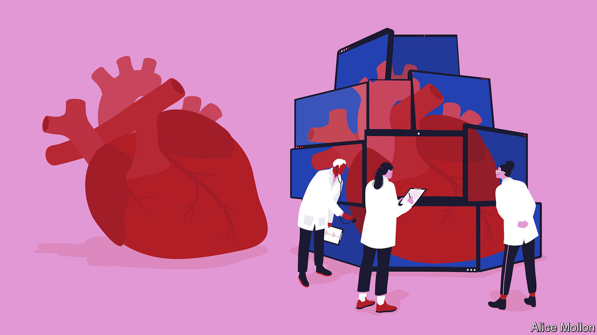

###### Cardiology

# Digital twins of hearts could help diagnose and treat cardiac disease 

##### Making a virtual heart 

 

> Feb 29th 2020 

IF YOU TRAVEL on a modern airliner, the chances are that each of the jet engines powering it will have a virtual copy residing in a computer on the ground. This copy, known as a digital twin, will be updated constantly with information from sensors that measure the engine’s performance and check for signs of wear and tear. Digital twins allow engineers to service engines as and when needed, rather than sticking to rigid schedules, and let them carry out preventive maintenance by fixing things before they break. Their use is increasingly common—not only in aerospace, but also in carmaking, construction and factory planning. If an international team of researchers have their way, similar twins will soon keep an eye on another important piece of equipment, the human heart.

Building a digital twin of a patient’s heart would first require that person to don a variety of sensors. The data from these would then be turned by specialised software into a computer simulation of the pumping organ. This simulation would show detailed information about how the heart is working, and the way blood is flowing within it. And, in the same way that digital twins in industry are employed by engineers, virtual hearts could be used by doctors to help with their diagnoses and to determine what treatments might be necessary. A twin could then keep track of how a patient responded to those treatments.


Heart of the matter

The idea of creating digital heart-twins comes from a cardiac-research programme called ECHOES, led by Frank Rademakers of University Hospitals Leuven, in Belgium. Several European and American research groups are involved, including the Universities of Sheffield and Bristol in Britain and, in America, Harvard and Stanford, along with firms such as ANSYS, a computer-simulation company, and GE, which makes jet engines and medical devices.

An important part of ECHOES is the development of miniaturised sensors that will allow people to wear the monitoring equipment throughout their daily lives, rather than just in a clinic or a doctor’s surgery, says Tim Chico of the University of Sheffield, who leads the British arm of the project. This will permit heart function to be simulated in a variety of circumstances, including walking, sleeping and climbing stairs, rather than just for the brief period when a patient is undergoing clinical examination. Although some portable cardiac devices are already available—small electrocardiographs worn on a belt, for example, with leads that attach to a patient’s chest to trace the rhythm and electrical activity of the heart—these tend to be used for just a couple of days. Digital twins would draw data from a broader suite of sensors, and for longer.

Some of the monitoring could be done by existing or adapted consumer products, such as health apps on smartphones and fitness trackers, adds Dr Chico. Other sensors, with more sophisticated capabilities, are being developed by ECHOES’ members. These include a wearable ultrasound scanner which Jan d’hooge and his colleagues at the University of Leuven are working on. An ultrasound scanner is a device that employs high-frequency sound waves to create images of parts of the inside of the body. The idea, says Dr d’hooge, is that both the transmitters which produce the ultrasonic pulses and the receivers which pick up the returning echoes can be woven into textiles used to make items of clothing, such as vests. He is optimistic that it will thus be possible to create garments capable of conducting heart scans, and that these might be washable.

All this would help cardiologists like Dr Chico a lot. It is often hard for patients to describe their symptoms fully, and hospital tests might not reveal a complete picture—especially as people tend to be under stress when those examinations are carried out. To start with, the data used to model and update a digital heart-twin will be recorded by the collection device and uploaded therefrom at intervals. Eventually, though, it should be possible for them to be transmitted directly to a medical centre, just as data from a jet engine are transmitted to an engineering base.

While wearable heart scanners are several years away, some elements needed to build digital heart-twins are close to deployment. Rod Hose, a former aerospace engineer who is now an expert in medical modelling at the University of Sheffield, led a recent project called EurValve, which developed a system to help doctors treat people with heart-valve disease. EurValve gathered a variety of data about patients’ conditions from scans and other hospital tests, and combined these with other information acquired from those patients when they were at home, via health-tracking watches produced by Philips, a Dutch technology group. The EurValve system, which the researchers hope will soon be put into clinical practice, can model the severity of disease and predict the outcome of heart-valve-replacement surgery.

A digital twin of the whole heart will allow simulation of the treatment of a particular individual for many other conditions, as well. That will give a clearer idea, in a particular case, of the likely outcome of an intervention. It might show, for instance, what type of operation is best suited to a patient’s condition, or if drugs and regular check ups are more appropriate.

As more and more patients have their heart twins analysed, machine learning, a form of artificial intelligence that is good at pattern recognition, will be used to study the outputs. This should make the system yet more accurate, and help with unusual and rare cases that a cardiologist might not have seen before. Just as pilots can relax knowing that a digital twin is keeping an eye on their engines, doctors will benefit from a new depth of knowledge about how their patients’ hearts are working. ■

