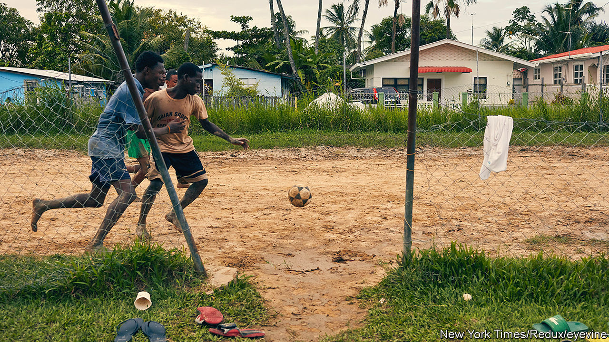
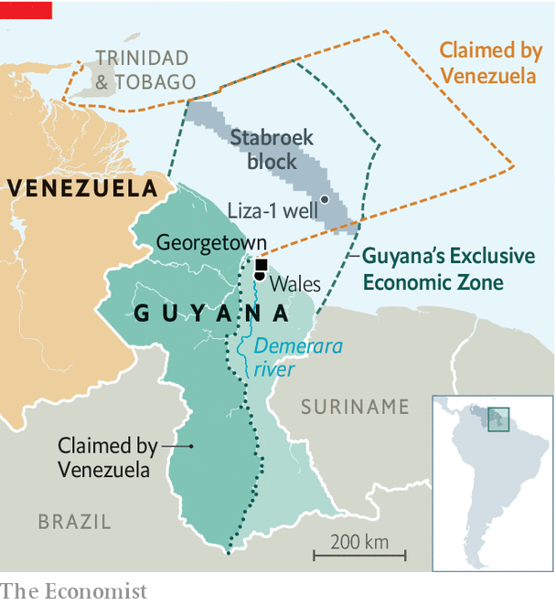
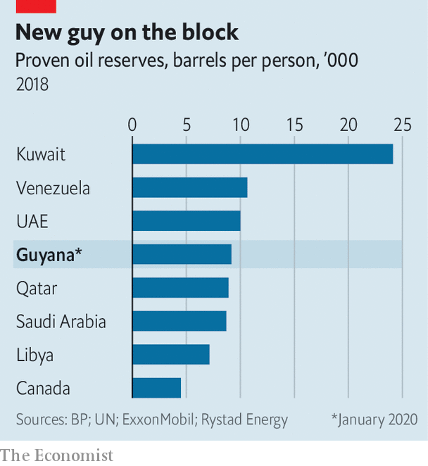

###### A scoring opportunity

# Ahead of oil riches, Guyana holds a decisive election 

##### The country’s rancorous politics could make it hard to use the bonanza well 

 

> Feb 29th 2020 

AT ELECTION TIME, it is easy to tell which ethnic group dominates each of the villages strung out along Guyana’s Atlantic coast even without looking at the people. Where Afro-Guyanese are the main group, the green-and-yellow banners of the ruling coalition flutter. In Indo-Guyanese villages, it’s the red, gold and black of the opposition People’s Progressive Party (PPP). Voting in Guyana’s general election, due to be held on March 2nd, is likely to follow ethnic lines, as it has done for decades. This year the stakes are unusually high. That is because Guyana, South America’s third-poorest country, is about to be transformed by the petroleum that has begun to flow from vast offshore reservoirs.

Oil could change Guyana as radically as did sugar, which brought African slaves in the 18th century and indentured labourers from India in the 19th. By 2024 it could lift income per person from $5,000 to $19,000, nearly the same as in Poland. The IMF expects the economy to grow by 85% this year. By 2030 the government’s share of earnings from oil could reach $10bn in real terms, more than double last year’s GDP. This could “change us once and for all into a Singapore kind of country,” says the finance minister, Winston Jordan. Whichever party takes charge of the bounty could govern for decades. Mr Jordan calls the vote “the mother of all elections”.


Guyana, which has just 780,000 inhabitants, is better known for its problems than its successes. It has the world’s third-highest suicide rate and the highest rate of maternal mortality in South America. One reason is that it loses talent, including doctors and nurses. Its diaspora is nearly as large as its population. At least four-fifths of its university graduates leave the country. Children spend 12 years in school on average, but education is so poor they learn less than seven years’ worth of material. Most of the population, including that of Georgetown, the capital, is on the low-lying coast that is vulnerable to flooding. Two-fifths live on less than $5.50 a day.

 


Oil riches could make life much better, but most Guyanese do not feel as if they have hit the jackpot. “We don’t know when oil comes whether we will get it or not,” says Hasser Bacchus, who lost his job cutting cane for GuySuCo, the state-owned sugar producer, which in 2017 shut down four estates and sacked 7,000 workers. He now ekes out a living plucking razor grass from abandoned sugar-cane fields in Wales, alongside the Demerara river, which he sells for bird seed at 200 Guyanese dollars (96 cents) a bundle. Alex Paul Singh, a former sugar worker who sells chickens by a roadside, thinks “oil could help Guyana a lot.” But if it’s not properly managed Guyana could become “like Nigeria or Venezuela”, whose oil-rich economies are subverted by corruption. Almost every Guyanese seems to be aware that, like a downpour on parched ground, a torrent of oil money could bring destruction rather than relief.

That worry makes Guyana’s polarised politics even more rancorous, which in turn increases the risk that the money will be misspent. The election is a delayed reaction to a vote of no-confidence in the government in 2018. That was caused by the defection of an Indo-Guyanese MP who belonged to the Alliance for Change (AFC), the junior partner of President David Granger’s A Partnership for National Unity (APNU), itself an alliance of parties. The government manoeuvred to postpone the election for a year. That infuriated the PPP and has delayed many of the decisions that a country on the cusp of oil riches would be expected to make.

 


The campaign has been inflamed by allegations that the government mishandled negotiations with ExxonMobil, which holds the licence to operate Liza-1, Guyana’s first productive oil well, and others in the promising Stabroek block. A report this month by Global Witness, a pressure group, claims that the deal signed in 2016 by Raphael Trotman, the natural-resources minister, so favoured Exxon that it made Guyana up to $55bn poorer than it should have been. That is 11 times the country’s GDP. After Exxon wined and dined him, the report claims, he signed a bad agreement. It entitles Guyana to a 2% royalty and just 50% of “profit oil”, ie, after deducting the operators’ costs. Global Witness says the government’s total take should be at least 69%. Bharrat Jagdeo, a former Guyanese president who remains the PPP’s most powerful figure, has said that Mr Trotman “shafted the country”.

The agreement may be evidence of Guyana’s weak position rather than malign intent. It has a history of unsuccessfully prospecting for oil that goes back to the 1930s, the government points out. Operators like Exxon needed big incentives to keep trying. And Guyana needs help in defending itself against Venezuela’s claim to two-thirds of its territory, including a big chunk of its offshore oil reserves. It is fighting Venezuela’s claim at the International Court of Justice in The Hague, which is due to hold preliminary hearings in late March.

My bodyguards

The real muscle, Guyana believes, comes from Exxon and its Chinese partner in the Stabroek block, the China National Offshore Oil Corporation. “Our number-one interest was to get a big bad wolf onto the shelf,” says Mr Jordan, the finance minister. In Exxon, whose Venezuelan operation was acrimoniously nationalised in 2007, “we found the ideal one”. Rystad, a consultancy, disputes Global Witness’s estimate of the government’s share of oil. It puts the government’s take at 60%, in line with agreements struck by countries with similar characteristics.

To achieve Singapore’s living standards, Guyana will need a state that approaches Singaporean levels of effectiveness. It is not anywhere close. “Our systems are broken,” says Mr Jordan. “We can’t even run the existing spending that we’re doing.”

The government has begun to address these shortcomings. Guyana’s main defence against petroleum perils is its sovereign-wealth fund, called the Natural Resource Fund (NRF). All the money from oil, and perhaps from mines and forests, is to flow into an account at the New York Federal Reserve. To prevent inflation and Dutch disease—an overvalued exchange rate that makes other industries uncompetitive—and preserve the money for future Guyanese, the government has devised rules that restrict the drawdown. In the early years, when production is low, the government will be able to take out of the fund no more than two-thirds of the revenue that flows into it. At 102,000 barrels a day, the IMF’s forecast for this year, that would be about $230m, 18% of non-oil revenue. As the inflow increases and the fund grows, the share going to the budget will shrink but the absolute amount will rise. Mr Jordan rules out borrowing money against expected earnings, a practice that backfired on such countries as Ghana.

The principles for spending the money are in the “Green State Development Strategy”, which tries to reconcile Guyana’s new status as a petro-state with such goals as generating nearly all electricity from renewable and “clean” sources by 2040. Some of the cash will need to be spent on shoring up defences against rising sea levels. But the principles must be translated into projects. The institutions needed to implement them with competence and honesty are in their infancy. Greenery and prudence could be subverted by politics.

In principle, the PPP agrees with those aims. The green plan builds on a Low Carbon Development Strategy introduced by Mr Jagdeo when he was president in 2009. On use of oil money, he sounds more cautious than the government. He blasts the NRF law, because it gives the finance minister too much power. If Irfaan Ali, the PPP’s presidential candidate, wins, “we will repeal this and quickly replace it with one that moves politicians away from management of the fund,” Mr Jagdeo promises. Guyana needs a “national consensus” on how it manages its oil riches, he says. Mr Jordan wants much the same thing.

That is just what the country’s racially charged politics may prevent. Afro-Guyanese remember the PPP’s 23-year rule, until 2015, as a time of corruption and Indo-Guyanese triumphalism. Those of Indian origin hurl similar accusations at Mr Granger’s government, though the AFC brought more racial diversity to the coalition and independent observers regard the president himself as honest. Rage is especially intense near the shuttered sugar estates. If the APNU wins re-election, “people will not accept the results”, says an official from the Guyana Agricultural and General Workers’ Union, which represents sugar-cane workers and is linked to the PPP.

The antagonism is made sharper by Guyana’s electoral system, which awards seats in the National Assembly on the basis of proportional representation. After elections party leaders handpick the politicians who occupy the legislature’s 65 seats, including the 25 regional seats. They are thus more beholden to their leaders than to racially mixed groups of constituents.

The main hope for ending the standoff rests with mixed-race and indigenous Guyanese, whose weight in the population is increasing. An array of third parties is trying to break the duopoly. Lenox Shuman, the presidential candidate of the Liberty &amp; Justice Party, which represents mainly indigenous people, hopes to be “the balance of power and bring reason to the house”. With more reason and less rancour, Guyana will have a better chance of making the most of its new riches. ■

