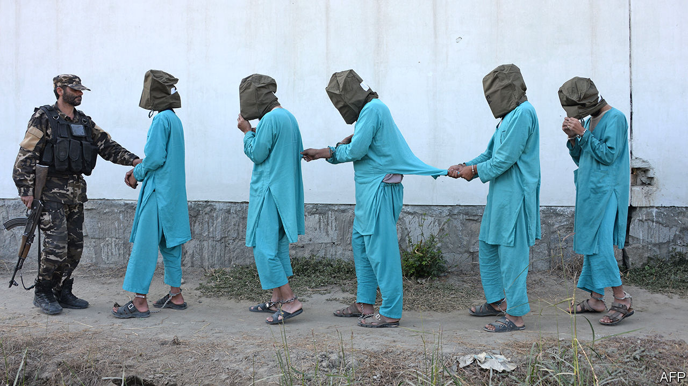

###### Peace with Afghan characteristics

# A peace deal signed. Then America and the Taliban resume fighting 

##### In fact, it’s not clear that the peace deal called for peace 

 

> Mar 7th 2020 

THE INK was barely dry on the peace agreement signed on February 29th by America and the Taliban before the disputes began. The deal states that “up to 5,000” Taliban prisoners will be released before March 10th, paving the way for talks between the Taliban and assorted Afghan grandees about the future of the country. But the deal glosses over who will do the releasing. Most Taliban prisoners are in the hands of the Afghan government, with whom the Taliban have refused thus far to negotiate, on the grounds that it is an illegitimate, American-imposed regime (although the government is supposed to participate in the talks on March 10th). Ashraf Ghani, the president, says he has not made any promises to release anyone.

Meanwhile, both sides have resumed shooting one another. They had observed a partial but successful seven-day ceasefire in the run-up to the signing. American and Afghan officials said this “significant reduction” in violence should continue, but the Taliban have called it off. On March 3rd they attacked no fewer than 43 government checkpoints in just one of Afghanistan’s 34 provinces, Helmand. On the same day in another province, Kunduz, at least 15 Afghan soldiers were killed. The following day, just hours after President Donald Trump said he’d had a “very good talk” with the Taliban’s chief negotiator, Abdul Ghani Baradar, American warplanes bombed a Taliban position in support of Afghan troops—the first air strike since the agreement was signed.


All this does not necessarily mean that the deal is dead. America, after all, says it is pressing on with its promise to reduce its garrison in Afghanistan from 12,000 to 8,600 troops and to close five bases by mid-July. But as Mark Esper, America’s defence secretary, says, implementing the agreement will be “a long, windy, bumpy road”.

Part of the problem is the ambiguity of the deal. The public parts of it make no mention of a ceasefire, beyond suggesting that the inter-Afghan talks may produce one. But there are two “implementing documents”—in effect, codicils that have not been published. Mike Pompeo, America’s secretary of state, says there was “a detailed set of commitments that the Taliban have made about the levels of violence that can occur”. The commander of American forces in Afghanistan, General Scott Miller, puts it more bluntly: “The United States has been very clear about our expectations—the violence must remain low.”

American officials seem to be trying to talk the Afghan government into going along with the release of prisoners, in order to get the inter-Afghan talks going. That may yet happen, keeping the agreement broadly on track. But the events of the past few days suggest that the deal will be even harder to stick to than it was to strike. ■

