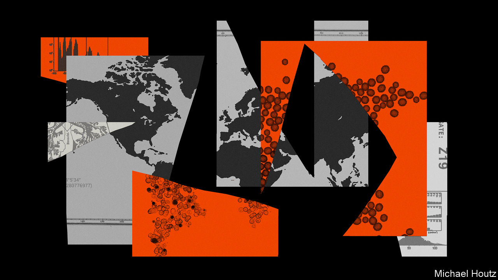
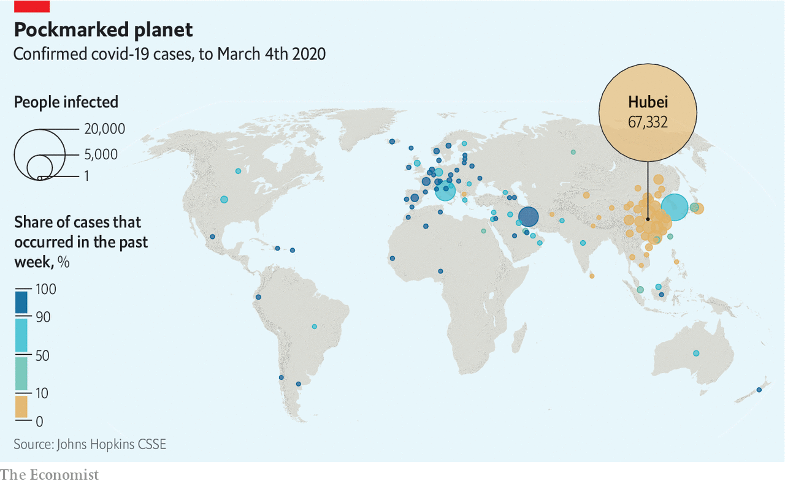
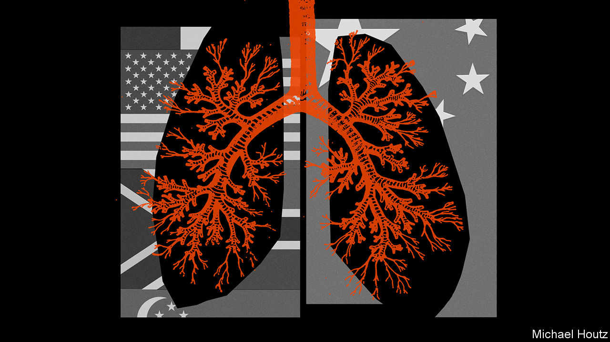

###### Firstest with the mostest

# What the world has learned about facing covid-19 

##### Many countries are ill prepared 

 

> Mar 5th 2020 

SPEAKING FROM his home in Abuja, Chikwe Ihekweazu, the director general of the Nigerian Centre for Disease Control, says China has one big lesson to teach the world about covid-19: “It can be contained.” Mr Ihekweazu was in voluntary self-isolation following a visit to Wuhan, the city at the centre of the Chinese outbreak, as part of a group of experts dispatched by the World Health Organisation (WHO) to examine the country’s measures to stop the spread of covid-19.

These measures seem to have had significant success. On February 4th China recorded 3,887 new cases. On March 4th the number was 139. The report that the WHO group published on February 28th put the good results down to the way that the state had used manpower and technology to implement quarantine meticulously on an unprecedented scale. It did not go into the disturbing mechanisms of state power employed to that end.


All over the country cities closed down schools, public transport and almost all social and economic activity to stop people from moving around. In Wuhan, a city of 11m people, have been restricted to their homes for five weeks. The lockdown was enforced not just by the network of officials which covers every block of flats, street and alley but also, under the influence of those officials, by the property managers at residential compounds. In some villages life is now relatively unconstrained; there are reports that in others every visitor has to be cleared by a local party boss. The top-down set-up lends itself to excessive alacrity among the lower echelons. Missing a target is less dangerous than overstepping the mark. Hence the (swiftly censored) online videos showing police smashing Mahjong tables, people being paraded or tied to trees for failing to wear face-masks, or a screaming woman barricaded in her home with iron bars.

How less thuggish states can achieve similar results remains to be seen. In South Korea, the country with the most cases outside China, stringent measures widely supported by the public may be slowing the rate of spread. A drop has definitely been seen in Singapore, where pandemic preparedness became a priority after the SARS outbreak of 2003. The city-state knows where all but 12 of the 112 cases it has seen got infected.

But whether the isolation of whole towns in northern Italy has done much to curb the outbreak there remains to be seen. In Iran there is no evidence as yet of any overarching control at all. And in America the response to date has been a shambolic missed opportunity. Shockingly, the worst American bungling has more in common with the catastrophic early stages of the Chinese epidemic—when officials minimised risks and punished truth-tellers, thus letting the disease spread much further and faster than it might have—than with the country’s later co-ordinated control efforts.

The wrong controls

In the week from February 26th to March 4th the number of countries and territories reporting cases of covid-19 rose from 50 to 85 (see map). Most, so far, have fewer than a dozen cases, mostly imported from or directly linked to cases in China, Iran, Italy and South Korea, which between them accounted for 91,903 of the 95,124 confirmed cases as of March 4th (see chart). Low case numbers, though, should not be taken to signify successful containment; they are often a measure of ignorance.

 


Take America. On February 25th Larry Kudlow, chief economic adviser to President Donald Trump, told reporters that “We have contained this. I won’t say airtight, but it’s pretty close to airtight.” As he spoke a cluster of cases at a care facility in Washington state was showing that America’s public-health agencies had been caught flat footed. Test kits made available by the Centres for Disease Control and Prevention (CDC) were faulty; restrictions were limiting tests in other settings. By March 1st, when South Korea had run 100,000 tests for the virus, America—which saw its first case on January 23rd—had run fewer than 500.


The WHO team urged all countries which have seen any cases to follow China in carrying out as much testing as they could, especially of unexplained pneumonia cases and flu-like symptoms in patients who seem not to be infected with the flu virus. “Test and you shall find,” says Gabriel Leung of the University of Hong Kong, who was also on the WHO team. “You either test and find it early, and do something about it, or the body bags are going to pile up,” he adds.

That dire warning has not yet born bitter fruit in under-tested America, but it could. As of March 4th, there were cases in 14 American states. Some of them, such as that of a New York lawyer and his family, have no obvious connection to any of the four high-incidence countries, strongly suggesting that there are what epidemiologists call silent chains of transmission in the country. In a population without measures in place to control such chains, a single undiagnosed case can, in principle, give rise to more than 3,000 cases six weeks later. On March 4th, while Mr Trump blamed his predecessor, Barack Obama, for the CDC’s problems, Andrew Cuomo, the governor of New York, revealed he had asked 1,000 people in Westchester, where the infected lawyer lives, to isolate themselves.

In South Korea, by contrast, the government is being forthright and formidably transparent, allowing Koreans to trace their possible brushes with the disease. As well as briefing the press thoroughly twice a day, and texting reporters details of every death, the government puts online a detailed record of each new patient’s movements over previous days and weeks, allowing people to choose to shun the places they visited. The risk of illicit activity being thus uncovered—at least one extramarital affair may have been—gives people an extra incentive to avoid exposure to a disease which, in most of the infected, results in only mild symptoms.

No Roman candles

Across the country, schools are closed and public gatherings cancelled. Though neither Daegu nor Cheongdo, the cities which saw the first clustered outbreaks, were ever completely locked down, more than 9,000 people in Daegu were quarantined. As in China, where personal data from electronic payment and social media apps have been used by the authorities to track people’s movements and estimate their chances of infection, phones play a role in South Korea, too. The government has produced an app which reports on quarantined people’s movements and can alert authorities if they abscond. Officials call regularly to check in on people.

South Korea has powers that put very little weight on its citizens’ privacy; some aspects of its response might be hard to mount in other democracies. But in countries where there is a high level of trust in government, some strong measures will be supported. When SARS hit Toronto in 2003 only 23 of almost 30,000 people placed under quarantine refused to comply. Asked in a survey how serious a crime or misdemeanour they thought breaking quarantine was, half of Canadians ranked it as similar to manslaughter. In all the countries questioned about their attitudes to quarantine in an Ipsos MORI poll at the end of February, a majority said that they would back quarantines if the government called for them. In Canada, the majority was 78%, one of the largest seen. In Italy it was only 60%, the smallest.

That seems to reflect national levels of trust. Last June polling by the Wellcome Trust, a charity, found that 78% of Canadians said they trusted government health advice. In Germany and Britain the number was over 80% and in South Korea a remarkable 86%. In Italy it was just 63%; in America, worryingly, lower still at 59%. Italians will need to wait a bit to discover if their government’s response has deserved what trust they have accorded it. According to Walter Ricciardi, a leading public-health expert in Rome, it will take until the middle of March to know whether sealing towns with outbreaks off into two “red zones” has worked to slow the virus’s spread. It cannot be good news that over 400 cases have now been diagnosed in an area around the city of Bergamo, north of Milan. On March 4th the government announced it was closing schools and universities until March 15th.

If a quarantine is to enjoy public support, the people it shuts away need to be well looked after. Economically, those in Italy may be: the government has put aside €3.6bn ($4bn) to cover the epidemic’s costs. Some of it is earmarked to help exporters such as the doubly unlucky Erik Granzon. Not only is his fireworks company suffering the inconvenience of life in one of the two red zones; it also lost €300,000 last week when big displays were cancelled in Qatar and Milan so as to limit opportunities for further infection.

Some in the other red zone have more pressing problems. In a video posted to YouTube on March 3rd, Costantino Pesatori, the mayor of Castiglione d’Adda, a village of 4,650 inhabitants, said: “We feel truly alone. People are ill and are not receiving the necessary assistance. Help us please.” There are around 100 infections among the villagers; there have been 15 deaths. Mr Pesatori told The Economist that all three doctors in the village were in quarantine and a locum had “no gloves, no mask, no overalls—nothing to protect him.” He is begging the authorities to open consulting rooms at two local hospitals or send in army doctors.

A lack of supplies is being reported elsewhere in the red zones, too. In nearby Casalpusterlengo, Anna Rossi, a pharmacist, says she has no disinfectant gel to sell her customers, nor any masks capable of stopping contagion. On March 2nd a group of general practitioners wrote to the health minister in Rome that they too lacked protective equipment. “We want to stay at our patients’ sides,” they wrote. “But how can we do so effectively if we are not given the minimal means with which to defend them and defend ourselves?”

This looks like being a problem more widely. The WHO says the world’s health-care workers will need 89m medical masks a month to deal with covid-19. Because production is currently only about 70% of that there are shortages, and prices have gone up six-fold. Germany, Russia, Taiwan and Thailand have restricted exports of masks to protect their domestic supplies. China, which last year made half the world’s face masks, has not banned exports. But in practice they have, understandably, ground to a halt.

Masks of sorrows

Production, though, has rocketed—as it could elsewhere, if politicians forced it to. According to the government, China is now making 116m face masks a day, 12 times the production a month ago, with 1.7m of them the high-performance sort that health-care workers need when faced with patients coughing and sneezing. A General Motors joint venture in south-western China is making both its own disposable face masks and face-mask-making machinery for the many other companies doing the same. There are no precise figures for the production of tests, but the number carried out suggests that it, too, has soared.

Some populations will not be able to afford to test at the necessary rates—or to hospitalise large numbers of patients. In Africa, which currently has very few cases, a big emphasis on tracking cases at this early stage in the epidemic could serve to limit the absolute number of infections, avoiding wherever possible the extensive community transmission that seems to have taken off in Iran. Bitter experience of other epidemics means that some African countries are well set up for this. Mr Ihekweazu’s teams go out to investigate a new disease outbreak of some sort almost every week with the help of SORMAS, an open-source data-logging app used by health workers.

That said, although covid-19 has become a major priority, it is not the overriding concern it could be. Mr Ihekweazu notes that Nigeria is currently experiencing the largest spike in Lassa fever cases it has ever seen; Africa also has a high burden of the world’s most deadly respiratory disease, tuberculosis. Most of Mr Ihekweazu’s team is focused on the new virus, but some remain ring-fenced for other areas “so that we don’t drop the ball.”

In places where the covid-19 ball is being dropped, or has been dropped already, the sort of self-isolation being urged in Westchester will be crucial to slowing the spread of the disease. In Britain statutory sick pay, normally not applicable until the fourth day of absence, will now be paid from the first to encourage people to stay at home if they think they need to. That said, the pay is not generous and does not cover the lowest paid.

In America both the health-care system and paid-leave laws are poorly configured for epidemics. Public-health authority is mostly devolved to state and city health agencies, creating a patchwork system of control. Preparedness, funding and sophistication all vary by county and hospitals, meaning that response and care could become uneven.

The patchwork system could be especially problematic if it leads to sick people showing up to work when they should not. Few lower-income workers in service-sector jobs have the option of paid sick leave available to them. The prospect of lost wages—and potentially a lost job—could be enough to persuade them to attend work rather than stay at home feeling a bit ill but increasingly poor. A study of paid sick-leave mandates in America by Stefan Pichler and Nicholas Ziebarth, two economists, found that the policy reduced the spread of influenza by 5% in normal times and 40% during a wave. Assuming that covid-19 is comparable, that calculation suggests that the 39 states that do not require paid sick leave risk a worsened crisis.

The second big problem is that, because pandemic preparedness is not generally billable, American hospitals do not keep spare infectious-disease capacity. “We’re already running our health-care systems razor-thin in terms of capacity. There’s very little excess capacity in people, beds...or protective equipment,” says Michael Osterholm, an infectious-disease specialist at the University of Minnesota. A lack of preparedness has already forced the quarantine of 124 staff because of a single patient in California.

 


At the patient level, the costs of medical testing and treatment could act as a hindrance to effective containment. There are already widely circulating reports of worried patients showing up to emergency rooms for testing who are leaving with medical bills for thousands of dollars. More than a quarter of the 28m uninsured Americans say they have put off medical care they cannot afford. The Trump administration is said to be considering routing disaster-relief funds towards reimbursing the uninsured, which would ease things. The implications for the un- and under-insured of the $8.3bn “supplemental appropriation” passed by the House on March 4th are not clear.

Pay attention

Not all countries can be as well prepared as Singapore: rich enough to pledge S$5.6bn ($4bn)—as much as Italy—to blunt the disease’s economic impacts, well organised enough to enforce pretty strict measures and shaken by SARS into taking such things seriously. Yet Lee Hsien Loong, the prime minister, still worried in February that the costs would eclipse those of SARS. Lawrence Wong, co-chair of the ministerial task force on covid-19, warns that “all it takes is one incident, one event, and there is a sharp spike in cases and sustained transmission.” Everyone has things to learn. Some have more than others. ■

