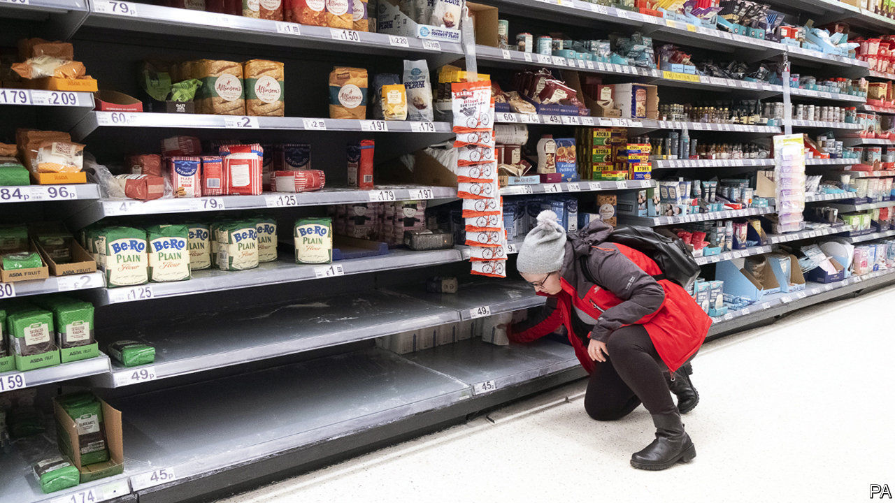

###### Preppers

# For some Britons, coronavirus means apocalypse soon 

##### Christmas has come for disaster hobbyists 

 

> Mar 7th 2020 

“I’M NOT GOING to be selling boiled heads on a market stall,” says the anonymous leader of the South East England Preppers, a survivalist group that has meticulously planned for the coming apocalypse. Historical analysis, he says, is crucial to this preparation. After discovering that peasants turned to cannibalism during the Russian famine in the 1920s, he was spurred on to avoid a similar situation. Since then he has brought fellow-travellers together through online groups and awaydays to share bushcraft techniques.

Until now emergency preparation has been the preserve of a small band of eccentrics. But since coronavirus began spreading throughout Britain, their social media groups have seen an influx of applicants. To these hobbyists of disaster, all catastrophes are streamlined into the simple acronym “SHTF”, and thorough preparation means that when “Shit Hits the Fan” they will be the übermenschen.


Britain’s spate of coronavirus infections has so far remained rather mild, with the number of cases rising to 87 on March 4th, and 12 people who tested positive have recovered. But the government’s latest plans make for alarming reading. Police will ignore all but the most serious crimes, concentrating on public order. Health workers currently enjoying retirement will be called back to nurse the infected. Large-scale gatherings could be reduced and schools closed. Lockdown would prove popular, according to Ipsos MORI, a polling firm, which found that three-quarters of Britons support quarantining cities and towns. At present, the government is content with reminding citizens to wash their hands. The British public are complying. Hand sanitiser sales are up by 255%.

Those disinclined to stay calm are stripping supermarket shelves of bottled water, tinned food, pasta and cleaning products. Some are joining the survivalist clubs. One Facebook group “Coronavirus UK Preppers S.H.T.F raw survival” has gained 787 new members in the last 30 days, bringing their total to 5,872. They also offer a specialist offshoot account, selling items that they judge will be handy in the event of social collapse: crossbows fitted with telescopic sights and 12-hour ration packs. These are the hardcore survivalists, who see Armageddon round every geopolitical corner. Last year, their name was “Preppers UK S.H.T.F brexit raw survival”.

Their advice ranges from stockpiling tips to instructions on fitting ultraviolet lights above your doormat that kill germs arriving on your mail. Mostly, though, the survivalists’ advice is about discouraging people from going rogue and “bugging out” (running away). “A lot of people think they are going to live in the woods, and live off rabbits and fish,” says the South East England Preppers commander, a Gillingham travel agent by day. “If they do go and live off that diet for three weeks, they are going to be very ill indeed.” He is giving lessons on what happened after the Romans left Britain. To help his followers survive the modern Dark Ages now looming, he has been instructing amateurs in the making of pottage, a vegetable stew.

Others have turned to more professional outfits. James Blake, who runs Europe’s largest crisis food supplier, says orders are up 100-fold. Demand, Mr Blake suggests, may have been suppressed in recent years. “We’ve had a long extended period of austerity, so emergency planning has always taken a back seat.” It’s a reasonably priced way to get ready for the apocalypse: £425 ($550) buys three months’ supply of food that will last 25 years. For even more parsimonious preppers, there’s the budget option: pottage.■

