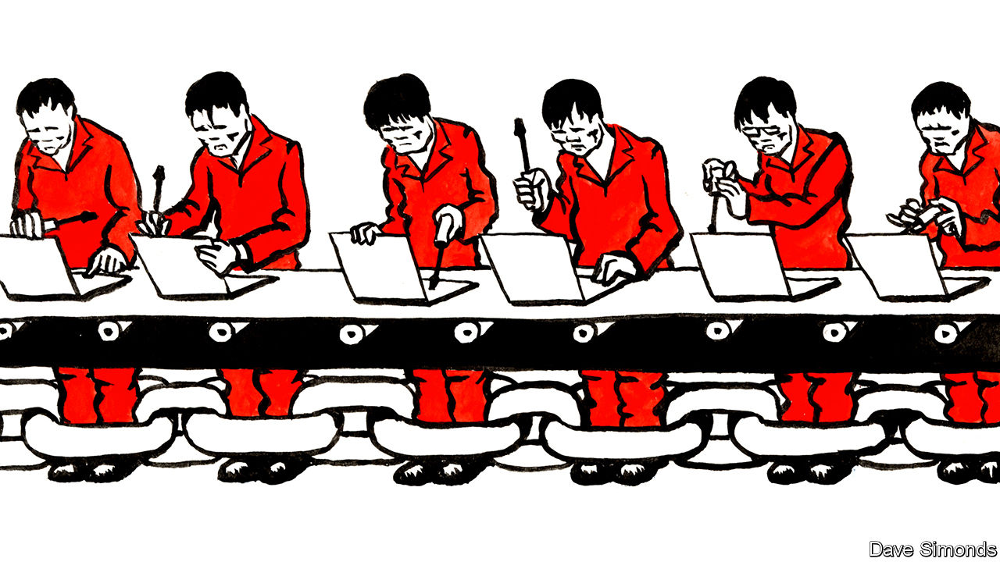

###### From slammer to serfdom

# What happens when China’s Uighurs are released from re-education camps 

##### Many are forced to work in factories, a new report claims 

 

> Mar 7th 2020 

AT THE END of last year the Communist Party decided to deflect some of the international opprobrium it was earning because of its vast network of detention facilities in the western region of Xinjiang. Since 2017 perhaps 1m Uighurs, a predominantly Muslim group indigenous to the area, have been thrown into the prison camps, which are officially referred to as vocational-training centres. Offences include even the most innocuous forms of piety, such as sporting long beards. The party had claimed the centres were necessary to “deradicalise” potential terrorists. Few outsiders accepted this implausible argument. So in December Xinjiang’s government declared that “all trainees” in the camps had “graduated”.

Where are they now? A report published on March 1st by the Australian Strategic Policy Institute (ASPI), a think-tank in Canberra, reveals that some former detainees in Xinjiang have swapped one form of coercion for another, and have been obliged to go work in other provinces. In 2017-19, the study found, more than 80,000 Uighurs were shipped out of Xinjiang to take jobs in factories across China under conditions that “strongly suggest forced labour”. An analysis of government documents suggests that many prisoners were transferred directly from the detention centres to their new workplaces.


Vicky Xu, the study’s lead author, found that at least 27 factories in nine provinces benefit from this labour-transfer scheme. Many are links in supply chains of prominent Western brands like Apple, Dell, Mercedes-Benz and Nike. Not all such companies may be aware of this, since big multinationals are unlikely to deal directly with every subcontractor.

China’s government openly admits that it arranges for the transfer of “surplus” Uighur workers in Xinjiang to the rest of China. The scheme, meant to reduce poverty, is known as “Xinjiang Aid”. Factories in wealthy coastal provinces, which tend to be short of labour, offer higher wages than most forms of manual work in Xinjiang, a poorer region. The government insists that participation in the programme is entirely voluntary. The foreign ministry impugns the integrity of ASPI, accusing it, without evidence, of ties with the “US government and arms dealers”.

Ms Xu acknowledges that there may be a “genuinely” voluntary component. Even so, her research indicates that once Uighur workers arrive on factory sites, their freedoms are severely curbed. Satellite imagery and first-hand accounts compiled by Ms Xu and her co-authors paint a disturbing picture. Uighur workers live in segregated quarters and eat in separate canteens from their ethnic-Han comrades. In some factories Uighurs are paid less for the same work. Relatives back in Xinjiang are said to face threats lest Uighur workers think of resigning before their contracts end.

A recent online ad for “government-sponsored” Uighur labour posted by an agent affiliated to Xinjiang’s government extols the benefits of hiring Uighurs. One such benefit is the “semi-military style of management”, says the posting. That is because a “government-appointed companion” is required to live on-site for every 50-100 Uighurs, the agent explains. The function of this “companion”, whose salary must be borne by the prospective employer, is ostensibly to prevent cultural misunderstanding between Uighurs and Han Chinese. In all likelihood, however, they are really there to snoop and to enforce discipline. “If one Uighur misbehaves, they all get sent back.” It may be a while yet before criticism of the party’s conduct in Xinjiang dries up. ■

