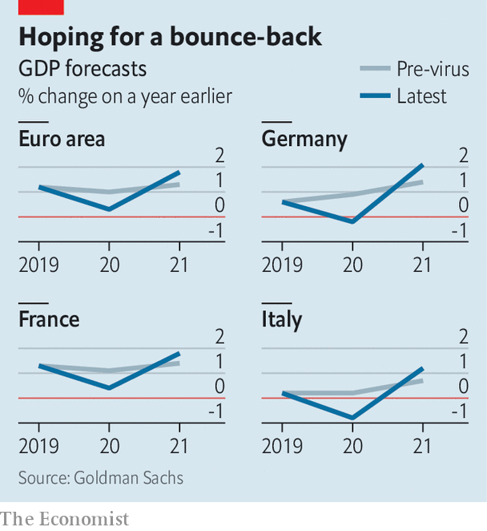

###### A series of unfortunate events

# Covid-19 risks tipping Germany and Italy into recession 

##### Both economies have already borne a number of blows 

 

> Mar 7th 2020 

BAD WEATHER, trade war, changes to car-emissions testing, and low water levels in the Rhine: since 2017 Europe’s economy has been struck by a number of shocks, none of which hapless finance ministers or central bankers could control. Last year euro-area GDP rose by only 1.2%. Germany and Italy, which as big manufacturers were most exposed to America’s trade war with China, sank to the bottom of the zone’s growth rankings.

Now covid-19 is spreading across the continent. Over 3,000 cases have been confirmed in Italy, and more than 200 each in France and Germany. Responding to the outbreak falls to health authorities. But the virus also deals the economy a big blow.


The economic trouble began even before the virus reached Europe. China is usually a keen buyer of European cars and other manufactured goods, gobbling up 7% of German exports. Figures for February are not yet available, but it seems certain that sales will have fallen as the epidemic took hold in China.

Disruption will also have rippled along manufacturers’ supply chains, many of which rely on parts from China, and hurt countries such as Germany. According to a survey of euro-area purchasing managers, released on March 2nd, lead times for the delivery of manufacturing parts had lengthened “appreciably” in February, with respondents attributing the delay to coronavirus-related shutdowns in China.

Added to all of this is the economic impact of the outbreak of the virus in northern Italy. The country’s most productive regions, Lombardy and Veneto, have been the most seriously affected. Together they account for nearly a third of output. On March 4th the government ordered the closure of schools and universities nationwide until March 15th. Such containment measures could force more people to stay at home, leading to a further drop in economic activity.

 


All told, another bad year for Italy and Germany seems likely (see chart). Analysts at Goldman Sachs are expecting both to fall into recession in the first half; the euro area as a whole is expected narrowly to skirt one. Forecasters are pencilling in a sharp rebound in the second half of the year. But precisely when it comes will depend on the extent to which the virus spreads and on the measures taken to contain it. Authorities in France, for instance, have banned large-scale indoor events. Some tourist attractions, such as the Louvre, have closed. That will slow the spread of the virus. But it will also drag down output: according to the OECD, tourism accounts for 7% of France’s GDP, and around 12% in Portugal and Spain.

Expectations are rising that policymakers will help companies that face the most disruption. On March 2nd Christine Lagarde, the head of the European Central Bank (ECB), promised to take “appropriate and targeted” measures to deal with the economic effects of the virus. Investors expect the ECB to cut interest rates in coming months, following the lead of America’s Federal Reserve, which on March 3rd unexpectedly cut rates. But with the ECB’s rates already at -0.5%, it has little room to prune further. Some economists expect it to tweak its cheap-lending scheme for banks at its meeting on March 12th instead, perhaps to encourage lenders to keep credit flowing to companies that have been most affected by the spread of the virus.

So far governments have shown varying degrees of enthusiasm for loosening the purse strings. Italy has promised to spend €3.6bn ($4bn) on health care and tax cuts to help companies facing the most disruption. Given the unusual circumstances, it has a dispensation from the European Commission to spend more than the EU’s fiscal rules would allow in normal times. France’s finance minister, Bruno Le Maire, is urging more spending to cushion the blow to the economy. By contrast, Germany’s government, traditionally tight-fisted, has so far done little.

This could rapidly change if the virus spreads further. Analysts from Deutsche Bank predict that euro-area GDP growth could fall at an annualised rate of 4% in the second quarter if there is a more severe outbreak, and by even more in Germany. The prospect of job losses and bankruptcies might soon jolt governments into doing a lot more. ■

