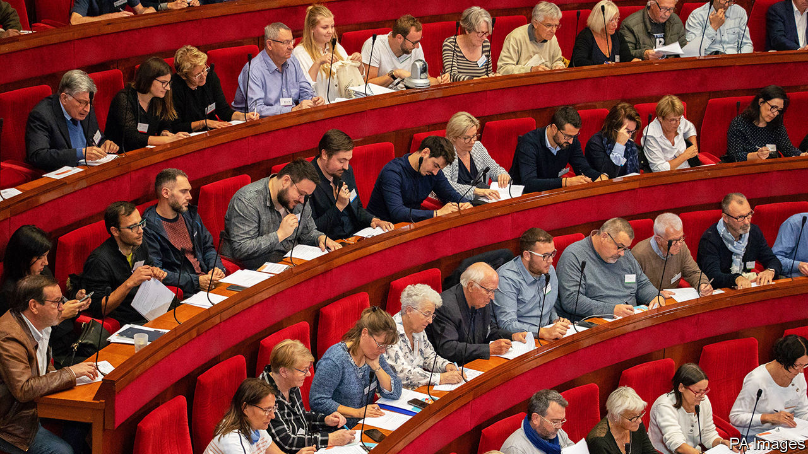

###### Aux powerpoints, citoyens!

# France asks its citizens how to meet its climate-change targets 

##### An experiment in consultative democracy 

 

> Mar 7th 2020 

A NURSE, a roofer, an electrician, a former fireman, a lycée pupil, a photographer, a teacher, a marketing manager, an entrepreneur and a civil servant. Sitting on red velvet benches in a domed art-deco amphitheatre in Paris, they and 140 colleagues are part of an unusual democratic experiment in a famously centralised country. Their mission: to draw up measures to reduce French greenhouse-gas emissions by at least 40% by 2030, in line with an EU target that is otherwise in danger of being missed (and which the European Commission now wants to tighten). Six months ago, none of them had met. Now, they have just one month left to show that they can reinvent the French democratic process—and help save the planet. “It’s our moment,” Sylvain, one of the delegates, tells his colleagues from the podium. “We have the chance to propose something historic.”

On March 6th the “citizens’ climate convention” was due to begin its penultimate three-day sitting, the sixth since it began work last October. The convention is made up of a representative sample of the French population, selected by randomly generated telephone numbers. President Emmanuel Macron devised it in an attempt to calm the country after the gilets jaunes (yellow jackets) crisis of 2018. In response to the demand for less top-down decision-making, he first launched what he grandly called a “great national debate”, which took place a year ago. He also pledged the creation of a citizens’ assembly. It is designed to focus on precisely the conundrum that provoked the original protests against a rise in the carbon tax on motor fuel: how to make green policy palatable, efficient and fair.


“It was a real shock at first,” says Guy, a retired computer technician from Limousin, in central France, “because I realised that all the common-sense things we are doing are far from enough to stop climate change.” When delegates began travelling to Paris for their monthly sessions, they took evidence from experts, listened to presentations, and studied. “I didn’t know what to expect. I thought it would be mostly a discussion,” says Agny, who works for a medical firm. When the prime minister, Edouard Philippe, turned up on the first day, however, “we realised that the stakes were really high.”

Divided into five working groups—to discuss such topics as transport, housing or food—they then began working on proposals that could actually be put into practice. Scientists, farmers, businessmen, urban planners and over 100 other witnesses were summoned. In January they invited Mr Macron, who spent over two hours answering questions and urged them to be “precise” and “bold”. In an over-lit basement meeting room on a recent Friday evening, small groups could be found poring over documents, discussing the feedback given by legal experts on their initial ideas. Five lawyers are on hand to help shape proposals into legally enforceable text.

Forging a consensus, even after five months of exhaustive discussion, will not be easy. The older members tend to be more complacent about climate change, note some of the delegates, while the younger are more ambitious. A few grumble that the exercise is a gimmick; others argue that Mr Macron is politically committed to making it work. The regional mix has exposed divergent views, but has also precluded metropolitan bias. Grégoire, a 31-year-old from Normandy who works with the unemployed, says that he had to remind Parisians that it is not practical for those in rural areas “just to say ban cars”. Despite such differences, over 90% of the original delegates are still taking part, notes Thierry Pech, a think-tanker who presides over the assembly. He argues that the gravity of the subject, along with Mr Macron’s backing, have been crucial in persuading delegates to invest long hours and weekends away from home in the exercise.

It is a gamble nonetheless. Next month, the assembly will send its final list of measures to Mr Macron. He has promised delegates that he would put the bulk of them either to parliament, or to a referendum. Still unpopular in the polls, the president badly needs to show that he has listened to the many critics of his elitist governing style. In this respect, it did not help that his government chose to force its unpopular pension-reform proposals through parliament this week by using a special constitutional provision, known as 49-3.

If the proposals that emerge from the citizens’ assembly are indeed bold, and Mr Macron is prepared to risk putting them to a vote, this could prove a way for him both to renew popular legitimacy and to deflect blame for potentially unpopular green policies onto the assembly. If he rejects too many, however, the exercise will be denounced as a sham, designed to disguise what in most other respects remains a highly centralised presidency. ■

