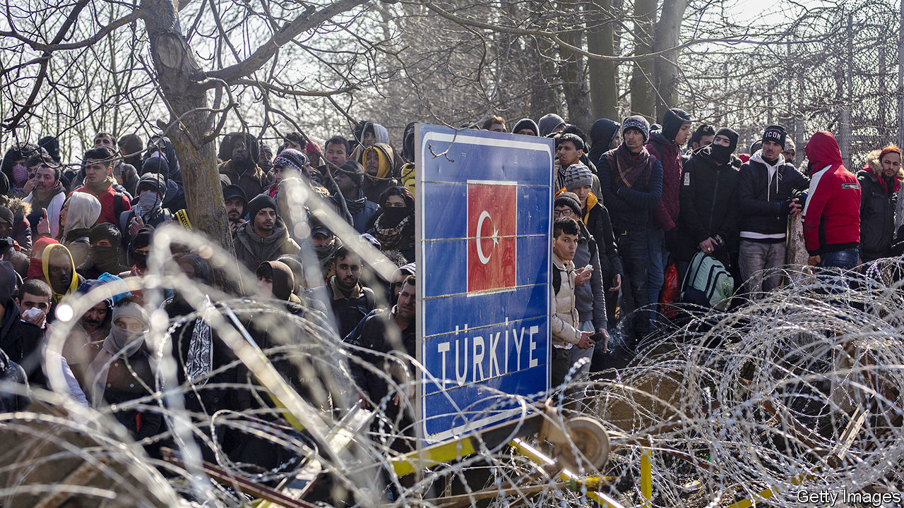
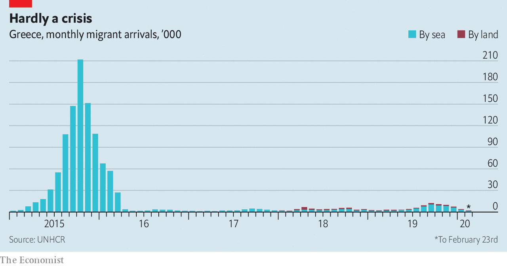

###### No refuge

# Turkey threatens to let asylum-seekers flood into Europe 

##### But Greece and the EU are refusing to let them in 

 

> Mar 7th 2020 

WHEN President Recep Tayyip Erdogan announced on February 28th that his government would no longer stop refugees from crossing into Greece, Nabila’s parents packed her and her five siblings onto a bus, left their house in the Turkish town of Tokat and headed west. The 12-year-old Afghan refugee had no chance to say goodbye to her Turkish classmates. No one bothered to tell Nabila and her family that the Greek side of the border would be closed. So they and dozens of other migrants have spent the past five days in a field on the banks of the Maritsa River, which separates the two countries, with armed Greek guards on the far side. “We have to keep waiting for the border to open,” says Nabila, translating for her father (she learned fluent Turkish at school). “We have no money to go back.”

Nabila and the tens of thousands of other migrants who took up Mr Erdogan’s empty promise of free passage to Europe are now trapped in an international standoff. Turkey is home to 3.6m refugees from the war in Syria, and polls show most Turks want them to leave. Turkey says it opened the border to Greece in the face of an imminent influx of another 1m refugees from bloody fighting in Idlib (see ). More likely, it wants to divert attention from its military problems there.


In response, Greece began forcibly turning back migrants. It sent riot police, armoured vehicles and 1,000 soldiers to the border, and suspended the right to apply for asylum for a month. The European Union rushed to Greece’s aid. After a visit to the border on March 3rd, Ursula von der Leyen, the president of the European Commission, promised €700m ($780m) in emergency assistance, along with seven vessels, two helicopters, a plane and extra guards from Frontex, the EU border agency. European foreign ministers will meet on March 6 to discuss further measures.

Turkey and the EU are stuck in an uneasy bargain over refugees. After more than 1m migrants entered Europe from Turkey in 2015-16, the two sides came to a deal. The EU offered Turkey €6bn in aid for refugees. Turkey promised to do whatever it could to prevent them from leaving, and to take back any migrants who reached Greece but had their applications for refugee status rejected. But the aid ran out at the end of last year. Mr Erdogan says he turned down an offer of another €1bn as insufficient; the EU denies making the offer.

Since the deal was first signed, Mr Erdogan has often threatened to let migrants stream into Europe again. On February 29th, as more than 10,000 people stepped off buses and passed through a Turkish checkpoint near the town of Edirne, “it looked as if our nightmare scenario ... was coming true,” said a Greek diplomat. Greek border guards blocked the migrants, who became trapped between the checkpoints. On March 2nd police fired tear-gas on the crowd, and the Greek military staged an exercise nearby using live artillery. Intimidated, some migrants have begun returning to Turkey.

The other main route into Greece has been via inflatable dinghy to Lesbos, an island just five miles (8km) off the Turkish coast. The number of migrants rose there too, with some 1,200 arriving on March 1st and 2nd alone. But the island is already overcrowded with migrants, including 19,000 in a camp built for 3,000, and locals have grown weary of the burden. Some migrants say their boats have been attacked by unidentified men who push them back towards Turkey. A small boy drowned on March 2nd when a dinghy capsized; the Greek coastguard rescued the others.

Greece’s tough response has forestalled another crisis like that of 2015 (the numbers remain tiny, see chart), and it has the support of the EU. But its suspension of the right to apply for asylum violates international and European law. The International Convention on Refugees bars countries from turning away people seeking asylum, a practice known as “refoulement”. “The minimum that a state has to do is to check whether those who come to its border have a right to refugee status, and you can’t do that if you’re keeping them at a distance with tear-gas,” says Hanne Beirens of the Migration Policy Institute Europe, a think-tank in Brussels.

 


Greece has invoked anarticle of the EU Treaty that allows emergency measures when a state is overwhelmed by migrants. But that does not include suspending asylum, according to UNHCR, the UN’s refugee agency. Gerald Knaus, an expert who helped design the EU-Turkey migration pact, says the suspension threatens the very existence of the right to asylum, and accuses the EU of implementing “Trump-style policies”. Harsh words for Greece’s newish prime minister, Kyriakos Mitsotakis, to hear.

A durable solution will require more people, presumably to be paid for by Europe as a whole, to process asylum applications in Greece, so that the EU is less vulnerable to extortion. It will also require a new deal with Turkey. Some EU foreign ministers support a no-fly zone in Idlib as part of an effort to prevent the refugee flood Turkey fears. There has been less talk of more generous aid to Turkey. That is unpopular with European voters, who tend to dislike the autocratic Mr Erdogan.

In the meantime, Greece and Europe are relying on deterrence. Turkey claims that 130,000 refugees have already headed for Greece, a wildly inflated figure aimed at satisfying domestic anti-refugee pressure. Most of them are not Syrians, but Afghans and others. No one knows the real numbers, nor how many have made it across. Those who have, and were caught, return with harrowing stories.

Ali Khoja, an Afghan teenager, says he crossed the river four times, once by swimming and three times by boat. He says the Greek police took his phone, identity papers and clothes, and sent him back in his underwear. Others say they were beaten or tasered. On March 4th migrants and Turkish authorities reported that Greek police had fired on a group crossing near the town of Pazarkule, killing one and wounding five; the Greek government denied it. Greece may be avoiding another migrant crisis, but it risks plunging Europe into a crisis of conscience. ■

