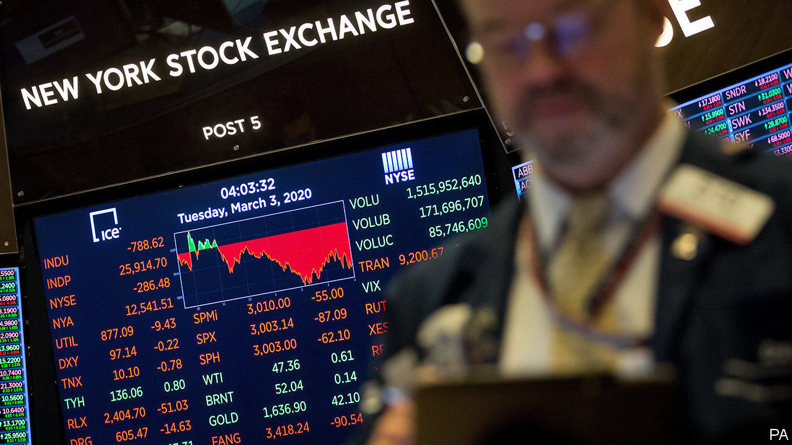

###### Where the bucks stop

# Can America’s banking system keep cash flowing if activity dries up? 

##### Banks are on the front lines of the economic fallout 

 

> Mar 5th 2020 

DURING THE financial crisis of 2007-09, American banks were part of the problem. As the covid-19 disease spreads, and efforts to halt it threaten to cause a cash crunch, they could be part of the solution. Company revenues may tumble but firms will still need to cover wages, leases and loans. Workers—especially temporary or gig ones—may not be paid, but mortgage or rent payments and credit-card bills will pile up. The banks (maybe backed by the government) will need to plug the gap.

Ordinarily, such stresses would indicate insolvency and banks would attempt to collect. But this crisis is different. There is a reasonable expectation that the cash crunch will be temporary. When activity resumes payments can once again start flowing.


America has recently endured a small-scale version of such a cashflow crisis. From December 22nd 2018 the government was shut down for 35 days, resulting in delays to the wage payments of 800,000 federal employees. According to Prudential, an insurance company, half of the federal employees it surveyed missed bill payments, like utilities or phone bills, and a quarter missed making a mortgage payment.

Many banks at the time acted to minimise financial hardship, by agreeing to delays in mortgage payments, waiving credit-card interest and overdraft fees, allowing early access to fixed-term deposits and offering low- or no-interest short-term financing to some customers. There were some long-term effects, like lower credit scores, but few major ones.

If such measures are required for a longer period, the pressures on banks to lend or offer forbearance might clash with post-crisis regulatory restrictions. Big banks already report seeing “flight to quality” deposits pouring in. But leverage ratios constrain bank balance-sheets. More deposits might induce banks to cut back on other activities.

No one is served by defaults on the part of borrowers who would have been solvent but for the epidemic. The question for banks, their customers and their regulators is how these can be avoided.

