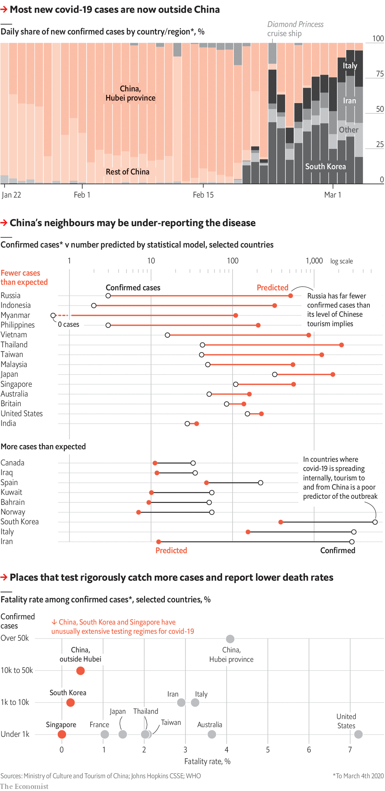

###### Tracking the stealthy killer

# Tourism flows and death rates suggest covid-19 is being under-reported 

##### Indonesia, Myanmar, Russia and the Philippines have confirmed just eight cases 

 

> Mar 7th 2020 


IN RECENT WEEKS covid-19, a deadly new disease, has slowed in China but spread widely elsewhere. China’s strict quarantine has led to a 90% decline in new infections, whereas outbreaks in Italy and Iran have grown rapidly. In the last week of February 70% of new diagnoses were outside of China. As covid-19 reaches countries unwilling or unable to monitor it, officials must use educated guesswork to track its evolution.

The number of cases each country reports depends both on the number of infections and on how many people get tested. By March 1st South Korea had tested over 100,000 people; America just 472.


To estimate the number of undetected cases, scholars can make use of patterns in more complete data. One model, built by a team at Harvard, used the number of people flying from Hubei province in China, where the outbreak began, to various countries to predict imported cases. Such data are less relevant now, because Hubei has been locked down for a month.

To derive fresh estimates, The Economist built a similar model. We tested the link within the OECD—a club of mostly rich countries, which should have strong detection capacity—between Chinese tourism in 2019 and confirmed covid-19 cases. As expected, OECD states that swapped lots of tourists with China, such as Switzerland, tend to report higher infection rates than do ones with small flows, like Belgium.


Applied worldwide, our model finds big outliers. The outbreaks in Iran, Italy and South Korea, where the virus is spreading internally, are bigger than tourist flows suggest. At the other extreme, countries like Singapore may have fewer diagnoses than expected because of strong containment efforts. But the Philippines, Russia, Myanmar and Indonesia have lots of people and tourism to and from China, and just eight confirmed cases in total. Thousands more have probably gone undetected.


Another pattern bolsters this finding. South Korea and China test regularly. In both places—excluding Hubei, where the virus began claiming lives before authorities formulated a response—0.5-1% of people who have tested positive have died. In other countries with at least one death, this rate is five times higher. Deaths are easier to count than infections are. The most likely explanation for this gap is that for every person diagnosed in these countries, four more do not know they are infected. ■

Sources: Ministry of Culture and Tourism of China; Johns Hopkins CSSE; WHO


