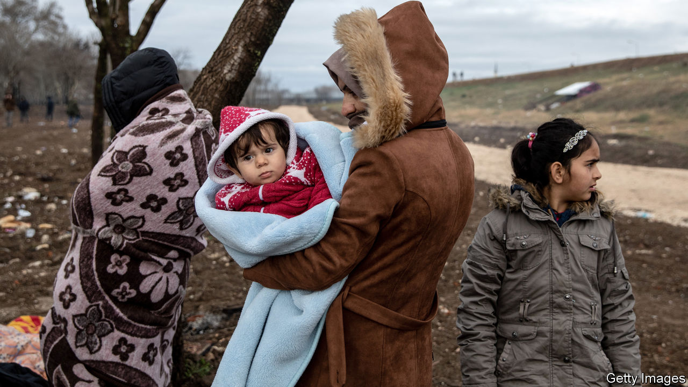

###### An ally in need

# Why NATO should grit its teeth and help Turkey in Idlib 

##### The crisis is an opportunity for the alliance to reinvigorate itself, while alleviating the suffering 

 

> Mar 7th 2020 

FEW PLACES on Earth are more miserable than Idlib province, the last big pocket of rebel-held territory in war-torn Syria. It is home to some 3m people, roughly half of whom are there only because they have fled fighting elsewhere. Along with the poor, huddled masses came jihadists, who now largely control the territory. Syria’s dictator, Bashar al-Assad, wants it back, even if that means reducing it to rubble. His months-long bombing campaign has destroyed schools, houses and hospitals, and pushed a million people towards Turkey’s sealed border. Many are trapped there, cold, hungry and exposed.

The world is at last waking up to this humanitarian crisis—and to the fact that Turkey is the only country trying to stave it off. Fearing another flood of migrants, its president, Recep Tayyip Erdogan, has sent thousands of troops to Idlib in recent weeks to stop Mr Assad’s offensive. Dozens were killed in an attack by Syrian (and perhaps Russian) forces on February 27th, prompting retaliatory strikes from Turkey (see ). But what got the attention of European countries was Mr Erdogan’s decision to open Turkey’s borders and send refugees streaming their way (see ).


Turkey is crying out for help in Idlib. Its NATO partners should provide it, not only to stop the suffering of desperate Syrians, but also to reinvigorate their faltering alliance.

Some NATO members are reluctant to work with Mr Erdogan. This is understandable. He locks up dissidents, cosies up to Russia, uses refugees as bargaining chips, and is often at odds with NATO. Look no further than Syria, where Turkey has pounded Kurdish fighters, whom it calls terrorists, but whom America regards as allies in the fight against Islamic State. Mr Erdogan sees Vladimir Putin, Russia’s president, as the man to deal with in Syria—and elsewhere. Mr Putin, in turn, uses Mr Erdogan to divide and weaken NATO. Russia’s sale to Turkey of an S-400 anti-aircraft system, which is incompatible with NATO systems, has deepened the rift between Turkey and its allies.

But Turkey is too important for NATO to abandon. It has the alliance’s second-biggest army and sits at the crossroads between west and east. The situation in Idlib, dire as it is, provides an opportunity to reset relations. Turkey has renewed its call for NATO to patrol a no-fly zone over the province and asked America for Patriot missiles to defend itself against attack. Western leaders are understandably reluctant to put troops on the ground or planes in the air around Idlib. NATO, though, can do more than merely express solidarity. Promises of more ammunition, humanitarian aid and radar surveillance over Syria are a start. Spain already stations Patriot missiles in Turkey and other European allies should step in. NATO should put its weight behind talks to reach a political settlement over Idlib. And Turkey should insist that some of its allies should be present at such talks, something Russia rejects.

These moves will not completely heal the rift between Turkey and the West, nor will they solve the problem of Idlib, which has been festering for years. But they might restore some of Turkey’s faith in its allies and send a message to Mr Putin. The fact that such strategic considerations—and a fear of Syrian refugees—might motivate Western policymakers more than their concern over struggling Syrians is disheartening. Yet NATO attention would look the same to the people of Idlib whatever its motive. Helping Turkey there would alleviate some of their suffering. ■

