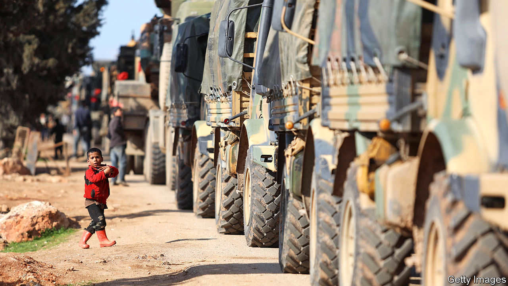
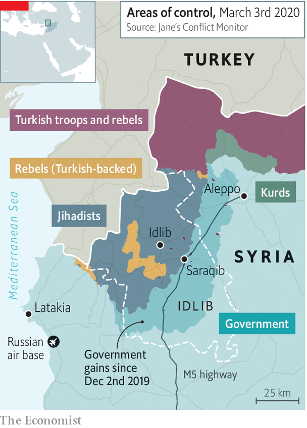

###### The battle for Idlib

# As Turkey pounds the Syrian army, Russia wants to talk 

##### Two tetchy autocrats, one propped-up tyrant and a big bloody mess 

 

> Mar 5th 2020 

THE SYRIAN army is still better at stealing refrigerators than at fighting rebels. But after a decade of war it at last looked to be learning better tactics. Instead of sending lone tanks to bounce through the hills, some units fighting in Idlib, the last opposition-held province, have worked together, with columns of armour backed by infantry. In recent days, though, grainy black-and-white footage has shown those tanks being pulverised from overhead, their crews helpless to fight back.

Long accustomed to squaring off with ill-equipped rebels, Bashar al-Assad’s men are unexpectedly battling the second-largest army in NATO. The clash began on February 27th when an air strike on a Turkish convoy killed at least 36 soldiers, the deadliest attack on Turkish troops in more than two decades. It is still unclear whether Syrian or Russian jets dropped the bombs. But Turkey has chosen to respond to Syria with a barrage of drone strikes and artillery that have dealt Mr Assad’s regime its worst blow in years. It has also brought Turkey to the brink of conflict with Russia, Mr Assad’s biggest foreign backer.


As The Economist went to press, the leaders of Russia and Turkey were to hold a meeting in Moscow. President Recep Tayyip Erdogan entered with a stronger hand than he had just weeks ago. He wants to stop the Syrian regime from retaking Idlib and forcing millions more desperate refugees across the border. Caught between a furious Mr Erdogan and a recalcitrant Mr Assad, Vladimir Putin cannot offer much. He and Mr Erdogan might agree on a new demarcation line to separate Turkish and Syrian troops, an updated version of the deal they made in Sochi in 2018—which quickly fell apart. That may only delay the reckoning, but may be enough to stanch the current fighting. In the long run, Turkey’s intervention may also benefit Russia, by demonstrating to the Syrian regime that it cannot endure without Russian support.

That should now be painfully clear to Mr Assad. Although there are no precise statistics on his losses (both sides have an incentive to fudge them), even regime loyalists say hundreds of Syrian soldiers have been killed by Turkish strikes. The casualties also include members of Hizbullah, a Lebanese militia that backs Mr Assad, and other Iranian-trained militias stocked with Afghan and Pakistani fighters. A video posted on social media showed Syrian troops roaming Idlib in an ambulance (itself a war crime), desperately trying to hide from Turkish missiles. Scores of Syrian tanks have been destroyed or captured.

 


Turkey hit back mostly with unmanned drones. They fly low and slow, without the range or payload of America’s hulking Reapers. But they pack enough punch to wreck armoured units. Syria’s air defences, never very strong, were useless against swarms of drones orbiting overhead. After Syrian jets shot one down, a Turkish F-16 downed two of the Syrian planes.

The Turks could do this because Russia sat on the sidelines. On February 29th Mr Erdogan asked his Russian counterpart to “get out of the way” in Idlib. Mr Putin temporarily obliged, letting Turkey save face and claim retribution. Russian jets were grounded for much of the weekend and air-defence batteries kept quiet. Mr Putin probably cares more about economic and military ties with Turkey than about Syria. He would love to split Turkey from NATO and the European Union.

Still, he cannot indulge Turkey forever, because he cannot afford to see Mr Assad fall. Before the latest clash in Idlib the regime seemed on track to recapture all of the province, home to millions of Syrians displaced from elsewhere. Now Hizbullah and Iran have had to rush in reinforcements to help a Syrian army on the defensive. Letting Turkey slaughter Mr Assad’s forces would hurt Russian credibility and could force the Kremlin to send more of its own men to defend Mr Assad’s gains.

In recent weeks the focal point of fighting has been Saraqib, a town in eastern Idlib that sits on the M5, the main north-south highway. If rebels control it they can block transport between Damascus, the capital, and Aleppo, Syria’s one-time commercial hub. Saraqib, now under regime control, has changed hands three times since late February. On March 2nd the Russian defence ministry announced that it would deploy military police there.

They have little to police: Saraqib has few people left. But a Russian presence would limit Turkey’s freedom of action, unless Turkey were willing to engage Russian troops directly. That is unlikely, especially if Turkey’s NATO allies were against it. Neither America nor European states relish another intervention in the Middle East, least of all a direct clash with Russia.

Turkey has not helped its case in the West. Its dalliance with Moscow, last year’s offensive against Kurdish insurgents in Syria, the readiness to use refugees to put pressure on Europe, and a series of other rows have damaged its reputation. Another offence was its purchase of Russia’s S-400 air-defence system. America refuses to sell Mr Erdogan its own Patriot missiles unless it mothballs the Russian batteries.

Though Turkey inflicted painful damage on the Syrian regime, its own casualties put Mr Erdogan in a tight spot at home. He was already under fire for his Syria policy, even among friends. Most Turks want the 3.6m Syrians living in Turkey to go. His threat to grant them free passage to Europe has played well at home. But if he cannot prevent Idlib’s collapse he will face further criticism for leaving Turkish troops vulnerable on the battlefield, without a clear mandate. Mr Erdogan enjoys a reputation as a neighbourhood tough who helped turn Turkey from a Western client state into a regional power. “A major setback in Idlib would be a major setback to his image,” says Galip Dalay of Oxford University.

In the end, Messrs Erdogan and Putin face similar dilemmas. They want to contain the conflict, leaving Idlib as a buffer zone between Turkey and regime-held Syria. Vladimir Frolov, an expert on Russian foreign policy, points to the Donbas in eastern Ukraine as a model. Mr Assad, though, still wants to reclaim the last bits of his ravaged kingdom. Turkish ire and Russian insouciance may force him to back off, for now. But no one has a real solution for Idlib—and for the millions of exhausted, desperate civilians trapped inside. ■

