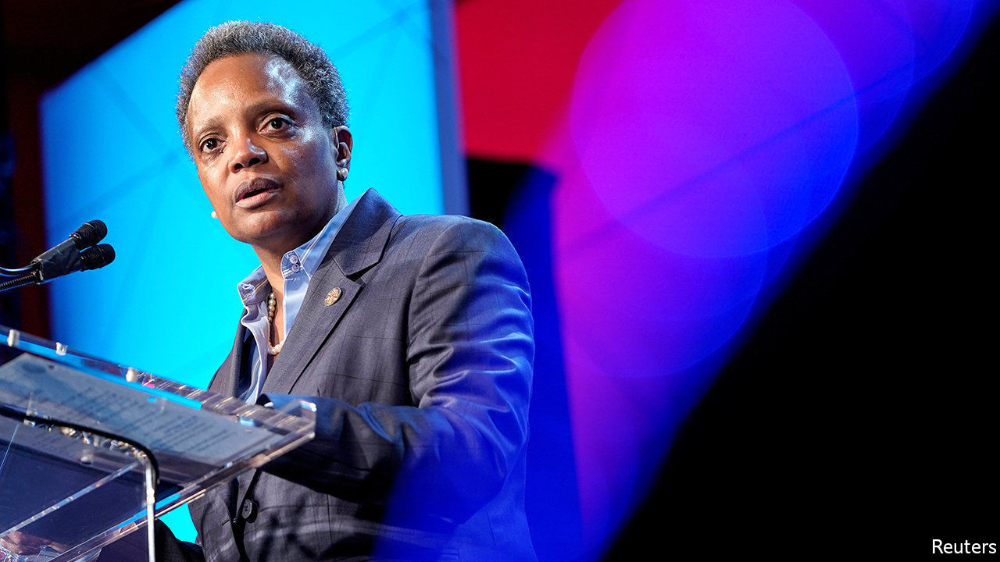

###### Policing poverty

# Chicago’s mayor thinks she has a plan to end poverty in a generation 

##### The city’s changing demographics make Lori Lightfoot’s job harder 

 

> Mar 7th 2020 

BLACK FAMILIES on Chicago’s South and West Sides have long endured joblessness, decrepit housing and violence. Lori Lightfoot, the city’s mayor for the past nine months, has made cutting poverty her main goal. Like the rest of the country, the city is doing well on this score: the poverty rate for Afrian-Americans and Hispanics has been creeping down, though that has more to do with low unemployment and decent wage growth than with City Hall.

Ms Lightfoot, who grew up poor in Ohio, speaks personally about privation. Her childhood taught her “what hardship and financial struggle was all about”. Though her father had three jobs, the family saw cars repossessed and services cut off for unpaid bills. She put herself through college and studied law. Her first summer job paid more than her father had ever earned. She was too embarrassed to tell him.


This sort of story is still common in Chicago. In its public schools 76% of students qualify for free meals because of low incomes. When classes end, many do without nutritious food. Life-expectancy can vary by as much as 15 years between neighbouring areas on the South Side. Ms Lightfoot points out that Cook County, which includes the Windy City, has the highest rate of personal bankruptcies in Illinois—often because people owe debts to the city.

Ms Lightfoot traces inequality’s roots in America to the “original sin of slavery”, and blames government for keeping black families down. She cites redlining, a practice of city governments and mortgage-lenders to determine which neighbourhoods African-Americans were allowed to live in, and the de facto segregation of black children at school. A mayor cannot do much about that history, and in any case many of her plans are small-bore. She will start by scrapping city fines and fees that burden the poor especially—as a small example, libraries no longer charge for overdue books. She wants more rights for tenants and the end of regulations that take away drivers’ licences for petty infractions, because losing a car often means losing a job.

She promises an extra $750m over the next three years to spruce up roads, parks and public transport in ten corridors running through needy districts. Philanthropists and foundations will be tapped for help. She will also expand a financial model that diverts some capital from firms building offices and skyscrapers downtown to boost small businesses in poor areas. Rahm Emanuel, her predecessor, launched that scheme in 2017 and says it will soon be worth $170m.

One of Ms Lightfoot’s plans is genuinely radical, however. Citing the “outrageous amounts of money that we spend on a criminal-justice infrastructure that is mostly punitive”—over $1.7bn a year for policing—she wants to switch spending to social and economic needs. Broken families, poor care for children and overall deprivation are the deepest causes of violent crime, she argues. Spending on mental-health care, she says, could do more to curb crime than paying for lots of arrests.

None of that will be easy. The wealthy voters who swept Ms Lightfoot to office last year could grow jittery if cuts to police are followed by a spike in violent crime. More important, the Chicagoans most affected by violence are the city’s poorest residents, whom Ms Lightfoot wants to help. She risks a sour relationship with the police after sacking their superintendent for ethical lapses in December. Her separate plans to tackle corruption leave some long-serving city aldermen uneasy. And her record as a negotiator has yet to be proved after Chicago’s teachers won big payouts from her last year, after a lengthy strike.

Ms Lightfoot’s aspiration to “end poverty in a generation” has a further glitch. The poverty statistics are skewed by a decades-long collapse in the black population. Since 2010 the city has seen a net loss of 70,000 black residents, who fled to the suburbs, next-door Indiana or southern cities like Atlanta. Part of the decline in poverty simply reflects the fact that there are just fewer poor African-Americans in Chicago now. Yet some of those left behind are too poor to move, making the poverty that remains even more intractable.■

