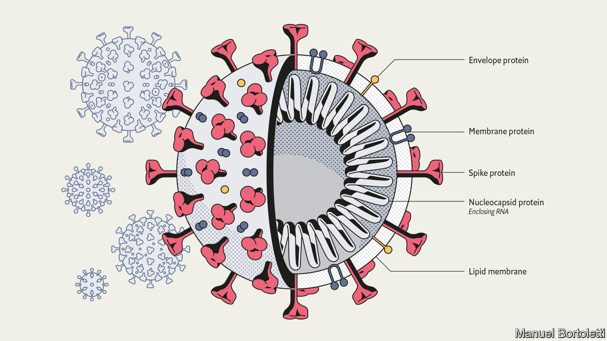
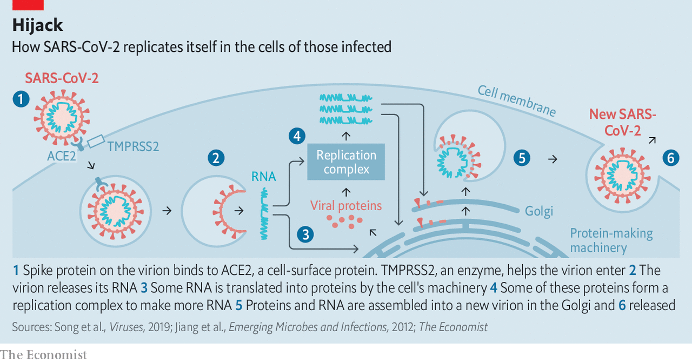
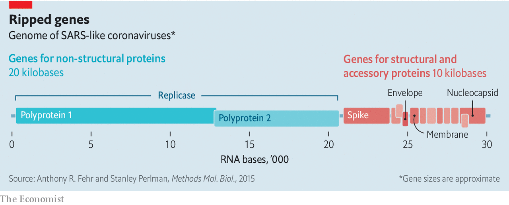
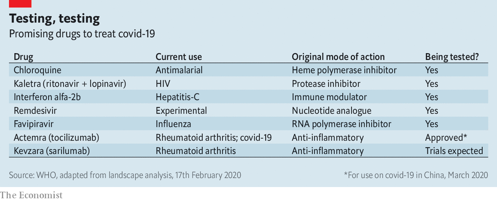

###### Anatomy of a killer

# Understanding SARS-CoV-2 and the drugs that might lessen its power 

##### Modest improvements in treatment could make a big difference 

 

> Mar 12th 2020 

THE INTERCONNECTEDNESS of the modern world has been a boon for SARS-CoV-2. Without planes, trains and automobiles the virus would never have got this far, this fast. Just a few months ago it took its first steps into a human host somewhere in or around Wuhan, in the Chinese province of Hubei. As of this week it had caused over 120,000 diagnosed cases of covid-19, from Tromsø to Buenos Aires, Alberta to Auckland, with most infections continuing to go undiagnosed (see ).

But interconnectedness may be its downfall, too. Scientists around the world are focusing their attention on its genome and the 27 proteins that it is known to produce, seeking to deepen their understanding and find ways to stop it in its tracks. The resulting plethora of activity has resulted in the posting of over 300 papers on MedRXiv, a repository for medical-research work that has not yet been formally peer-reviewed and published, since February 1st, and the depositing of hundreds of genome sequences in public databases. (For more coverage of covid-19 see our .)


The assault on the vaccine is not just taking place in the lab. As of February 28th China’s Clinical Trial Registry listed 105 trials of drugs and vaccines intended to combat SARS-CoV-2 either already recruiting patients or proposing to do so. As of March 11th its American equivalent, the National Library of Medicine, listed 84. This might seem premature, considering how recently the virus became known to science; is not drug development notoriously slow? But the reasonably well-understood basic biology of the virus makes it possible to work out which existing drugs have some chance of success, and that provides the basis for at least a little hope.

Even if a drug were only able to reduce mortality or sickness by a modest amount, it could make a great difference to the course of the disease. As Wuhan learned, and parts of Italy are now learning, treating the severely ill in numbers for which no hospitals were designed puts an unbearable burden on health systems. As Jeremy Farrar, the director of the Wellcome Trust, which funds research, puts it: “If you had a drug which reduced your time in hospital from 20 days to 15 days, that’s huge.”

Little noticed by doctors, let alone the public, until the outbreak of SARS (severe acute respiratory syndrome) that began in Guangdong in 2002, the coronavirus family was first recognised by science in the 1960s. Its members got their name because, under the early electron microscopes of the period, their shape seemed reminiscent of a monarch’s crown. (It is actually, modern methods show, more like that of an old-fashioned naval mine.) There are now more than 40 recognised members of the family, infecting a range of mammals and birds, including blackbirds, bats and cats. Veterinary virologists know them well because of the diseases they cause in pigs, cattle and poultry.

Virologists who concentrate on human disease used to pay less attention. Although two long-established coronaviruses cause between 15% and 30% of the symptoms referred to as “the common cold”, they did not cause serious diseases in people. Then, in 2002, the virus now known as SARS-CoV jumped from a horseshoe bat to a person (possibly by way of some intermediary). The subsequent outbreak went on to kill almost 800 people around the world.

Some of the studies which followed that outbreak highlighted the fact that related coronaviruses could easily follow SARS-CoV across the species barrier into humans. Unfortunately, this risk did not lead to the development of specific drugs aimed at such viruses. When SARS-CoV-2—similarly named because of its very similar genome—duly arrived, there were no dedicated anti-coronavirus drugs around to meet it.

As a known enemy

A SARS-CoV-2 virus particle, known technically as a virion, is about 90 nanometres (billionths of a metre) across—around a millionth the volume of the sort of cells it infects in the human lung. It contains four different proteins and a strand of RNA—a molecule which, like DNA, can store genetic information as a sequence of chemical letters called nucleotides. In this case, that information includes how to make all the other proteins that the virus needs in order to make copies of itself, but which it does not carry along from cell to cell.

The outer proteins sit athwart a membrane provided by the cell in which the virion was created. This membrane, made of lipids, breaks up when it encounters soap and water, which is why hand-washing is such a valuable barrier to infection.

The most prominent protein, the one which gives the virions their crown- or mine-like appearance by standing proud of the membrane, is called spike. Two other proteins, envelope protein and membrane protein, sit in the membrane between these spikes, providing structural integrity. Inside the membrane a fourth protein, nucleocapsid, acts as a scaffold around which the virus wraps the 29,900nucleotides of RNA which make up its genome.

Though they store their genes in DNA, living cells use RNA for a range of other activities, such as taking the instructions written in the cell’s genome to the machinery which turns those instructions into proteins. Various sorts of virus, though, store their genes on RNA. Viruses like HIV, which causes AIDS, make DNA copies of their RNA genome once they get into a cell. This allows them to get into the nucleus and stay around for years. Coronaviruses take a simpler approach. Their RNA is formatted to look like the messenger RNA which tells cells what proteins to make. As soon as that RNA gets into the cell, flummoxed protein-making machinery starts reading the viral genes and making the proteins they describe.

First contact between a virion and a cell is made by the spike protein. There is a region on this protein that fits hand-in-glove with ACE2, a protein found on the surface of some human cells, particularly those in the respiratory tract.

ACE2 has a role in controlling blood pressure, and preliminary data from a hospital in Wuhan suggest that high blood pressure increases the risks of someone who has contracted the illness dying of it (so do diabetes and heart disease). Whether this has anything to do with the fact that the virus’s entry point is linked to blood-pressure regulation remains to be seen.

Once a virion has attached itself to an ACE2 molecule, it bends a second protein on the exterior of the cell to its will. This is TMPRSS2, a protease. Proteases exist to cleave other proteins asunder, and the virus depends on TMPRSS2 obligingly cutting open the spike protein, exposing a stump called a fusion peptide. This lets the virion into the cell, where it is soon able to open up and release its RNA (see diagram).

 


Coronaviruses have genomes bigger than those seen in any other RNA viruses—about three times longer than HIV’s, twice as long as the influenza virus’s, and half as long again as the Ebola virus’s. At one end are the genes for the four structural proteins and eight genes for small “accessory” proteins that seem to inhibit the host’s defences (see diagram). Together these account for just a third of the genome. The rest is the province of a complex gene called replicase. Cells have no interest in making RNA copies of RNA molecules, and so they have no machinery for the task that the virus can hijack. This means the virus has to bring the genes with which to make its own. The replicase gene creates two big “polyproteins” that cut themselves up into 15, or just possibly 16, short “non-structural proteins” (NSPs). These make up the machinery for copying and proofreading the genome—though some of them may have other roles, too.

 


Once the cell is making both structural proteins and RNA, it is time to start churning out new virions. Some of the RNA molecules get wrapped up with copies of the nucleocapsid proteins. They are then provided with bits of membrane which are rich in the three outer proteins. The envelope and membrane proteins play a large role in this assembly process, which takes place in a cellular workshop called the Golgi apparatus. A cell may make between 100 and 1,000 virions in this way, according to Stanley Perlman of the University of Iowa. Most of them are capable of taking over a new cell—either nearby or in another body—and starting the process off again.

Not all the RNA that has been created ends up packed into virions; leftovers escape into wider circulation. The coronavirus tests now in use pick up and amplify SARS-CoV-2-specific RNA sequences found in the sputum of infected patients.

Take your time, hurry up

Because a viral genome has no room for free riders, it is a fair bet that all of the proteins that SARS-CoV-2 makes when it gets into a cell are of vital importance. That makes each of them a potential target for drug designers. In the grip of a pandemic, though, the emphasis is on the targets that might be hit by drugs already at hand.

The obvious target is the replicase system. Because uninfected cells do not make RNA copies of RNA molecules, drugs which mess that process up can be lethal to the virus while not necessarily interfering with the normal functioning of the body. Similar thinking led to the first generation of anti-HIV drugs, which targeted the process that the virus uses to transcribe its RNA genome into DNA—another thing that healthy cells just do not do.

Like those first HIV drugs, some of the most promising SARS-CoV-2 treatments are molecules known as “nucleotide analogues”. They look like the letters of which RNA or DNA sequences are made up; but when a virus tries to use them for that purpose they mess things up in various ways.

The nucleotide-analogue drug that has gained the most attention for fighting SARS-CoV-2 is remdesivir. It was originally developed by Gilead Sciences, an American biotechnology firm, for use against Ebola fever. That work got as far as indicating that the drug was safe in humans, but because antibody therapy proved a better way of treating Ebola, remdesivir was put to one side. Laboratory tests, though, showed that it worked against a range of other RNA-based viruses, including SARS-CoV, and the same tests now show that it can block the replication of SARS-CoV-2, too.

There are now various trials of remdesivir’s efficacy in covid-19 patients. Gilead is organising two in Asia that will, together, involve 1,000 infected people. They are expected to yield results in mid- to late-April. Other nucleotide analogues are also under investigation. When they screened seven drugs approved for other purposes for evidence of activity against SARS-CoV-2, a group of researchers at the State Key Laboratory of Virology in Wuhan saw some potential in ribavirin, an antiviral drug used in the treatment of, among other things, hepatitis C, that is already on the list of essential medicines promulgated by the World Health Organisation (WHO).

Nucleotide analogues are not the only antiviral drugs. The second generation of anti-HIV drugs were the “protease inhibitors” which, used along with the original nucleotide analogues, revolutionised the treatment of the disease. They targeted an enzyme with which HIV cuts big proteins into smaller ones, rather as one of SARS-CoV-2’s NSPs cuts its big polyproteins into more little NSPs. Though the two viral enzymes do a similar job, they are not remotely related—HIV and SARS-CoV-2 have about as much in common as a human and a satsuma. Nevertheless, when Kaletra, a mixture of two protease inhibitors, ritonavir and lopinavir, was tried in SARS patients in 2003 it seemed to offer some benefit.

Another drug which was developed to deal with other RNA-based viruses—in particular, influenza—is Favipiravir (favilavir). It appears to interfere with one of the NSPs involved in making new RNA. But existing drugs that might have an effect on SARS-CoV-2 are not limited to those originally designed as antivirals. Chloroquine, a drug mostly used against malaria, was shown in the 2000s to have some effect on SARS-CoV; in cell-culture studies it both reduces the virus’s ability to get into cells and its ability to reproduce once inside them, possibly by altering the acidity of the Golgi apparatus. Camostat mesylate, which is used in cancer treatment, blocks the action of proteases similar to TMPRSS2, the protein in the cell membrane that activates the spike protein.

Not all drugs need to target the virus. Some could work by helping the immune system. Interferons promote a widespread antiviral reaction in infected cells which includes shutting down protein production and switching on RNA-destroying enzymes, both of which stop viral replication. Studies on the original SARS virus suggested that interferons might be a useful tool for stopping its progress, probably best used in conjunction with other drugs

Conversely, parts of the immune system are too active in covid-19. The virus kills not by destroying cells until none are left, but by overstimulating the immune system’s inflammatory response. Part of that response is mediated by a molecule called interleukin-6—one of a number of immune-system modulators that biotechnology has targeted because of their roles in autoimmune disease.

Actemra (tocilizumab) is an antibody that targets the interleukin-6 receptors on cell surfaces, gumming them up so that the interleukin-6 can no longer get to them. It was developed for use in rheumatoid arthritis. China has just approved it for use against covid-19. There are anecdotal reports of it being associated with clinical improvements in Italy.

While many trials are under way in China, the decline in the case rate there means that setting up new trials is now difficult. In Italy, where the epidemic is raging, organising trials is a luxury the health system cannot afford. So scientists are dashing to set up protocols for further clinical trials in countries expecting a rush of new cases. Dr Farrar said on March 9th that Britain must have its trials programme agreed within the week.

 


International trials are also a high priority. Soumya Swaminathan, chief scientist at the WHO, says that it is trying to finalise a “master protocol” for trials to which many countries could contribute. By pooling patients from around the world, using standardised criteria such as whom to include and how to measure outcomes, it should be possible to create trials of thousands of patients. Working on such a large scale makes it possible to pick up small, but still significant, benefits. Some treatments, for example, might help younger patients but not older ones; since younger patients are less common, such an effect could easily be missed in a small trial.

Come as you are

The caseload of the pandemic is hard to predict, and it might be that even a useful drug is not suitable in all cases. But there are already concerns that, should one of the promising drugs prove to be useful, supplies will not be adequate. To address these, the WHO has had discussions with manufacturers about whether they would be able to produce drugs in large enough quantities. Generic drug makers have assured the organisation that they can scale up to millions of doses of ritonavir and lopinavir while still supplying the HIV-positive patients who rely on the drugs. Gilead, meanwhile, has enough remdesivir to support clinical trials and, thus far, compassionate use. The firm says it is working to make more available “as rapidly as possible”, even in the absence of evidence that it works safely.

In the lab, SARS-CoV-2 will continue being dissected and mulled over. Details of its tricksiness will be puzzled out, and the best bits of proteins to turn into vaccines argued over. But that is all for tomorrow. For today doctors can only hope that a combination of new understanding and not-so-new drugs will do some good. ■

Dig deeper:


