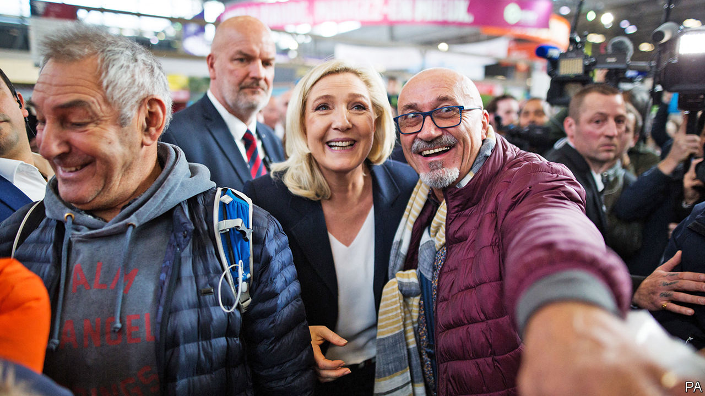

###### Marine’s mayors multiply?

# Emmanuel Macron’s party braces for a kicking in mayoral elections 

##### Terrible results are expected 

 

> Mar 14th 2020 

DRESSED IN A Barbour coat and clutching a NATO-embossed umbrella, the retired general strides down the streets as if into battle. “I’m not a politician,” declares Bertrand de la Chesnais as he knocks vigorously on doors, which are opened cautiously, if at all: “But I know how to run an organisation.” Dividing Carpentras into eight districts, he has chalked up 5,000 doors in this Provençal town of 29,000 people since last August. The general’s aim: to raise his profile as a candidate for mayor—backed by Marine Le Pen (pictured).

On March 15th and 22nd the French go to the polls for two rounds of voting for mayors of the country’s 35,000 towns and villages. At the previous elections, in 2014, Ms Le Pen’s populist party, National Rally (RN, formerly the National Front), won a record 11 town halls. It hopes to beat that this time. In Carpentras, with its 15th-century cathedral, shaded fountains and plentiful kebab shops, her candidate lost by just 306 votes after a three-way run-off against the Socialists and Republicans. Now the 62-year-old general, who led a United Nations battalion during the siege of Sarajevo, is hoping to take the town.


During an evening of canvassing, Mr de la Chesnais is mostly greeted as a candidate like any other. Inside a small flat, a man wearing a tracksuit and crucifix welcomes him in for a chat. A discussion ensues about the “Muslim vote”. “They are manipulated,” suggests his wife. Back out in the street, a woman parking her car smiles in recognition: “I know you from Sunday mass!” “Ah non, not you!” calls out another from the second-floor window of a shuttered town-house. “The bourgeois are often against us,” shrugs the general, marching off to the next door.

The campaign in southern France suggests three points with wider political resonance. The first is what the French call the “banalisation” of the RN vote. Mr de la Chesnais refuses to be labelled “Ms Le Pen’s candidate”. Yet he posed unapologetically for a campaign photo with her, and has splashed her party’s label on his official poster, alongside that of other right-wing fringe parties. The RN is not expected to do well in big cities. But in small and mid-sized towns it could build on its successes. Many are in Provence-Alpes-Côte d’Azur, the surrounding region. At the first round of the presidential election in 2017, Ms Le Pen came top in Carpentras.

This near-normalisation has led to a “porosity” between the right-wing and far-right vote in the region, says Christèle Marchand-Lagier, a political scientist at the University of Avignon. Carpentras was where Marion Maréchal, Ms Le Pen’s niece and a champion of Catholic right-wing politics, was once elected deputy. Thierry Mariani, another former deputy from the region and ex-Republican government minister, last year defected to the RN. So far, both locally and nationally, the Republicans have refused to contemplate alliances of any sort with Ms Le Pen. But the search for second-round backing in three-way contests could strain such principles.

A second feature is the local resilience of mainstream parties, despite Mr Macron’s crushing of them at the national level at a parliamentary election in 2017. French mayors have a strong link to voters, incumbency helps, and parochial issues prevail. In the nearby walled city of Avignon, home to 14th-century popes and 21st-century yoga studios, the talk at the Green party office is all about making public transport free and contesting the construction of a new motorway link. In 2014 Jean-Pierre Cervantes, the Green candidate, who wears a pea-green scarf knotted around his neck, was on the victorious Socialist list. Today, going it alone, he hopes the “green awakening” will make Avignon one of the Greens’ national successes.

The third point is the chronic local weakness of President Emmanuel Macron’s La République en Marche (LREM). The party he founded in 2016 did not exist at the previous local elections, and has struggled to put down roots. Across France, Ms Le Pen is running more party lists than Mr Macron. In Carpentras, in line with LREM’s policy of supporting friendly incumbents in many places, it does not have its own candidate. Frédéric Tacchino, the LREM candidate in Avignon, says that, unlike him, many of his fellow candidates in the region have not even put Mr Macron’s party name on their flyers. At Paris headquarters, the party says it will ask its candidates who come third in the first round to stand down, or merge with either the left or the right, in order to keep the RN out.

Focused on managing the coronavirus crisis, Mr Macron insists that this election is a local matter, not a referendum on him. Up to a point this may be true. Yet the dismal results that even his own party now expects will nonetheless be seen as further evidence of his lack of personal popularity, as well as the failure of his party to build up countrywide the sort of local networks it needs if it is ever to become a lasting force in French politics. ■

